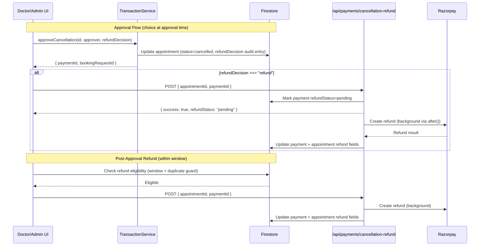

# Design Document: Cancellation Refund Choice

## Overview

This feature decouples the refund decision from the cancellation approval flow. Currently, when a doctor or admin approves a cancellation, the system automatically triggers a refund via the `/api/payments/cancellation-refund` endpoint. After this change, the approver will be presented with an explicit choice: "Approve with Refund" or "Approve without Refund." Doctors retain a 7-day window post-approval to issue a refund, while admins can refund at any time. All refund decisions are recorded in an audit trail on the `AppointmentDocument`.

The existing Refund API (`/api/payments/cancellation-refund`) remains unchanged — it continues to handle Razorpay communication and background processing via `after()`.

## Architecture



The architecture preserves the existing separation of concerns:
- **TransactionService** handles atomic Firestore writes for approval state
- **Refund API** handles Razorpay communication independently
- **UI layer** orchestrates the flow and enforces window/duplicate checks client-side (with server-side guards)

## Components and Interfaces

### 1. TransactionService Changes

The `approveCancellationWithTransaction` method gains a new parameter to record the refund decision:

```typescript
interface RefundDecision {
  decision: "refund" | "no_refund";
  decidedBy: string;       // UID
  decidedByRole: "doctor" | "admin";
  decidedAt: Date;
}

async approveCancellationWithTransaction(
  appointmentId: string,
  approvedBy: { uid: string; role: "doctor" | "admin" },
  refundDecision: RefundDecision
): Promise<{ paymentId?: string; bookingRequestId?: string }>
```

The transaction writes the refund decision as the first entry in a `refundAuditTrail` array on the appointment document.

### 2. New Refund Eligibility Check (Client-Side Utility)

```typescript
function isRefundEligible(
  appointment: AppointmentDocument,
  actorRole: "doctor" | "admin"
): { eligible: boolean; reason?: string } {
  // Already refunded → not eligible
  if (appointment.refundId || appointment.refundStatus === "processed") {
    return { eligible: false, reason: "Already refunded" };
  }
  // Refund in progress → not eligible
  if (appointment.refundStatus === "pending") {
    return { eligible: false, reason: "Refund in progress" };
  }
  // Not cancelled → not eligible
  if (appointment.status !== "cancelled") {
    return { eligible: false, reason: "Appointment not cancelled" };
  }
  // No payment → not eligible
  if (!appointment.paymentId) {
    return { eligible: false, reason: "No payment to refund" };
  }
  // Admin → always eligible
  if (actorRole === "admin") {
    return { eligible: true };
  }
  // Doctor → check 7-day window
  if (appointment.cancellationApprovedAt) {
    const windowEnd = new Date(appointment.cancellationApprovedAt);
    windowEnd.setDate(windowEnd.getDate() + 7);
    if (new Date() > windowEnd) {
      return { eligible: false, reason: "7-day refund window expired" };
    }
  }
  return { eligible: true };
}
```

### 3. Server-Side Duplicate Guard (Refund API Enhancement)

The existing `/api/payments/cancellation-refund` route already checks `payment.refundStatus`. We add an additional check on the appointment document:

```typescript
// In POST handler, after verifying token and loading payment:
const appointmentDoc = await db.collection("appointments").doc(appointmentId).get();
const appointment = appointmentDoc.data();

if (appointment?.refundId) {
  return NextResponse.json(
    { error: "Refund already processed for this appointment" },
    { status: 409 }
  );
}
```

### 4. Doctor UI Changes (`app/doctor/appointments/[id]/page.tsx`)

- **Approval modal**: Replace single "Approve" button with a modal/dialog offering "Approve with Refund" and "Approve without Refund" (only shown when `paymentId` exists on the appointment).
- **Post-approval refund button**: Show "Issue Refund" button on cancelled appointments where `isRefundEligible` returns true.
- **Window countdown**: Display remaining days in the refund window.

### 5. Admin UI Changes (`app/admin/appointments/cancellations/page.tsx`)

- **Approval options**: Same dual-choice as doctor UI.
- **Post-approval refund**: Show "Issue Refund" on any cancelled appointment without a completed refund (no time limit).
- **Audit trail display**: Show refund decision history in appointment detail view.

## Data Models

### AppointmentDocument Extensions

New fields added to the `AppointmentDocument` interface:

```typescript
// In types/firestore.ts — additions to AppointmentDocument

export type RefundDecisionType = "refund" | "no_refund";

export interface RefundAuditEntry {
  action: "decision_at_approval" | "post_approval_refund";
  decision: RefundDecisionType | "refund";  // "refund" or "no_refund" at approval; always "refund" for post-approval
  actorId: string;
  actorRole: "doctor" | "admin";
  timestamp: Date;
}

// Added to AppointmentDocument interface:
interface AppointmentDocument {
  // ... existing fields ...

  // Refund decision tracking (new)
  refundDecision?: RefundDecisionType;          // Latest decision: "refund" or "no_refund"
  refundDecisionBy?: string;                     // UID of decision maker
  refundDecisionByRole?: "doctor" | "admin";     // Role of decision maker
  refundDecisionAt?: Date;                       // When decision was made
  refundAuditTrail?: RefundAuditEntry[];         // Full history of refund decisions

  // Refund status (new — mirrors payment.refundStatus for quick UI access)
  refundStatus?: RefundStatus;                   // "none" | "pending" | "processed" | "failed"
}
```

### Firestore Document Shape (Example)

```json
{
  "id": "apt_123",
  "status": "cancelled",
  "cancellationApprovedAt": "2025-01-15T10:00:00Z",
  "cancellationApprovedBy": "doctor_uid",
  "cancellationApprovedByRole": "doctor",
  "refundDecision": "no_refund",
  "refundDecisionBy": "doctor_uid",
  "refundDecisionByRole": "doctor",
  "refundDecisionAt": "2025-01-15T10:00:00Z",
  "refundAuditTrail": [
    {
      "action": "decision_at_approval",
      "decision": "no_refund",
      "actorId": "doctor_uid",
      "actorRole": "doctor",
      "timestamp": "2025-01-15T10:00:00Z"
    },
    {
      "action": "post_approval_refund",
      "decision": "refund",
      "actorId": "doctor_uid",
      "actorRole": "doctor",
      "timestamp": "2025-01-18T14:30:00Z"
    }
  ],
  "refundStatus": "processed",
  "refundId": "rfnd_abc123",
  "refundAmount": 500,
  "refundedAt": "2025-01-18T14:31:00Z"
}
```

## Correctness Properties

*A property is a characteristic or behavior that should hold true across all valid executions of a system — essentially, a formal statement about what the system should do. Properties serve as the bridge between human-readable specifications and machine-verifiable correctness guarantees.*

### Property 1: Doctor refund window boundary

*For any* cancelled appointment with a `cancellationApprovedAt` timestamp T, and any current time C, a doctor should be eligible to issue a refund if and only if C ≤ T + 7 calendar days, the appointment has a `paymentId`, and no refund has already been processed.

**Validates: Requirements 2.1, 2.3, 2.4**

### Property 2: Admin bypasses time constraint

*For any* cancelled appointment with a `paymentId` and no completed refund, an admin should be eligible to issue a refund regardless of how much time has elapsed since `cancellationApprovedAt`.

**Validates: Requirements 3.2, 3.3**

### Property 3: Duplicate refund prevention (eligibility)

*For any* appointment where `refundId` is set or `refundStatus` is "processed", the `isRefundEligible` function should return `eligible: false` for both doctor and admin roles.

**Validates: Requirements 6.1, 6.2**

### Property 4: Server-side duplicate guard

*For any* refund request submitted to the Refund API for an appointment that already has a `refundId`, the API should reject the request with a 409 status and not initiate a Razorpay refund call.

**Validates: Requirements 6.3**

### Property 5: Audit trail entry completeness

*For any* refund action (either "decision_at_approval" or "post_approval_refund"), the resulting `RefundAuditEntry` should contain all required fields: `action`, `decision`, `actorId`, `actorRole`, and `timestamp`, with none being null or undefined.

**Validates: Requirements 4.1, 4.2**

### Property 6: Audit trail is append-only

*For any* sequence of refund actions on an appointment, the `refundAuditTrail` array length should be monotonically increasing — each new action appends an entry without modifying or removing previous entries.

**Validates: Requirements 4.3**

### Property 7: Approval with "no_refund" records correct audit entry

*For any* appointment in `cancellation_requested` state approved with decision "no_refund", the first entry in `refundAuditTrail` should have `action: "decision_at_approval"`, `decision: "no_refund"`, and the approver's `actorId` and `actorRole` matching the approval parameters.

**Validates: Requirements 1.4**

## Error Handling

| Scenario | Handling |
|----------|----------|
| Refund API returns non-2xx | Display error toast to user. Retain "Issue Refund" button so user can retry. Log error for debugging. |
| Refund API returns 409 (duplicate) | Display "Refund already processed" message. Refresh appointment data to update UI state. |
| Network failure during refund call | Display generic error. The `refundStatus` remains unchanged (not "pending"), so retry is safe. |
| Razorpay background processing fails | Payment doc gets `refundStatus: "failed"` with `refundFailureReason`. UI shows failure state with retry option. |
| Doctor tries to refund after window expiry | Client-side: button is hidden. If somehow bypassed, server could add window validation (future enhancement). |
| Concurrent approval attempts | `runTransaction` in Firestore ensures only one approval succeeds. Second attempt gets "not in cancellation_requested state" error. |
| Missing paymentId on appointment | "Issue Refund" button is not shown. Approval modal shows only "Approve" (no refund options). |

## Testing Strategy

### Unit Tests (Example-Based)

- **UI rendering**: Verify approval modal shows correct options based on `paymentId` presence
- **UI state**: Verify "Issue Refund" button visibility based on eligibility
- **Audit trail display**: Verify admin UI renders all audit entries
- **Error states**: Verify error messages display on API failures
- **API compatibility**: Verify existing refund API request/response format unchanged

### Property-Based Tests (fast-check)

Property-based testing is appropriate for this feature because the core logic (eligibility checks, window calculations, audit trail invariants) involves pure functions with clear input/output behavior and a large input space (timestamps, actor roles, appointment states).

**Library**: `fast-check` (already used in existing property tests in this codebase)

**Configuration**:
- Minimum 100 iterations per property test
- Each test tagged with: `Feature: cancellation-refund-choice, Property {N}: {title}`

**Properties to implement**:
1. Doctor refund window boundary — generate random approval timestamps and current times, verify eligibility matches window rule
2. Admin bypasses time constraint — generate random old timestamps, verify admin always eligible
3. Duplicate refund prevention — generate appointments with various refund states, verify ineligibility
4. Server-side duplicate guard — generate requests for already-refunded appointments, verify 409 response
5. Audit trail entry completeness — generate random actors and decisions, verify all fields present
6. Audit trail append-only — generate sequences of actions, verify array only grows
7. Approval "no_refund" audit entry — generate random approvers, verify correct first entry

### Integration Tests

- End-to-end approval flow with refund choice
- Post-approval refund within window
- Verify Razorpay idempotency key prevents duplicate charges
- Verify `after()` background processing completes correctly

