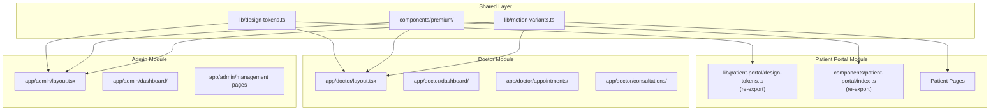

# Design Document: Doctor & Admin Premium Revamp

## Overview

This design applies the established premium design language from the Patient Portal across the Doctor Module and Admin Module of Eye Aura. The revamp unifies the entire platform into a cohesive premium AI-powered tele-health operating system by:

1. **Extracting** the existing design token system and component library from `patient-portal/` to a shared location
2. **Extending** the component library with new premium components (PremiumTable, PremiumInput, PremiumModal, PremiumTabs, MetricCard)
3. **Revamping** both Doctor and Admin module layouts to use the Floating Sidebar, glass surfaces, and token-driven styling
4. **Redesigning** dashboards, appointment management, consultation interfaces, and assessment modules with premium components
5. **Establishing** a motion system, depth layering, responsive design, and dark mode readiness

All visual quality is achieved exclusively through spacing, typography, layering, elevation, motion, and glass effects — using only existing theme tokens and CSS variables. No new colors or hardcoded hex values are introduced.

### Key Design Decisions

| Decision | Rationale |
|----------|-----------|
| Shared `lib/design-tokens.ts` with re-exports | Single source of truth; backward compatibility via re-exports avoids breaking Patient Portal |
| Shared `components/premium/` with re-exports | Identical components across all modules; re-exports preserve existing imports |
| Framer Motion exclusively | Already in use; consistent API; supports `prefers-reduced-motion` via `useReducedMotion` |
| Token-driven colors only | Enables future dark mode by changing CSS variables alone |
| GlassPanel as universal surface | Consistent depth/layering; already proven in Patient Portal |
| 32px/3xl/2xl/full radius hierarchy | Clear visual hierarchy; already established in design tokens |

---

## Architecture

### High-Level Module Structure



### File Organization

```
lib/
├── design-tokens.ts          # Shared: RADIUS, SPACING, SHADOWS, GLASS, TYPOGRAPHY
├── motion-variants.ts        # Shared: Framer Motion variant definitions
├── patient-portal/
│   ├── design-tokens.ts      # Re-export from lib/design-tokens.ts (backward compat)
│   └── motion-variants.ts    # Re-export from lib/motion-variants.ts (backward compat)

components/
├── premium/
│   ├── index.ts              # Barrel file exporting all premium components
│   ├── glass-panel.tsx
│   ├── premium-button.tsx
│   ├── dashboard-card.tsx
│   ├── status-badge.tsx
│   ├── section-header.tsx
│   ├── metric-card.tsx       # NEW
│   ├── premium-table.tsx     # NEW
│   ├── premium-input.tsx     # NEW
│   ├── premium-modal.tsx     # NEW
│   ├── premium-tabs.tsx      # NEW
│   ├── floating-sidebar.tsx
│   ├── premium-header.tsx
│   ├── info-row.tsx
│   ├── motion-wrapper.tsx
│   ├── page-transition.tsx
│   └── quick-actions-panel.tsx
├── patient-portal/
│   └── index.ts              # Re-export from components/premium/ (backward compat)
```

---

## Components and Interfaces

### Design Token System (`lib/design-tokens.ts`)

```typescript
// Unchanged from current implementation — relocated to shared path
export const RADIUS = {
  container: "rounded-[32px]",   // Layout containers
  card: "rounded-3xl",           // Cards and elevated surfaces
  interactive: "rounded-2xl",    // Buttons, inputs
  pill: "rounded-full",          // Badges, pills
} as const;

export const SPACING = {
  sectionGap: "gap-8",
  cardGap: "gap-6",
  cardPadding: "p-6",
  layoutGap: "gap-7",
  pageX: "px-4 sm:px-6",
  pageY: "py-5 sm:py-8",
} as const;

export const SHADOWS = {
  card: "shadow-[0_8px_32px_rgba(var(--primary-rgb),0.06)]",
  glass: "shadow-[0_24px_80px_rgba(var(--primary-rgb),0.12)]",
  buttonHover: "shadow-[0_12px_40px_rgba(var(--primary-rgb),0.14)]",
  sidebar: "shadow-[0_16px_64px_rgba(var(--primary-rgb),0.10)]",
} as const;

export const GLASS = {
  background: "bg-card/72",
  cardBackground: "bg-card/82",
  headerBackground: "bg-card/80",
  border: "border border-white/60",
  blur: "backdrop-blur-[22px]",
} as const;

export const TYPOGRAPHY = {
  heading: "text-2xl sm:text-3xl font-semibold text-foreground",
  subheading: "text-lg font-semibold text-foreground",
  body: "text-base text-foreground",
  label: "text-xs uppercase tracking-[0.12em] font-medium text-muted-foreground",
} as const;
```

### New Component: MetricCard

```typescript
export interface MetricCardProps {
  icon: React.ReactNode;
  value: string | number;
  label: string;
  trend?: { value: number; direction: "up" | "down" };
  className?: string;
  staggerIndex?: number;
}
```

Renders a DashboardCard-based metric display with icon, large value, label, and optional trend indicator. Uses `cardEntrance` animation with stagger support and `whileHover={{ y: -2 }}`.

### New Component: PremiumTable

```typescript
export interface PremiumTableColumn<T> {
  key: keyof T | string;
  header: string;
  render?: (row: T, index: number) => React.ReactNode;
  width?: string;
}

export interface PremiumTableProps<T> {
  columns: PremiumTableColumn<T>[];
  data: T[];
  onRowClick?: (row: T, index: number) => void;
  selectedRow?: number | null;
  pagination?: {
    currentPage: number;
    totalPages: number;
    onPageChange: (page: number) => void;
  };
  emptyMessage?: string;
  className?: string;
}
```

Renders within a GlassPanel container. Table headers use `TYPOGRAPHY.label` style. Rows have 16px vertical padding, `--border` bottom borders, hover animation to `bg-primary/8`, and staggered entrance animations (30-50ms delay per row). Selected rows display a 3px left-border accent using `--primary`. On mobile (<768px), renders as a card-based list view.

### New Component: PremiumInput

```typescript
export interface PremiumInputProps extends React.InputHTMLAttributes<HTMLInputElement> {
  label?: string;
  error?: string;
  helperText?: string;
}
```

Renders with `rounded-2xl`, 12px/16px padding, `--border` border. Focus state animates border to `--ring` with outer glow (`0 0 0 3px ring/20`). Error state shows `--destructive` border and error text. Labels use `TYPOGRAPHY.label` style positioned above with 6px margin.

### New Component: PremiumModal

```typescript
export interface PremiumModalProps {
  open: boolean;
  onClose: () => void;
  title?: string;
  subtitle?: string;
  children: React.ReactNode;
  actions?: React.ReactNode;
  maxWidth?: string;
}
```

Renders with glass panel background (`backdrop-blur-[22px]`, `bg-card/82`), `rounded-3xl`, max-width 560px. Entrance: fade-in + scale 0.95→1.0 over 200ms. Exit: fade-out + scale 1.0→0.95 over 150ms. Backdrop: `bg-background/50` with `backdrop-blur-sm`. Dismisses on backdrop click or Escape key.

### New Component: PremiumTabs

```typescript
export interface PremiumTabItem {
  id: string;
  label: string;
  icon?: React.ReactNode;
}

export interface PremiumTabsProps {
  tabs: PremiumTabItem[];
  activeTab: string;
  onTabChange: (tabId: string) => void;
  variant?: "underline" | "pill";
  className?: string;
}
```

Renders tab items with SPACING token padding, min-height 44px. Active indicator uses Framer Motion `layoutId` for smooth sliding animation (spring, ≤300ms). Supports `underline` (2px bottom border) and `pill` (rounded-full background fill) variants. Keyboard navigation with arrow keys, Enter/Space activation.

### Updated Component: FloatingSidebar

The existing FloatingSidebar component is already well-structured. Updates needed:

- Accept `activeHref` comparison logic that supports nested routes (prefix matching)
- Ensure hover states use `bg-muted/50` with 200ms transition
- Maintain sticky positioning with `top-24` (96px)
- Shared between Doctor and Admin modules via props

### Shared Layout Shell

Both Doctor and Admin modules will share a common layout pattern:

```typescript
interface ModuleLayoutProps {
  navItems: NavItem[];
  activeHref: string;
  portalLabel: string;
  children: React.ReactNode;
}
```

The layout renders:
- **Desktop (≥1024px)**: Glass header (sticky, backdrop-blur) + FloatingSidebar + main content
- **Tablet (768px–1023px)**: Glass header + icon-only collapsed sidebar + bottom nav + main content
- **Mobile (<768px)**: Glass header + bottom nav + slide-out drawer sidebar + main content

---

## Data Models

### Navigation Item Model

```typescript
interface NavItem {
  label: string;
  href: string;
  icon: LucideIcon;
  group?: string;        // For divider separation
  hideOnMobile?: boolean;
}
```

### Design Token Types

```typescript
type RadiusToken = typeof RADIUS;
type SpacingToken = typeof SPACING;
type ShadowToken = typeof SHADOWS;
type GlassToken = typeof GLASS;
type TypographyToken = typeof TYPOGRAPHY;

// Responsive spacing multiplier
interface ResponsiveSpacing {
  mobile: 0.75;    // <768px
  tablet: 0.875;   // 768px–1023px
  desktop: 1;      // ≥1024px
}
```

### Depth Layer Model

```typescript
interface DepthLayer {
  name: "background" | "surface" | "elevated";
  blur: string;          // backdrop-blur value
  background: string;    // bg opacity class
  shadow: string;        // shadow token
}

const DEPTH_LAYERS: DepthLayer[] = [
  { name: "background", blur: "none",                background: "bg-background",  shadow: "none" },
  { name: "surface",    blur: "backdrop-blur-[22px]", background: "bg-card/72",     shadow: SHADOWS.glass },
  { name: "elevated",   blur: "backdrop-blur-[30px]", background: "bg-card/82",     shadow: SHADOWS.buttonHover },
];
```

### Motion Variant Configuration

```typescript
// Extended motion-variants.ts
interface MotionConfig {
  cardEntrance: Variants;      // Staggered fade-up (existing)
  cardHover: Variants;         // Hover lift (existing)
  pageEntrance: Variants;      // Page fade-up (existing)
  buttonPress: object;         // Scale tap (existing)
  fadeIn: Variants;            // Simple fade (existing)
  staggerContainer: Variants;  // Stagger parent (existing)
  tableRowEntrance: Variants;  // NEW: Row stagger (30-50ms)
  modalEntrance: Variants;     // NEW: Scale + fade in
  modalExit: Variants;         // NEW: Scale + fade out
  tabIndicator: object;        // NEW: Spring layout animation
  statusTransition: Variants;  // NEW: Status change fade
}
```

---

## Correctness Properties

*A property is a characteristic or behavior that should hold true across all valid executions of a system-essentially, a formal statement about what the system should do. Properties serve as the bridge between human-readable specifications and machine-verifiable correctness guarantees.*

**PBT is not applicable** to this feature. This revamp is exclusively focused on UI rendering, layout, styling, and animation — areas where property-based testing provides no meaningful value because:

1. **UI rendering and layout** — Component output is deterministic given props; there is no meaningful input space to generate randomly. Snapshot tests and render assertions are the appropriate verification approach.
2. **Static design token objects** — Tokens are finite, known structures (RADIUS, SPACING, SHADOWS, etc.) with no variability. Schema validation and snapshot tests suffice.
3. **CSS class application** — Styling is a direct mapping from props to class strings with no complex logic that benefits from randomized inputs.
4. **Animation configuration** — Framer Motion variants are static configuration objects verified by checking prop values, not by generating random inputs.

### Property 1: Design token consistency across modules

*For any* component rendered in the Doctor or Admin module, the styling classes applied must originate exclusively from the shared design token system (RADIUS, SPACING, SHADOWS, GLASS, TYPOGRAPHY) — no hardcoded hex colors or local token overrides are permitted.

**Validates: Requirements 1.1, 1.2, 2.1**

> Note: This property is verified via static analysis (grep-based lint tests) rather than property-based testing, as the input space is the finite set of source files rather than generated random data.

#### Key Correctness Invariants

*Verified via Unit Tests and Static Analysis*

The following invariants will be enforced through example-based tests, static analysis, and lint rules:

| Invariant | Verification Method |
|-----------|-------------------|
| No hardcoded hex colors in Doctor/Admin modules | Grep-based lint test |
| All interactive elements meet 44px minimum touch target | Unit test assertions on rendered output |
| Design tokens are the single source of truth (no local overrides) | Static analysis test |
| Re-exports from patient-portal paths resolve to shared premium components | Import equivalence snapshot test |
| All components respect `prefers-reduced-motion` | Unit test with mocked `useReducedMotion` |
| PremiumModal dismisses on Escape key and backdrop click | Event handler unit tests |
| PremiumTabs supports full keyboard navigation (arrow keys, Enter/Space) | Accessibility unit tests |
| PremiumTable renders card-based layout on mobile (<768px) | Responsive render test |
| Glass effects degrade gracefully when `backdrop-filter` is unsupported | CSS fallback verification |

---

## Error Handling

### Data Loading Failures

| Component | Error Behavior |
|-----------|---------------|
| MetricCard | Displays "Data unavailable" placeholder text within the card shell; card maintains its dimensions |
| DashboardCard (data section) | Shows error message with retry PremiumButton |
| PremiumTable | Renders empty-state message in GlassPanel container |
| Appointment list | Shows "No appointments found" in GlassPanel with filter context |

### Component Graceful Degradation

- **Missing icon prop**: MetricCard renders without icon, maintaining layout
- **Empty data array**: PremiumTable shows centered empty-state message
- **Invalid status variant**: StatusBadge falls back to "pending" variant styling
- **Animation failure**: Components render in final state without animation (CSS fallback positions)

### Reduced Motion Handling

When `prefers-reduced-motion: reduce` is active:
- All Framer Motion durations set to 0ms via `useReducedMotion()` hook
- Elements render immediately in their final positions
- Layout transitions apply without animation
- Global CSS rule already handles CSS animations (existing in globals.css)

### Theme Token Fallbacks

- If a CSS custom property is undefined, components fall back to the Tailwind theme defaults
- Glass effects degrade gracefully: if `backdrop-filter` is unsupported, the semi-transparent background still provides visual separation

---

## Testing Strategy

### Why Property-Based Testing Does Not Apply

This feature is primarily a **UI rendering, layout, and styling** revamp. The requirements focus on:
- Component visual appearance (CSS classes, styling)
- Animation behavior (Framer Motion props)
- Responsive layout (breakpoint-driven rendering)
- Design token usage (static object structure)
- Color constraint enforcement (static analysis)

These characteristics make PBT inappropriate because:
1. **UI rendering** — best tested with snapshot tests and render assertions
2. **Static token objects** — finite, known structure with no meaningful input space to generate
3. **CSS class application** — deterministic given props, no input variation
4. **Animation props** — verified by checking Framer Motion prop values, not by generating random inputs

### Testing Approach

#### 1. Component Unit Tests (Vitest + Testing Library)

Each premium component gets example-based unit tests verifying:
- Correct CSS classes applied for each variant/state
- Proper ARIA attributes for accessibility
- Event handler invocations (onClick, onClose, onTabChange)
- Conditional rendering (loading, disabled, error, empty states)
- Responsive class application

**Example test areas:**
- `PremiumTable`: renders headers with label typography, shows empty state, applies hover classes, renders pagination
- `PremiumInput`: renders with correct radius/padding, shows error state, applies focus ring classes
- `PremiumModal`: renders with glass panel classes, calls onClose on Escape/backdrop click, animates entrance
- `PremiumTabs`: renders active indicator, supports keyboard navigation, applies variant styles
- `MetricCard`: renders value/label/icon, shows trend indicator, applies hover animation props
- `FloatingSidebar`: renders active item with primary background, shows group dividers

#### 2. Static Analysis / Lint Tests

Automated checks to enforce design constraints:
- **No hardcoded hex colors**: Grep test across Doctor/Admin module files for hex patterns (`#[0-9a-fA-F]{3,8}`)
- **No arbitrary Tailwind colors**: Grep for patterns like `bg-blue-`, `text-gray-`, `border-red-`
- **No local token overrides**: Verify no files in `app/doctor/` or `app/admin/` define `RADIUS`, `SPACING`, `SHADOWS`, `GLASS`, or `TYPOGRAPHY` constants
- **No alternative animation libraries**: Verify no imports of `react-spring`, `gsap`, or CSS `@keyframes` in module files
- **All Button replaced**: Verify no `@/components/ui/button` imports in Doctor/Admin modules

#### 3. Snapshot Tests

- Design token object structure (RADIUS, SPACING, SHADOWS, GLASS, TYPOGRAPHY)
- Component render output for each variant
- Re-export equivalence (patient-portal paths resolve to premium components)

#### 4. Accessibility Tests

- Focus ring visibility on all interactive elements
- Minimum touch target sizes (44px) on interactive elements
- ARIA labels on navigation components
- Keyboard navigation for PremiumTabs
- `prefers-reduced-motion` respected (animations disabled)

#### 5. Visual Regression Tests (Manual / Future Automation)

- Layout at 320px, 768px, 1024px, 1440px viewports
- Dark mode rendering (when token set is available)
- Glass effect rendering across depth layers
- Animation smoothness verification

### Test File Organization

```
__tests__/
├── components/
│   ├── premium/
│   │   ├── glass-panel.test.tsx
│   │   ├── premium-button.test.tsx
│   │   ├── dashboard-card.test.tsx
│   │   ├── metric-card.test.tsx
│   │   ├── premium-table.test.tsx
│   │   ├── premium-input.test.tsx
│   │   ├── premium-modal.test.tsx
│   │   ├── premium-tabs.test.tsx
│   │   ├── floating-sidebar.test.tsx
│   │   ├── status-badge.test.tsx
│   │   └── section-header.test.tsx
│   └── layouts/
│       ├── doctor-layout.test.tsx
│       └── admin-layout.test.tsx
├── design-system/
│   ├── tokens.test.ts           # Token structure verification
│   ├── no-hardcoded-colors.test.ts  # Static analysis
│   └── re-exports.test.ts      # Backward compatibility
└── integration/
    ├── responsive.test.tsx      # Breakpoint behavior
    └── reduced-motion.test.tsx  # Motion preference
```

### Test Configuration

- **Runner**: Vitest with happy-dom environment
- **Component testing**: @testing-library/react
- **Assertions**: @testing-library/jest-dom
- **Minimum coverage target**: All premium components, both module layouts
- **CI integration**: `vitest --run` for single execution in CI pipeline
