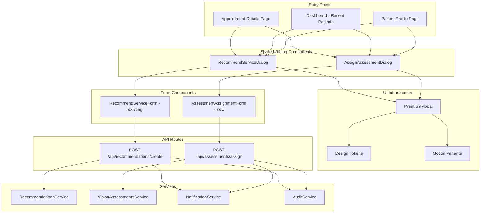

# Design Document: Doctor Portal Quick Actions

## Overview

This feature extends the doctor portal with contextual quick actions, enabling doctors to initiate service recommendations and assessment assignments directly from appointment details and dashboard surfaces. The design introduces two shared dialog components (`RecommendServiceDialog` and `AssignAssessmentDialog`) usable from multiple entry points, redesigns the Recent Patients dashboard section with richer cards and inline actions, and adds a Patient Summary Card to the appointment details view. The notification and audit systems are extended to cover assessment lifecycle events.

**Key Design Decisions:**
- **Single shared dialogs** over per-surface implementations — eliminates logic duplication and ensures consistent UX
- **PremiumModal** as the dialog wrapper — maintains visual consistency with existing modals (glass effect, focus trap, backdrop click, Escape key)
- **Composition over modification** — the existing `RecommendServiceForm` is wrapped rather than rewritten; a new `AssessmentAssignmentForm` is created for the new dialog
- **Notification builder pattern** — extends the existing `recommendationNotificationsService` pattern for assessment events
- **Audit entries as Firestore subcollection** — mirrors the existing `RecommendationAuditEntry` pattern

## Architecture



## Components and Interfaces

### 1. RecommendServiceDialog

**Location:** `components/doctor/recommend-service-dialog.tsx`

Wraps the existing `RecommendServiceForm` inside a `PremiumModal`, adding appointment-context awareness and the "Use appointment schedule" checkbox.

```typescript
interface RecommendServiceDialogProps {
  open: boolean;
  onClose: () => void;
  patientId: string;
  doctorId: string;
  appointmentId?: string;
  // When appointmentId is provided, the dialog fetches appointment data
  // to pre-fill scheduling fields
}
```

**Behavior:**
- When `appointmentId` is provided: fetches appointment, enables "Use appointment schedule" checkbox (checked by default), pre-fills date/time from appointment's `scheduledFor`
- When `appointmentId` is omitted: disables the "Use appointment schedule" checkbox, requires manual patient selection if `patientId` is not pre-filled
- Guards: if `patientId` or `doctorId` is missing, logs error and does not render

**Internal state:**
- `useAppointmentSchedule: boolean` — drives date/time field enable/disable
- Delegates form state to the wrapped `RecommendServiceForm` with overridden `selectedDate`/`selectedTime` when checkbox is active

### 2. AssignAssessmentDialog

**Location:** `components/doctor/assign-assessment-dialog.tsx`

A new dialog component for assessment assignment, using `PremiumModal`.

```typescript
type ExtendedAssessmentType =
  | "distance_visual_acuity"
  | "near_vision"
  | "color_vision"
  | "contrast_sensitivity"
  | "custom";

type AssignmentTiming = "now" | "schedule_later";

interface AssignAssessmentDialogProps {
  open: boolean;
  onClose: () => void;
  patientId: string;
  doctorId: string;
  appointmentId?: string;
}
```

**Behavior:**
- Assessment Type selector with 5 options (mapped to extended types)
- Assignment Timing: "Assign Now" (default) or "Schedule Later"
- When "Schedule Later": reveals Date Picker + Time Picker
- Optional Instructions textarea (500 char limit)
- Validation: type required, timing valid (future date when scheduled)
- On submit: calls `POST /api/assessments/assign` with mapped type, timing, instructions

### 3. Patient Summary Card

**Location:** `components/doctor/patient-summary-card.tsx`

Compact patient info panel for appointment details.

```typescript
interface PatientSummaryCardProps {
  patientId: string;
  className?: string;
}
```

**Displays:** Profile photo (or avatar placeholder via `Users` icon), name, age, gender, phone, email, "View Full Profile" button.

**Error handling:** If patient data fails to load, shows error state with retry button. Does not block sibling content.

**Missing data:** Phone/email show "—" placeholder. Age/gender are omitted entirely (label + value hidden) without leaving a gap.

### 4. Recent Patient Card (Redesigned)

**Location:** `components/doctor/recent-patient-card.tsx`

Replaces the current minimal `DashboardCard` usage with a richer card.

```typescript
interface RecentPatientData {
  patientId: string;
  name: string;
  age?: number;
  gender?: string;
  lastAppointmentDate: string;
  lastAssessmentDate?: string;
  upcomingAppointment?: string;
  status: "active" | "completed" | "pending";
}

interface RecentPatientCardProps {
  patient: RecentPatientData;
  doctorId: string;
  onRecommendService: (patientId: string) => void;
  onAssignAssessment: (patientId: string) => void;
}
```

**Layout:** Min height 180px, min width 320px on desktop. Displays all patient fields with dash placeholders for missing optional data. Quick action buttons: View Profile, Prescription, Recommend Service, Assign Assessment. Secondary action: Book Follow-up.

### 5. QuickActionsSection (Extended)

**Location:** Updated in `app/doctor/appointments/[id]/page.tsx`

Extends the existing Quick Actions card to include "Recommend Service" and "Assign Assessment" cards alongside the existing "Create Prescription" action.

**Disabled logic:** Cards are disabled (reduced opacity, non-interactive) when appointment status is `cancelled`, `completed` (without active follow-up), or if a hypothetical `no-show` status is present.

**Responsive layout:**
- ≥1024px: horizontal row
- 768px–1023px: 2-column grid
- <768px: single-column stack

### 6. Assessment Notification Builders

**Location:** `services/notifications/assessment-notifications.service.ts`

New service following the `recommendationNotificationsService` pattern.

```typescript
interface AssessmentNotificationContext {
  assessmentId: string;
  patientId: string;
  doctorId: string;
  doctorName?: string;
  assessmentType: string;
  timing: AssignmentTiming;
  scheduledDate?: Date;
}

class AssessmentNotificationsService {
  notifyAssessmentAssigned(context: AssessmentNotificationContext): Notification;
  notifyAssessmentCompleted(context: AssessmentNotificationContext): Notification;
}
```

### 7. Assessment Audit Types

**Location:** Extended in `types/recommendations.ts` (or new `types/audit.ts`)

```typescript
type AssessmentAuditAction =
  | "assessment_assigned"
  | "assessment_completed"
  | "assessment_cancelled";

interface AssessmentAuditEntry {
  id: string;
  assessmentId: string;
  action: AssessmentAuditAction;
  actorId: string;
  actorRole: "doctor" | "patient" | "admin" | "system";
  timestamp: Date;  // ISO 8601 UTC
  patientId: string;
  doctorId: string;
  metadata: {
    assessmentType?: string;
    timing?: AssignmentTiming;
    scheduledDate?: string;
    [key: string]: unknown;
  };
}
```

### 8. Extended Notification Types

Add to `types/notifications.ts`:

```typescript
export type NotificationType =
  | /* ...existing types... */
  | "assessment_assigned"
  | "assessment_completed";
```

## Data Models

### Extended VisionAssessmentType

The existing `VisionAssessmentType = "far" | "near"` needs expansion. A mapping layer translates between the new extended types used in the UI and the existing backend types:

```typescript
// New extended assessment type for the dialog UI
type ExtendedAssessmentType =
  | "distance_visual_acuity"  // maps to "far"
  | "near_vision"             // maps to "near"
  | "color_vision"            // new
  | "contrast_sensitivity"    // new
  | "custom";                 // new

// Mapping function
function mapExtendedToVisionType(extended: ExtendedAssessmentType): VisionAssessmentType | string {
  const mapping: Record<ExtendedAssessmentType, string> = {
    distance_visual_acuity: "far",
    near_vision: "near",
    color_vision: "color_vision",
    contrast_sensitivity: "contrast_sensitivity",
    custom: "custom",
  };
  return mapping[extended];
}
```

**Decision:** The `VisionAssessmentType` union in `types/firestore.ts` will be extended to include the new types (`"color_vision" | "contrast_sensitivity" | "custom"`). This is a backward-compatible addition.

### Assessment Assignment with Scheduling

The existing `VisionAssessmentDocument` already has `expiresAt` and status states. For "Schedule Later" assignments, we add:

```typescript
// Additional fields on VisionAssessmentDocument
interface VisionAssessmentSchedulingFields {
  scheduledFor?: Date;        // When "Schedule Later" is used
  instructions?: string;      // Doctor-provided guidance (max 500 chars)
  assignmentTiming: "now" | "schedule_later";
}
```

### Audit Entry Base Structure

All audit entries (recommendation + assessment) share a common base:

```typescript
interface AuditEntryBase {
  id: string;
  actor: string;            // userId or "system"
  actorRole: "doctor" | "patient" | "admin" | "system";
  action: string;
  patientId: string;
  doctorId: string;
  timestamp: Date;          // ISO 8601 UTC
  metadata: Record<string, unknown>;
}
```

### Notification Persistence Model

Uses the existing `Notification` interface from `types/notifications.ts`. The `read` field tracks read/unread status. The `createdAt` field provides the timestamp. No schema changes needed — only new `NotificationType` values are added.

### RecommendServiceDialog Form State

When "Use appointment schedule" is checked:
- `suggestedDate` = appointment's `scheduledFor` date portion
- `suggestedTime` = appointment's `scheduledFor` time portion
- Both fields are disabled (read-only)

When unchecked:
- Fields are editable, constrained to today or future, and times must fall within doctor's availability with no active reservations or hard blocks.

## Correctness Properties

*A property is a characteristic or behavior that should hold true across all valid executions of a system — essentially, a formal statement about what the system should do. Properties serve as the bridge between human-readable specifications and machine-verifiable correctness guarantees.*

### Property 1: Quick Action disabled state follows appointment status

*For any* appointment status, the "Recommend Service" and "Assign Assessment" quick action cards should be disabled if and only if the status is one of "cancelled", "completed" (with no active follow-up window), or "no-show".

**Validates: Requirements 1.3**

### Property 2: Past date rejection in dialogs

*For any* date value that is before today's date, both the RecommendServiceDialog and AssignAssessmentDialog should reject submission with a validation error on the date field, regardless of all other form fields being valid.

**Validates: Requirements 2.9, 3.8**

### Property 3: Required field validation produces correct errors

*For any* subset of required fields left empty in the RecommendServiceDialog (Service, Suggested Date, Suggested Time), submitting the form should produce inline validation errors on exactly those empty fields and prevent submission.

**Validates: Requirements 2.7**

### Property 4: Dialog validation is entry-point independent

*For any* form state in the RecommendServiceDialog or AssignAssessmentDialog, the validation result (pass/fail and error messages) should be identical regardless of whether the dialog was opened from Appointment Details, Patient Profile, or Recent Patient Cards.

**Validates: Requirements 7.6, 8.5, 11.6, 11.7**

### Property 5: Patient card renders all required fields with dash placeholders for missing data

*For any* patient data where `lastAssessmentDate`, `upcomingAppointment`, phone, or email is null/undefined, the rendered card should display a "—" placeholder character for each missing field while correctly displaying all available fields.

**Validates: Requirements 5.2, 5.3, 6.5**

### Property 6: Patient card omits unavailable age/gender without visual gap

*For any* patient data where age or gender is null/undefined, the Patient Summary Card should not render the label or value for that field, and the rendered layout should contain no empty gap (the remaining fields are contiguous).

**Validates: Requirements 6.7**

### Property 7: Notification lifecycle events contain required context

*For any* notification lifecycle event (recommendation created, updated, cancelled, accepted, declined, assessment assigned), the generated notification should contain all required context fields for that event type: the actor's name, the action-specific entity (service name or assessment type), and relevant date/time information.

**Validates: Requirements 9.1, 9.2, 9.3, 9.4, 9.5, 9.6**

### Property 8: Notification retry mechanism

*For any* notification that fails delivery, the system should retry up to exactly 3 times. After the 3rd failure, the notification should be persisted in an "undelivered" state for later retrieval.

**Validates: Requirements 4.6, 9.7**

### Property 9: Notification persistence invariants

*For any* notification created by the system, the persisted notification should have `read` set to `false` and `createdAt` set to a valid Date that is less than or equal to the current time.

**Validates: Requirements 9.8**

### Property 10: Audit log structural invariants

*For any* audit log entry (regardless of action type), the entry must contain: `actor` (user ID or "system"), `timestamp` in ISO 8601 UTC format, `patientId`, `doctorId`, `action` (matching a defined action type), and a `metadata` object containing action-specific details.

**Validates: Requirements 10.1, 10.2, 10.3, 10.4, 10.5, 10.6, 10.7, 10.8, 10.9, 10.10**

### Property 11: Scheduled assessment visibility

*For any* assessment assigned with "Schedule Later" timing where the scheduled date is in the future, the assessment should not appear in the patient's active assessments list until the scheduled date arrives.

**Validates: Requirements 4.5, 4.7**

### Property 12: Recent Patient Card name truncation

*For any* patient name longer than 60 characters, the rendered Recent Patient Card should display the name truncated to 60 characters with an ellipsis appended, while names of 60 characters or fewer are displayed in full.

**Validates: Requirements 5.2**

## Error Handling

| Scenario | Behavior | User Feedback |
|----------|----------|---------------|
| Dialog fails to open (missing required props) | Dialog does not render, error logged to console | Toast error: "Could not open action. Please try again." |
| Form submission network error | Dialog remains open, all data preserved | Inline error banner: "Could not complete action. Please check your connection." |
| Past date submitted (client bypass) | Server-side validation rejects, returns 400 | Inline field error: "Date must be today or later" |
| Patient data load failure (Patient Summary Card) | Card shows error state with retry button | Error state within card boundary; rest of page unaffected |
| Notification delivery failure | Retry up to 3× with exponential backoff (1s, 2s, 4s) | Silent — notification persisted as "undelivered" for later retrieval |
| Audit persistence failure | Original action completes successfully | Silent — failed entry queued for retry within 60 seconds |
| Invalid assessment type submitted | Server returns 400 | Inline field error: "Please select a valid assessment type" |
| Doctor has no active services | Service selector shows empty state | Inline message: "No active services available. Please configure services first." |

**Error boundaries:** Each dialog component handles its own errors internally. A dialog error never propagates to or crashes the parent page. The Patient Summary Card uses its own error boundary to avoid blocking appointment details content.

## Testing Strategy

### Property-Based Testing (fast-check)

This feature is suitable for property-based testing. The pure validation logic, notification builders, audit entry construction, and data mapping functions all have clear input/output behavior with wide input spaces.

**Library:** `fast-check` (already in devDependencies)
**Configuration:** Minimum 100 iterations per property test
**Tag format:** `Feature: doctor-portal-quick-actions, Property {N}: {description}`

Property tests target:
1. Validation functions (date validation, required field validation)
2. Notification builder functions (content correctness)
3. Audit entry construction (structural invariants)
4. Assessment type mapping (round-trip correctness)
5. Disabled state logic (status-to-disabled mapping)
6. Name truncation logic
7. Placeholder rendering logic

### Unit Tests (Vitest)

- RecommendServiceDialog: opens with correct pre-population based on context params
- AssignAssessmentDialog: conditional rendering of date/time pickers based on timing selection
- Patient Summary Card: renders all fields, handles missing data, shows error state on load failure
- Recent Patient Card: renders all fields, action button click handlers fire with correct params
- Quick Actions Section: correct responsive classes applied, disabled state on terminal statuses
- Assessment type mapping: `mapExtendedToVisionType` correctness

### Integration Tests

- Full dialog submit flow: mock API, verify request payload structure
- Notification creation after assessment assignment: verify correct notification type and content
- Audit logging after recommendation creation: verify entry persisted with correct fields
- Error recovery: submit failure → dialog retains state → retry succeeds

### End-to-End Tests

- Doctor opens appointment details → clicks "Recommend Service" → fills form → submits → dialog closes → success toast shown
- Doctor clicks "Assign Assessment" on Recent Patient Card → selects type → submits → dialog closes
- Patient receives notification after doctor assigns assessment
