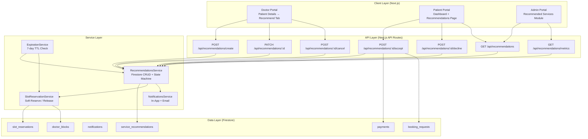
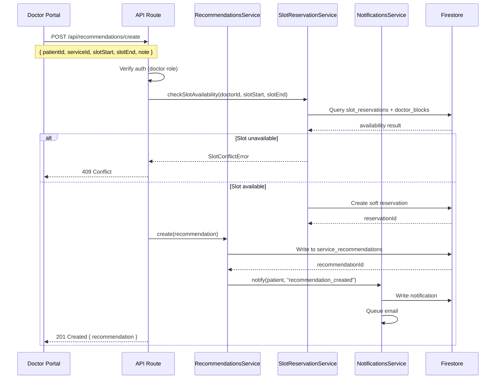
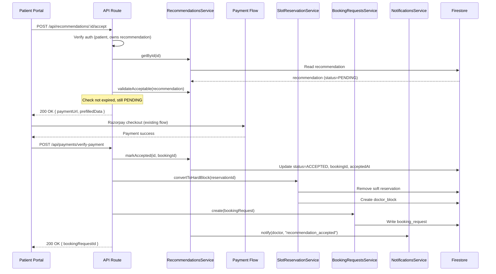
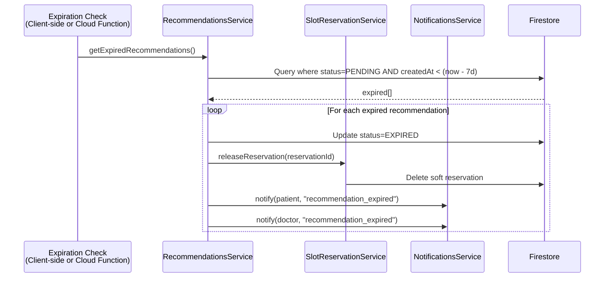
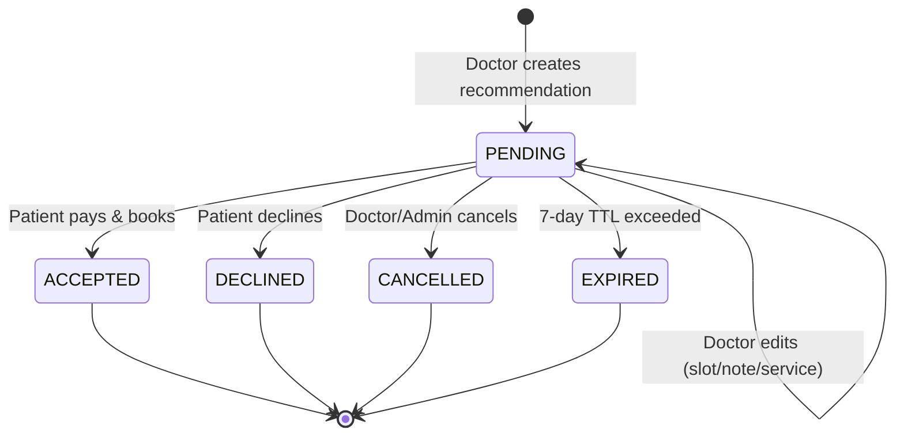

# Design Document: Doctor Recommended Services

## Overview

The "Doctor Recommended Services" feature enables doctors to recommend clinically relevant services to patients after consultation. This creates a guided post-consultation workflow where doctors select a service, date/time slot, and add a clinical note. Patients receive notifications, review recommendations, and either accept (triggering the existing payment/booking flow with pre-selected parameters) or decline (with an optional reason). Doctors retain edit/cancel capabilities until acceptance. Administrators have full oversight with metrics, audit logs, and management capabilities.

The feature integrates deeply with the existing Eye Aura platform: reusing the payment infrastructure (Razorpay), booking request flow, doctor availability/blocks system, and notification framework. A new `service_recommendations` Firestore collection serves as the primary data store, with a finite state machine governing the recommendation lifecycle (PENDING → ACCEPTED/DECLINED/CANCELLED/EXPIRED).

Slot management uses a "soft reservation" pattern — when a doctor recommends a service, the suggested time slot is soft-reserved (marked in a reservation sub-collection) but not fully blocked. This prevents double-booking of the same slot by multiple recommendations while allowing the doctor's general availability to remain open for direct bookings. Upon acceptance and payment, the soft reservation converts to a hard block (via `doctor_blocks`). On cancellation, decline, or expiry, the soft reservation is released.

## Architecture



## Sequence Diagrams

### Doctor Creates Recommendation



### Patient Accepts Recommendation



### Expiration Flow



## State Machine — Recommendation Lifecycle



**Transition Rules:**
| From | To | Actor | Preconditions |
|------|-----|-------|---------------|
| PENDING | ACCEPTED | Patient | Payment completed, slot still available |
| PENDING | DECLINED | Patient | Recommendation not expired |
| PENDING | CANCELLED | Doctor/Admin | Recommendation not yet accepted |
| PENDING | EXPIRED | System | createdAt + expirationDays < now |
| PENDING | PENDING (edit) | Doctor | Recommendation not yet accepted |

## Components and Interfaces

### Component 1: RecommendationsService (Firestore Service)

**Purpose**: CRUD operations and state machine enforcement for the `service_recommendations` collection.

```typescript
interface IRecommendationsService {
  create(data: CreateRecommendationInput): Promise<ServiceRecommendation>;
  getById(id: string): Promise<ServiceRecommendation | null>;
  update(id: string, updates: UpdateRecommendationInput): Promise<ServiceRecommendation>;
  getByPatientId(patientId: string): Promise<ServiceRecommendation[]>;
  getByDoctorId(doctorId: string): Promise<ServiceRecommendation[]>;
  getByStatus(status: RecommendationStatus): Promise<ServiceRecommendation[]>;
  getExpired(): Promise<ServiceRecommendation[]>;
  getAll(): Promise<ServiceRecommendation[]>;
  getMetrics(): Promise<RecommendationMetrics>;
  accept(id: string, bookingId: string): Promise<ServiceRecommendation>;
  decline(id: string, reason?: string): Promise<ServiceRecommendation>;
  cancel(id: string, cancelledBy: string): Promise<ServiceRecommendation>;
  expire(id: string): Promise<ServiceRecommendation>;
}
```

**Responsibilities**:
- Enforce state machine transitions (reject invalid transitions)
- Set timestamps on state changes (acceptedAt, declinedAt, cancelledAt)
- Query by patient, doctor, status
- Calculate aggregate metrics for admin dashboard

### Component 2: SlotReservationService

**Purpose**: Manages soft slot reservations to prevent double-booking of recommended time slots.

```typescript
interface ISlotReservationService {
  checkAvailability(doctorId: string, start: Date, end: Date): Promise<boolean>;
  softReserve(doctorId: string, start: Date, end: Date, recommendationId: string): Promise<string>;
  release(reservationId: string): Promise<void>;
  convertToHardBlock(reservationId: string, reason: string): Promise<void>;
  getByDoctorId(doctorId: string, start: Date, end: Date): Promise<SlotReservation[]>;
}
```

**Responsibilities**:
- Check availability against both soft reservations and hard blocks (doctor_blocks)
- Create/release soft reservations
- Convert soft reservation to hard block upon acceptance
- Prevent overlapping reservations for the same doctor

### Component 3: RecommendationNotificationService

**Purpose**: Handles all notification events for the recommendation lifecycle.

```typescript
interface IRecommendationNotificationService {
  notifyRecommendationCreated(recommendation: ServiceRecommendation): Promise<void>;
  notifyRecommendationAccepted(recommendation: ServiceRecommendation): Promise<void>;
  notifyRecommendationDeclined(recommendation: ServiceRecommendation): Promise<void>;
  notifyRecommendationCancelled(recommendation: ServiceRecommendation): Promise<void>;
  notifyRecommendationExpired(recommendation: ServiceRecommendation): Promise<void>;
  notifyRecommendationEdited(recommendation: ServiceRecommendation): Promise<void>;
}
```

**Responsibilities**:
- Create in-app notifications (Firestore `notifications` collection)
- Queue email notifications for patient/doctor
- Use appropriate clinical language in notifications

### Component 4: Doctor Portal — Recommend Service Form

**Purpose**: React component for doctors to create/edit recommendations from the patient details page.

```typescript
interface RecommendServiceFormProps {
  patientId: string;
  doctorId: string;
  existingRecommendation?: ServiceRecommendation; // For edit mode
  onSuccess: (recommendation: ServiceRecommendation) => void;
  onCancel: () => void;
}

interface RecommendServiceFormState {
  serviceId: string;
  selectedDate: Date | null;
  selectedSlotStart: Date | null;
  selectedSlotEnd: Date | null;
  recommendationNote: string;
  isSubmitting: boolean;
  error: string | null;
}
```

### Component 5: Patient Portal — Recommendations Dashboard Section

**Purpose**: Shows pending recommendations on patient dashboard with action buttons.

```typescript
interface RecommendationCardProps {
  recommendation: ServiceRecommendation;
  service: ServiceDocument;
  doctor: UserDocument;
  onAccept: (id: string) => void;
  onDecline: (id: string) => void;
}

interface RecommendationsListProps {
  patientId: string;
  filter: "pending" | "confirmed" | "declined" | "all";
}
```

### Component 6: Admin Portal — Recommended Services Module

**Purpose**: Full management view with metrics, filtering, and audit capabilities.

```typescript
interface AdminRecommendationsPageProps {}

interface RecommendationMetrics {
  total: number;
  pending: number;
  accepted: number;
  declined: number;
  cancelled: number;
  expired: number;
  conversionRate: number; // accepted / (accepted + declined + expired) * 100
}

interface AdminRecommendationTableRow {
  id: string;
  patientName: string;
  doctorName: string;
  serviceName: string;
  recommendedOn: Date;
  suggestedSlot: { start: Date; end: Date };
  status: RecommendationStatus;
  actions: ("view" | "cancel")[];
}
```

## Data Models

### ServiceRecommendation (Primary Entity)

```typescript
interface ServiceRecommendation {
  id: string;
  patientId: string;
  doctorId: string;
  serviceId: string;
  recommendedSlotStart: Date;
  recommendedSlotEnd: Date;
  status: RecommendationStatus;
  recommendationNote?: string;
  // Timestamps
  createdAt: Date;
  updatedAt: Date;
  acceptedAt?: Date;
  declinedAt?: Date;
  cancelledAt?: Date;
  // Actors
  cancelledBy?: string;
  declineReason?: string;
  // Linkage
  bookingId?: string;
  reservationId?: string; // Links to soft reservation
  // Expiration
  expiresAt: Date; // createdAt + 7 days (configurable)
}

type RecommendationStatus = "PENDING" | "ACCEPTED" | "DECLINED" | "CANCELLED" | "EXPIRED";
```

**Validation Rules:**
- `patientId` must reference an active user with role "patient"
- `doctorId` must reference an active user with role "doctor"
- `serviceId` must reference an active service
- `recommendedSlotStart` must be in the future
- `recommendedSlotEnd` must be after `recommendedSlotStart`
- `recommendedSlotEnd - recommendedSlotStart` must equal the service duration
- `expiresAt` = `createdAt` + configurable expiration period (default 7 days)
- `bookingId` is only set when status transitions to ACCEPTED

### SlotReservation (Soft Reservation)

```typescript
interface SlotReservation {
  id: string;
  doctorId: string;
  recommendationId: string;
  start: Date;
  end: Date;
  status: "active" | "released" | "converted";
  createdAt: Date;
  releasedAt?: Date;
  convertedAt?: Date;
}
```

**Validation Rules:**
- No overlapping active reservations for the same doctor
- `start` must be in the future at creation time
- `status` can only transition: active → released, active → converted

### AuditLogEntry (Embedded in Recommendation or Separate Sub-collection)

```typescript
interface RecommendationAuditEntry {
  id: string;
  recommendationId: string;
  action: RecommendationAuditAction;
  actorId: string;
  actorRole: "doctor" | "patient" | "admin" | "system";
  timestamp: Date;
  previousStatus?: RecommendationStatus;
  newStatus?: RecommendationStatus;
  metadata?: Record<string, any>; // Additional context (edit diffs, reasons, etc.)
}

type RecommendationAuditAction =
  | "created"
  | "edited"
  | "accepted"
  | "declined"
  | "cancelled"
  | "expired"
  | "slot_reserved"
  | "slot_released"
  | "slot_converted";
```

### Extended Notification Types

```typescript
// Add to existing NotificationType union:
type NotificationType =
  | /* existing types... */
  | "recommendation_created"
  | "recommendation_accepted"
  | "recommendation_declined"
  | "recommendation_cancelled"
  | "recommendation_expired"
  | "recommendation_edited";
```

## Algorithmic Pseudocode

### Create Recommendation Algorithm

```typescript
async function createRecommendation(input: CreateRecommendationInput): Promise<ServiceRecommendation> {
  // PRECONDITIONS:
  // - input.doctorId is authenticated and has role "doctor"
  // - input.patientId exists and is active
  // - input.serviceId exists and is active
  // - input.recommendedSlotStart > now
  // - input.recommendedSlotEnd > input.recommendedSlotStart
  
  // Step 1: Validate service exists and doctor can provide it
  const service = await servicesService.getById(input.serviceId);
  if (!service || !service.isActive) throw new AppError("SERVICE_NOT_FOUND");
  if (!service.doctorIds.includes(input.doctorId)) throw new AppError("DOCTOR_NOT_ASSIGNED");
  
  // Step 2: Validate slot duration matches service
  const slotDuration = (input.recommendedSlotEnd.getTime() - input.recommendedSlotStart.getTime()) / 60000;
  if (slotDuration !== service.duration) throw new AppError("INVALID_SLOT_DURATION");
  
  // Step 3: Check slot availability (soft reservations + hard blocks)
  const isAvailable = await slotReservationService.checkAvailability(
    input.doctorId, input.recommendedSlotStart, input.recommendedSlotEnd
  );
  if (!isAvailable) throw new AppError("SLOT_CONFLICT");
  
  // Step 4: Create soft reservation
  const reservationId = await slotReservationService.softReserve(
    input.doctorId, input.recommendedSlotStart, input.recommendedSlotEnd, "" // will update with recommendationId
  );
  
  // Step 5: Create recommendation document
  const now = new Date();
  const expirationDays = 7; // configurable
  const recommendation: ServiceRecommendation = {
    id: generateId(input.patientId, input.doctorId),
    patientId: input.patientId,
    doctorId: input.doctorId,
    serviceId: input.serviceId,
    recommendedSlotStart: input.recommendedSlotStart,
    recommendedSlotEnd: input.recommendedSlotEnd,
    status: "PENDING",
    recommendationNote: input.recommendationNote,
    reservationId,
    expiresAt: new Date(now.getTime() + expirationDays * 24 * 60 * 60 * 1000),
    createdAt: now,
    updatedAt: now,
  };
  
  await firestoreWrite("service_recommendations", recommendation);
  
  // Step 6: Update reservation with recommendation ID
  await slotReservationService.linkRecommendation(reservationId, recommendation.id);
  
  // Step 7: Create audit log entry
  await createAuditEntry(recommendation.id, "created", input.doctorId, "doctor");
  
  // Step 8: Notify patient
  await notificationService.notifyRecommendationCreated(recommendation);
  
  // POSTCONDITIONS:
  // - recommendation.status === "PENDING"
  // - Soft reservation exists for the slot
  // - Patient has been notified (in-app + email)
  // - Audit log entry created
  
  return recommendation;
}
```

### Accept Recommendation Algorithm

```typescript
async function acceptRecommendation(
  recommendationId: string,
  patientId: string,
  paymentData: PaymentVerificationData
): Promise<{ recommendation: ServiceRecommendation; bookingRequestId: string }> {
  // PRECONDITIONS:
  // - patientId is authenticated
  // - recommendation exists with status "PENDING"
  // - recommendation.patientId === patientId
  // - recommendation.expiresAt > now
  // - paymentData is verified (Razorpay signature valid)
  
  // Step 1: Fetch and validate recommendation
  const recommendation = await recommendationsService.getById(recommendationId);
  if (!recommendation) throw new AppError("RECOMMENDATION_NOT_FOUND");
  if (recommendation.status !== "PENDING") throw new AppError("INVALID_STATE_TRANSITION");
  if (recommendation.patientId !== patientId) throw new AppError("UNAUTHORIZED");
  if (recommendation.expiresAt < new Date()) throw new AppError("RECOMMENDATION_EXPIRED");
  
  // Step 2: Verify payment
  const isPaymentValid = await verifyRazorpaySignature(paymentData);
  if (!isPaymentValid) throw new AppError("PAYMENT_VERIFICATION_FAILED");
  
  // Step 3: Create booking request (reuse existing flow)
  const bookingRequest = await bookingRequestsService.create({
    patientId: recommendation.patientId,
    doctorId: recommendation.doctorId,
    serviceId: recommendation.serviceId,
    requestedTime: recommendation.recommendedSlotStart,
    notes: recommendation.recommendationNote || "Recommended by doctor",
    paymentId: paymentData.paymentId,
    paymentStatus: "completed",
    paymentAmount: paymentData.amount,
  });
  
  // Step 4: Convert soft reservation to hard block
  if (recommendation.reservationId) {
    await slotReservationService.convertToHardBlock(
      recommendation.reservationId,
      `Recommendation accepted: ${recommendationId}`
    );
  }
  
  // Step 5: Update recommendation status
  const updatedRecommendation = await recommendationsService.accept(
    recommendationId, bookingRequest.id
  );
  
  // Step 6: Create audit entry
  await createAuditEntry(recommendationId, "accepted", patientId, "patient");
  
  // Step 7: Notify doctor
  await notificationService.notifyRecommendationAccepted(updatedRecommendation);
  
  // POSTCONDITIONS:
  // - recommendation.status === "ACCEPTED"
  // - recommendation.bookingId is set
  // - recommendation.acceptedAt is set
  // - Soft reservation converted to doctor_block
  // - Booking request created with payment linked
  // - Doctor notified
  
  return { recommendation: updatedRecommendation, bookingRequestId: bookingRequest.id };
}
```

### Expiration Check Algorithm

```typescript
async function checkAndExpireRecommendations(): Promise<number> {
  // PRECONDITIONS:
  // - Called periodically (client-side on page load OR cloud function on schedule)
  
  const now = new Date();
  
  // Step 1: Query all PENDING recommendations past their expiry
  const expired = await recommendationsService.getExpired();
  // Equivalent to: WHERE status == "PENDING" AND expiresAt < now
  
  let expiredCount = 0;
  
  // Step 2: Process each expired recommendation
  // LOOP INVARIANT: All previously processed recommendations have been expired
  for (const recommendation of expired) {
    // Step 2a: Update status to EXPIRED
    await recommendationsService.expire(recommendation.id);
    
    // Step 2b: Release soft reservation
    if (recommendation.reservationId) {
      await slotReservationService.release(recommendation.reservationId);
    }
    
    // Step 2c: Create audit entry
    await createAuditEntry(recommendation.id, "expired", "system", "system");
    
    // Step 2d: Notify both parties
    await notificationService.notifyRecommendationExpired(recommendation);
    
    expiredCount++;
  }
  
  // POSTCONDITIONS:
  // - All expired recommendations have status "EXPIRED"
  // - All associated soft reservations released
  // - Both doctor and patient notified for each expiration
  // - Audit entries created
  
  return expiredCount;
}
```

### Slot Availability Check Algorithm

```typescript
async function checkSlotAvailability(
  doctorId: string,
  start: Date,
  end: Date
): Promise<boolean> {
  // PRECONDITIONS:
  // - start < end
  // - start is in the future
  // - doctorId is a valid doctor
  
  // Step 1: Check hard blocks (doctor_blocks)
  const blocks = await doctorBlocksService.getByDoctorIdAndRange(doctorId, start, end);
  if (blocks.length > 0) return false;
  
  // Step 2: Check active soft reservations
  const reservations = await getActiveReservations(doctorId, start, end);
  // Overlap check: reservation overlaps if reservation.start < end AND reservation.end > start
  const hasOverlap = reservations.some(
    (r) => r.start < end && r.end > start && r.status === "active"
  );
  if (hasOverlap) return false;
  
  // Step 3: Verify doctor has availability defined for this day/time
  const dayOfWeek = getDayOfWeek(start); // "monday", "tuesday", etc.
  const availability = await doctorAvailabilityService.getByDoctorIdAndDay(doctorId, dayOfWeek);
  if (!availability || availability.isOff) return false;
  
  // Step 4: Check time falls within doctor's defined ranges
  const timeStr = formatTime(start); // "HH:mm"
  const endTimeStr = formatTime(end);
  const inRange = availability.timeRanges.some(
    (range) => timeStr >= range.startTime && endTimeStr <= range.endTime
  );
  
  // POSTCONDITIONS:
  // - Returns true IFF no hard blocks, no soft reservations, and within doctor's availability
  
  return inRange;
}
```

## Key Functions with Formal Specifications

### Function: transitionStatus()

```typescript
function transitionStatus(
  current: RecommendationStatus,
  target: RecommendationStatus,
  actor: "doctor" | "patient" | "admin" | "system"
): boolean
```

**Preconditions:**
- `current` is a valid RecommendationStatus
- `target` is a valid RecommendationStatus
- `actor` is a valid role

**Postconditions:**
- Returns `true` if and only if the transition is valid per the state machine
- Valid transitions: PENDING→ACCEPTED (patient), PENDING→DECLINED (patient), PENDING→CANCELLED (doctor|admin), PENDING→EXPIRED (system)
- Returns `false` for all other combinations
- No side effects

### Function: calculateExpiresAt()

```typescript
function calculateExpiresAt(createdAt: Date, expirationDays: number = 7): Date
```

**Preconditions:**
- `createdAt` is a valid Date
- `expirationDays` > 0

**Postconditions:**
- Returns a Date exactly `expirationDays * 24 * 60 * 60 * 1000` milliseconds after `createdAt`
- Result > createdAt
- Pure function, no side effects

### Function: isRecommendationExpired()

```typescript
function isRecommendationExpired(recommendation: ServiceRecommendation): boolean
```

**Preconditions:**
- `recommendation` is a valid ServiceRecommendation with `expiresAt` set
- `recommendation.status === "PENDING"` (only PENDING recommendations can expire)

**Postconditions:**
- Returns `true` if `now > recommendation.expiresAt`
- Returns `false` otherwise
- Pure function (reads system clock), no mutations

### Function: generateRecommendationId()

```typescript
function generateRecommendationId(patientId: string, doctorId: string): string
```

**Preconditions:**
- `patientId` is a non-empty string
- `doctorId` is a non-empty string

**Postconditions:**
- Returns a unique string in format `rec_{patientId}_{doctorId}_{timestamp}`
- Result is a valid Firestore document ID
- Two calls with same inputs at different times produce different IDs

## Example Usage

```typescript
// Example 1: Doctor creates a recommendation
const recommendation = await fetch("/api/recommendations/create", {
  method: "POST",
  headers: {
    "Content-Type": "application/json",
    Authorization: `Bearer ${doctorIdToken}`,
  },
  body: JSON.stringify({
    patientId: "patient_abc123",
    serviceId: "service_contact_lens",
    recommendedSlotStart: "2025-02-15T10:00:00.000Z",
    recommendedSlotEnd: "2025-02-15T10:30:00.000Z",
    recommendationNote: "Further evaluation recommended for contact lens fitting based on today's consultation findings.",
  }),
});

// Example 2: Patient accepts a recommendation (triggers payment)
const acceptResponse = await fetch(`/api/recommendations/${recId}/accept`, {
  method: "POST",
  headers: {
    "Content-Type": "application/json",
    Authorization: `Bearer ${patientIdToken}`,
  },
  body: JSON.stringify({
    razorpayOrderId: "order_xyz",
    razorpayPaymentId: "pay_abc",
    razorpaySignature: "sig_123",
    paymentId: "payment_doc_id",
  }),
});
// Returns: { bookingRequestId: "patient_abc_doctor_xyz_1707990000000" }

// Example 3: Patient declines with reason
await fetch(`/api/recommendations/${recId}/decline`, {
  method: "POST",
  headers: {
    "Content-Type": "application/json",
    Authorization: `Bearer ${patientIdToken}`,
  },
  body: JSON.stringify({
    reason: "Schedule conflict, will book manually later",
  }),
});

// Example 4: Doctor edits recommendation before acceptance
await fetch(`/api/recommendations/${recId}`, {
  method: "PATCH",
  headers: {
    "Content-Type": "application/json",
    Authorization: `Bearer ${doctorIdToken}`,
  },
  body: JSON.stringify({
    recommendedSlotStart: "2025-02-16T14:00:00.000Z",
    recommendedSlotEnd: "2025-02-16T14:30:00.000Z",
    recommendationNote: "Updated: Moved to next day per patient availability discussion.",
  }),
});

// Example 5: Admin fetches metrics
const metrics = await fetch("/api/recommendations/metrics", {
  headers: { Authorization: `Bearer ${adminIdToken}` },
});
// Returns: { total: 45, pending: 12, accepted: 20, declined: 8, cancelled: 3, expired: 2, conversionRate: 66.7 }
```

## Correctness Properties

*A property is a characteristic or behavior that should hold true across all valid executions of a system — essentially, a formal statement about what the system should do. Properties serve as the bridge between human-readable specifications and machine-verifiable correctness guarantees.*

### Property 1: State Machine Integrity

*For any* recommendation status and attempted transition, only valid transitions from PENDING (to ACCEPTED, DECLINED, CANCELLED, or EXPIRED) succeed. All other transition attempts are rejected with an error, and the recommendation status remains unchanged.

**Validates: Requirements 1.3, 1.4, 1.8**

### Property 2: Creation Postconditions

*For any* valid set of inputs (active service, future slot, correct duration, available slot), creating a recommendation produces a ServiceRecommendation with status PENDING, expiresAt equal to createdAt plus 7 days, all required fields populated, and an associated active Soft_Reservation.

**Validates: Requirements 1.1, 1.2, 2.1, 2.7, 6.1, 7.1**

### Property 3: Terminal State Metadata Recording

*For any* recommendation that transitions to a terminal state, the appropriate timestamp is recorded: acceptedAt and bookingId for ACCEPTED, declinedAt for DECLINED, cancelledAt and cancelledBy for CANCELLED. The metadata is never set for transitions that did not occur.

**Validates: Requirements 1.5, 1.6, 1.7, 3.6, 4.5, 5.4, 9.5**

### Property 4: No Double Booking (Slot Non-Overlap)

*For any* doctor and time range, at most one active Soft_Reservation or Hard_Block can exist that overlaps that range. If a conflicting reservation or block exists, recommendation creation or edit fails with a conflict error.

**Validates: Requirements 2.5, 2.6, 6.2, 6.3**

### Property 5: Slot Availability Validates Schedule

*For any* slot request where the time does not fall within the doctor's defined availability schedule for that day, the availability check returns false and creation is rejected.

**Validates: Requirements 6.4**

### Property 6: Reservation Release on Terminal States

*For any* recommendation that transitions from PENDING to DECLINED, CANCELLED, or EXPIRED, the associated Soft_Reservation status is set to released and releasedAt is recorded.

**Validates: Requirements 3.7, 4.6, 6.5, 7.4**

### Property 7: Reservation Conversion on Acceptance

*For any* recommendation that transitions to ACCEPTED, the associated Soft_Reservation status is set to converted, convertedAt is recorded, and a corresponding Hard_Block is created in doctor_blocks for the same time range.

**Validates: Requirements 5.6, 6.6**

### Property 8: Reservation State Machine

*For any* Soft_Reservation, only the transitions active→released and active→converted are permitted. No other status changes are allowed.

**Validates: Requirements 6.7**

### Property 9: Expiration Identification

*For any* set of ServiceRecommendations, after the ExpirationService runs, all recommendations where status was PENDING and expiresAt is less than the current time have transitioned to EXPIRED status, and no non-expired recommendations are affected.

**Validates: Requirements 7.2, 7.3**

### Property 10: Expired Recommendation Rejection

*For any* recommendation where expiresAt is in the past, an acceptance attempt is rejected with an expiration error and the status remains unchanged.

**Validates: Requirements 4.8**

### Property 11: Payment Failure Preserves State

*For any* recommendation where payment verification fails or is cancelled, the recommendation remains in PENDING status and the associated Soft_Reservation remains active.

**Validates: Requirements 5.3, 5.7**

### Property 12: Booking Request Data Integrity

*For any* accepted recommendation, the resulting booking request contains the recommendation's patientId, doctorId, serviceId, requestedTime matching recommendedSlotStart, and verified payment details.

**Validates: Requirements 5.5**

### Property 13: Validation Rejects Invalid Inputs

*For any* recommendation creation attempt with an inactive or unassigned service, a past recommendedSlotStart, or a slot duration not matching the service duration, the operation is rejected with a validation error and no documents are created.

**Validates: Requirements 2.2, 2.3, 2.4**

### Property 14: Access Control Enforcement

*For any* user attempting a recommendation action, if the user lacks the required role or does not own the resource (doctor for create/edit/cancel of their recommendations, patient for accept/decline of their recommendations, admin for read-all/cancel-any), the request is rejected with 403 Forbidden.

**Validates: Requirements 10.2, 10.3, 10.4, 10.5**

### Property 15: Rate Limiting

*For any* doctor-patient pair that already has 10 pending recommendations, any additional creation attempt for that pair is rejected.

**Validates: Requirements 10.6**

### Property 16: Input Sanitization

*For any* input string provided as recommendationNote or declineReason, the stored value is at most 500 characters and contains no HTML tags.

**Validates: Requirements 10.7**

### Property 17: Metrics Calculation Correctness

*For any* set of recommendations, the metrics counts (total, pending, accepted, declined, cancelled, expired) match the actual status distribution, and conversion rate equals accepted / (accepted + declined + expired) × 100.

**Validates: Requirements 9.1, 9.2**

### Property 18: Filter Correctness

*For any* filter applied to the recommendations table (status, doctor, patient, date range, service), all returned results satisfy the filter criteria and no matching results are excluded.

**Validates: Requirements 9.4**

### Property 19: Pagination Ordering

*For any* page of recommendations returned by cursor-based pagination, items are ordered by createdAt descending, and consecutive pages contain no overlapping or missing items.

**Validates: Requirements 9.7**

### Property 20: Edit Releases Old and Creates New Reservation

*For any* successful slot edit on a PENDING recommendation, the previous Soft_Reservation is released and a new active Soft_Reservation is created for the updated slot. If the new slot conflicts, the edit is rejected and the original reservation remains active.

**Validates: Requirements 3.2, 3.3, 3.4**

### Property 21: Terminology Compliance

*For any* user-facing notification or communication generated by the Recommendation_System, the text uses the term "recommended" and does not contain the term "prescribed."

**Validates: Requirements 11.5**

## Error Handling

### Error Scenario 1: Slot Conflict at Recommendation Creation

**Condition**: Doctor tries to recommend a slot that is already soft-reserved by another pending recommendation or hard-blocked.
**Response**: Return 409 Conflict with message "This time slot is no longer available. Please select a different time."
**Recovery**: Doctor selects a different time slot and retries.

### Error Scenario 2: Recommendation Expired During Accept Flow

**Condition**: Patient clicks "Pay & Book" but the recommendation expired between page load and payment completion.
**Response**: Return 410 Gone with message "This recommendation has expired. Please contact your doctor for a new recommendation."
**Recovery**: Patient is redirected to recommendations list. Doctor is notified to re-create if needed.

### Error Scenario 3: Payment Fails After Acceptance Initiated

**Condition**: Razorpay payment fails or is cancelled after the accept flow begins.
**Response**: Recommendation remains in PENDING status. No state transition occurs until payment is verified.
**Recovery**: Patient can retry payment. Soft reservation remains active (not converted).

### Error Scenario 4: Doctor Edits Slot to Conflicting Time

**Condition**: Doctor edits the recommended slot, but the new time conflicts with an existing reservation/block.
**Response**: Return 409 Conflict. Previous slot reservation remains active.
**Recovery**: Doctor must choose a non-conflicting time slot.

### Error Scenario 5: Concurrent Accept and Cancel

**Condition**: Patient accepts (payment in progress) while doctor simultaneously cancels.
**Response**: Use Firestore transaction with optimistic concurrency. First write wins. If cancel wins, payment is refunded. If accept wins, cancel fails with "Recommendation already accepted."
**Recovery**: If cancel wins, patient receives refund notification. If accept wins, doctor sees updated status.

### Error Scenario 6: Network Failure During State Transition

**Condition**: Network drops after Firestore write but before notification delivery.
**Response**: State change persists (Firestore is source of truth). Notifications are retried on next page load via a "pending notifications" check.
**Recovery**: Eventual consistency — notifications may be delayed but state is correct.

## Testing Strategy

### Unit Testing Approach

- **State machine tests**: Verify all valid transitions succeed and all invalid transitions throw
- **Expiration logic tests**: Verify time calculations with mock dates
- **Slot overlap detection tests**: Various overlap scenarios (partial, full, edge-touching)
- **ID generation tests**: Uniqueness and format compliance
- **Validation tests**: Input validation for all API endpoints

### Property-Based Testing Approach

**Property Test Library**: fast-check

Key properties to test:
1. **Roundtrip**: Creating a recommendation and fetching by ID returns the same data
2. **State machine closure**: Random sequences of transitions never produce an invalid state
3. **Slot non-overlap**: Generating random reservations, no two active reservations for the same doctor overlap
4. **Expiration monotonicity**: If recommendation A was created before B, A expires before B (given same expiration period)

### Integration Testing Approach

- **Full accept flow**: Create recommendation → patient accepts → verify booking request + hard block created
- **Full decline flow**: Create recommendation → patient declines → verify slot released
- **Expiration flow**: Create recommendation → advance time → run expiration → verify status + slot released
- **Concurrent operations**: Multiple recommendations for same slot → only first succeeds
- **Doctor edit flow**: Create → edit slot → verify old reservation released, new one created

## Performance Considerations

- **Firestore indexes**: Composite indexes on `(doctorId, status)`, `(patientId, status)`, `(status, expiresAt)` for efficient queries
- **Expiration batch size**: Process expirations in batches of 50 to avoid Firestore write limits
- **Client-side expiration check**: Run expiration logic on page load to avoid the cost of a dedicated Cloud Function (can add scheduled function later if volume increases)
- **Denormalization**: Store doctor name and service title on the recommendation document to avoid joins for list views
- **Pagination**: Admin table uses cursor-based pagination with `orderBy("createdAt", "desc")` and `startAfter(lastDoc)`

## Security Considerations

- **Firestore Security Rules**: 
  - Doctors can only create recommendations where `doctorId == request.auth.uid`
  - Patients can only read/accept/decline recommendations where `patientId == request.auth.uid`
  - Admins have full read/cancel access
  - No direct client writes to `status` field (all transitions via API routes with server-side validation)
- **API Route Auth**: All endpoints verify Firebase ID token and check role/ownership
- **Rate Limiting**: Maximum 10 pending recommendations per doctor-patient pair to prevent spam
- **Input Sanitization**: `recommendationNote` and `declineReason` are sanitized (max 500 chars, no HTML)
- **Payment Verification**: Accept flow requires valid Razorpay signature (server-side verification only)

## Page Routing

| Route | Portal | Purpose |
|-------|--------|---------|
| `/doctor/patients/[patientId]` | Doctor | Patient details with "Recommended Services" tab |
| `/patient/recommendations` | Patient | Full recommendations page with tabs |
| `/patient/dashboard` | Patient | Dashboard section showing pending recommendations |
| `/admin/recommendations` | Admin | Full management page with metrics + table |
| `/api/recommendations/create` | API | Create recommendation |
| `/api/recommendations/[id]` | API | PATCH (edit) |
| `/api/recommendations/[id]/accept` | API | Accept (patient) |
| `/api/recommendations/[id]/decline` | API | Decline (patient) |
| `/api/recommendations/[id]/cancel` | API | Cancel (doctor/admin) |
| `/api/recommendations` | API | GET with query params |
| `/api/recommendations/metrics` | API | GET admin metrics |

## Dependencies

- **Existing Services**: `servicesService`, `bookingRequestsService`, `doctorAvailabilityService`, `doctorBlocksService`, `notificationsService`, `usersService`
- **Existing Infrastructure**: Razorpay payment gateway, Firebase Auth, Firestore
- **New Collections**: `service_recommendations`, `slot_reservations`, `recommendation_audit_log`
- **Extended Types**: `NotificationType` union extended with recommendation events
- **UI Libraries**: Existing premium component system (`FloatingSidebar`, `PageTransition`, glass design tokens)
- **Email Service**: Existing email API route pattern (extend for recommendation templates)
