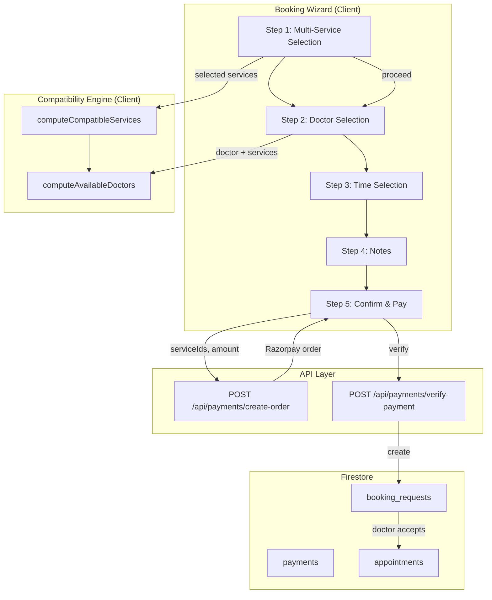

# Design Document: Multi-Service Booking

## Overview

This design transforms the existing single-service booking wizard into a multi-service booking system. The core change is enabling patients to select multiple compatible services in Step 1, filtering doctors to those who can perform all selected services, and combining payment into a single Razorpay order.

The design preserves backward compatibility: single-service bookings work identically (minus the auto-advance UX), existing queries on `serviceId` continue to function, and the new `serviceIds` array field provides forward-looking support for multi-service workflows.

### Key Design Decisions

1. **Compatibility as intersection**: A service is "compatible" with the current selection when the intersection of its `doctorIds` with the intersection of all currently-selected services' `doctorIds` is non-empty.
2. **No auto-advance**: Steps 1 and 2 use explicit Continue buttons, giving patients full control.
3. **Single payment order**: All selected services are paid in one Razorpay transaction (sum of prices).
4. **Dual field strategy**: `serviceId` (string, first service) retained for backward compatibility; `serviceIds` (string array) added for full multi-service support.
5. **Client-side computation**: Compatibility logic runs on already-fetched service data — no extra API calls needed.

## Architecture



### Data Flow

1. Patient selects services → compatibility computed client-side via `doctorIds` intersection
2. Patient proceeds to Step 2 → only doctors in the intersection are shown
3. Patient may add more services from the doctor's offerings in Step 2
4. Patient proceeds through Time → Notes → Confirm
5. Confirm step sends all `serviceIds` + combined `amount` to `create-order`
6. After Razorpay payment, `verify-payment` creates a `booking_request` with `serviceIds` array
7. When doctor accepts, appointment is created with `serviceIds` and combined duration

## Components and Interfaces

### 1. Service Compatibility Module

**Location:** `lib/booking/compatibility.ts` (new file)

```typescript
/**
 * Computes the set of doctorIds that can provide ALL given services.
 * Returns the intersection of doctorIds across all services.
 */
export function computeDoctorIntersection(services: ServiceDocument[]): string[];

/**
 * Given the current selection and all available services,
 * returns a map of serviceId → { compatible: boolean }.
 * A service is compatible if adding it keeps the doctor intersection non-empty.
 */
export function computeServiceCompatibility(
  selectedServices: ServiceDocument[],
  allServices: ServiceDocument[]
): Map<string, { compatible: boolean }>;

/**
 * Calculates total price and duration for selected services.
 */
export function computeBookingSummary(services: ServiceDocument[]): {
  totalPrice: number;
  totalDuration: number;
  currency: string;
};
```

### 2. Updated BookingState

**Location:** `types/booking.ts`

```typescript
export interface BookingState {
  currentStep: number;
  selectedServices: ServiceDocument[];   // Replaces single `service`
  doctor: UserDocument | null;
  slot: DoctorSlotDocument | null;
  notes: string;
  loading: boolean;
  error: string | null;
}
```

### 3. Updated Booking Page Components

**Location:** `app/booking/page.tsx`

- `ServiceSelectionStep` — refactored for multi-select with compatibility indicators, summary bar, and Continue button
- `DoctorSelectionStep` — filters doctors by intersection; adds services from doctor; uses Continue button
- `ConfirmationStep` — shows all selected services with itemized breakdown and combined total

### 4. Updated Payment API

**`POST /api/payments/create-order`** — accepts `serviceIds: string[]` alongside existing `serviceId` for compatibility:

```typescript
interface CreateOrderBody {
  doctorId: string;
  serviceIds: string[];       // New: array of service IDs
  serviceId?: string;         // Deprecated: kept for backward compat
  requestedTime: string;
  notes?: string;
  amount: number;             // Combined total
  currency: string;
}
```

**`POST /api/payments/verify-payment`** — stores `serviceIds` on the created `booking_request`:

The payment document already stores `serviceId`. It will additionally store `serviceIds`. On verification, the booking request is created with both fields.

### 5. Service Compatibility Visualization

The Step 1 UI renders incompatible services with:
- Reduced opacity (greyed out)
- Disabled click interaction
- Tooltip on hover/tap: "No common doctor available for this combination"

## Data Models

### BookingState (Client-Side)

```typescript
// types/booking.ts — UPDATED
export interface BookingState {
  currentStep: number;
  selectedServices: ServiceDocument[];  // Array replaces single `service`
  doctor: UserDocument | null;
  slot: DoctorSlotDocument | null;
  notes: string;
  loading: boolean;
  error: string | null;
}
```

### BookingRequestDocument (Firestore)

```typescript
// types/firestore.ts — ADDITIONS to existing interface
export interface BookingRequestDocument {
  // ... existing fields ...
  serviceId: string;           // First service ID (backward compat)
  serviceIds?: string[];       // NEW: All selected service IDs
  combinedDuration?: number;   // NEW: Total duration in minutes
  // paymentAmount already stores the combined total
}
```

### AppointmentDocument (Firestore)

```typescript
// types/firestore.ts — ADDITIONS to existing interface
export interface AppointmentDocument {
  // ... existing fields ...
  serviceId: string;           // First service ID (backward compat)
  serviceIds?: string[];       // NEW: All service IDs for the appointment
  combinedDuration?: number;   // NEW: Total scheduled duration in minutes
}
```

### PaymentDocument (Firestore)

```typescript
// payments collection — ADDITIONS
{
  // ... existing fields ...
  serviceId: string;           // First service (backward compat)
  serviceIds?: string[];       // NEW: All services being paid for
}
```

### Migration Strategy

- **No data migration needed**: existing documents without `serviceIds` are treated as single-service (fallback to `[serviceId]`).
- New bookings always write both `serviceId` (first item) and `serviceIds` (full array).
- Read-side logic: `const ids = doc.serviceIds ?? [doc.serviceId]`.


## Correctness Properties

*A property is a characteristic or behavior that should hold true across all valid executions of a system — essentially, a formal statement about what the system should do. Properties serve as the bridge between human-readable specifications and machine-verifiable correctness guarantees.*

### Property 1: Service compatibility correctness

*For any* set of currently selected services and *any* candidate service not in the selection, the candidate is compatible if and only if the intersection of its `doctorIds` with the intersection of all selected services' `doctorIds` is non-empty.

**Validates: Requirements 1.3, 2.1, 2.3, 2.4**

### Property 2: Doctor intersection correctness

*For any* non-empty array of services, `computeDoctorIntersection(services)` shall return exactly the set of doctor IDs that appear in every service's `doctorIds` array (the mathematical set intersection).

**Validates: Requirements 3.1**

### Property 3: Price summation correctness

*For any* array of services with numeric prices, `computeBookingSummary(services).totalPrice` shall equal the arithmetic sum of all individual service prices, and the currency shall equal the first service's currency.

**Validates: Requirements 1.5, 5.1, 5.4**

### Property 4: Duration summation correctness

*For any* array of services with numeric durations, the combined duration shall equal the arithmetic sum of all individual service durations.

**Validates: Requirements 6.4**

### Property 5: Service toggle preserves step

*For any* booking state at Step 1 and *any* service toggled (selected or deselected), the `currentStep` value shall remain unchanged after the toggle operation.

**Validates: Requirements 1.2**

### Property 6: serviceId backward compatibility invariant

*For any* booking request or appointment created with a non-empty `serviceIds` array, the `serviceId` field shall always equal `serviceIds[0]`.

**Validates: Requirements 7.2**

### Property 7: Effective service list fallback

*For any* document, the effective service list shall equal `serviceIds` when present, or `[serviceId]` when `serviceIds` is undefined or empty.

**Validates: Requirements 7.3**

### Property 8: Navigation preserves selection

*For any* non-empty service selection at Step 1, advancing to Step 2 and then navigating back to Step 1 shall result in the same set of selected services (order-preserved).

**Validates: Requirements 8.5**

## Error Handling

| Scenario | Handling |
|----------|----------|
| **Empty doctor intersection in Step 2** | Display informational message: "No single doctor provides all selected services." Offer Back button to adjust selection. Do not allow forward navigation. |
| **Service becomes inactive mid-flow** | If a selected service is no longer active when `create-order` is called, the API returns `400` with error identifying the stale service. Client removes it from selection and shows toast. |
| **Payment creation fails** | Existing error flow unchanged — toast with "Payment creation failed" and loading state reset. |
| **Razorpay signature mismatch** | Existing flow — payment marked `failed`, user shown verification error. |
| **Network failure on verify-payment** | Idempotency key (existing `bookingRequestId` check) ensures retries don't create duplicate booking requests. |
| **Currency mismatch across services** | Prevented by design: all services at Eye Aura use INR. API validates all service currencies match; returns `400` if not. |
| **Zero services selected at confirm** | Continue button is disabled when selection is empty, preventing this state. API also validates `serviceIds` is non-empty. |

## Testing Strategy

### Property-Based Tests (fast-check + Vitest)

The following pure functions are ideal for property-based testing:

| Function | Properties Tested | Min Iterations |
|----------|-------------------|----------------|
| `computeDoctorIntersection` | Property 2 | 100 |
| `computeServiceCompatibility` | Property 1 | 100 |
| `computeBookingSummary` | Property 3, Property 4 | 100 |
| `getEffectiveServiceIds` (fallback helper) | Property 7 | 100 |

**Library:** `fast-check` (already in devDependencies)
**Runner:** `vitest`
**Configuration:** Each property test runs minimum 100 iterations.
**Tagging:** Each test file includes a comment referencing the property:
```typescript
// Feature: multi-service-booking, Property 2: Doctor intersection correctness
```

### Unit Tests (Vitest)

- Toggle service selection state logic (Property 5 — example-based for UI)
- Continue button enabled/disabled conditions (Requirements 1.6, 1.7, 4.4)
- serviceId = serviceIds[0] write logic (Property 6)
- Navigation state preservation (Property 8 — example-based for state management)
- "Also available from this doctor" filtering logic

### Integration Tests

- `POST /api/payments/create-order` with multiple serviceIds — verify Razorpay order amount
- `POST /api/payments/verify-payment` — verify booking_request document has `serviceIds` array
- Full wizard flow with single service (backward compatibility)
- Full wizard flow with multiple services
- Idempotency: repeated verify-payment calls return same bookingRequestId

### Component Tests (React Testing Library)

- ServiceSelectionStep renders all services with selection indicators
- Incompatible services are visually disabled with tooltip
- Summary bar updates reactively
- DoctorSelectionStep shows only intersection doctors
- Empty intersection shows informational message
