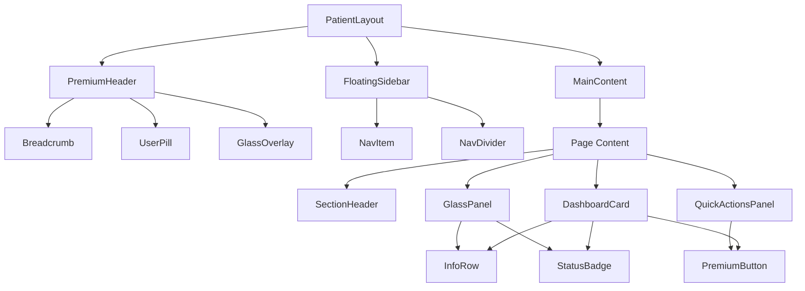

# Design Document: Patient Portal Premium UI

## Overview

This design establishes a premium design system for the Eye Aura Patient Portal, transforming it from ad-hoc styling into a cohesive, token-driven component architecture. The system introduces 6 reusable components (DashboardCard, StatusBadge, PremiumButton, GlassPanel, InfoRow, SectionHeader), a consistent radius hierarchy, layered glassmorphism backgrounds, Framer Motion microinteractions, and strict theme token compliance.

The architecture prioritizes:
- **Zero hardcoded colors** — all color values flow from CSS custom properties
- **Dynamic theming** — admin palette changes propagate automatically
- **Premium feel through structure** — spacing, typography, layering, shadows, blur, and animation create quality without relying on specific color values
- **Dark mode readiness** — token-based approach ensures compatibility when dark mode tokens are defined

### Key Design Decisions

1. **New component directory** (`components/patient-portal/`) rather than modifying existing `components/ui/` — the premium components are Patient Portal-specific and wrap/extend the base UI primitives
2. **Design tokens as a constants file** — centralizes radius, spacing, shadow, and animation values for consistency and easy updates
3. **Framer Motion variants as shared presets** — avoids duplicating animation definitions across components
4. **CVA (class-variance-authority)** for variant management — already used in the project for the Button component

## Architecture

### Component Hierarchy



### Layer Architecture

```
┌─────────────────────────────────────────────────┐
│  Layer 0: Body Background                        │
│  (--background + radial gradient glows)          │
├─────────────────────────────────────────────────┤
│  Layer 1: Layout Containers (rounded-[32px])     │
│  (Header hero, Sidebar, Page wrappers)           │
├─────────────────────────────────────────────────┤
│  Layer 2: Glass Panels (backdrop-blur-xl)        │
│  (GlassPanel, elevated sections)                 │
├─────────────────────────────────────────────────┤
│  Layer 3: Cards (rounded-3xl, soft shadow)       │
│  (DashboardCard, content cards)                  │
├─────────────────────────────────────────────────┤
│  Layer 4: Interactive Elements                   │
│  (PremiumButton, StatusBadge, inputs)            │
└─────────────────────────────────────────────────┘
```

## Components and Interfaces

### 1. DashboardCard

```typescript
// components/patient-portal/dashboard-card.tsx
import { type ReactNode } from "react";
import { type HTMLMotionProps } from "framer-motion";

export interface DashboardCardProps extends Omit<HTMLMotionProps<"div">, "children"> {
  children: ReactNode;
  /** Additional CSS classes */
  className?: string;
  /** Disable hover animation */
  disableHover?: boolean;
  /** Stagger index for entrance animation (delay = index * 80ms) */
  staggerIndex?: number;
}
```

**Styling contract:**
- `rounded-3xl` border radius
- `backdrop-blur-xl` with `bg-[hsl(var(--card)/0.82)]` background
- Box shadow: `shadow-[0_22px_70px_hsl(var(--primary)/0.09)]`
- Top border highlight: `border border-white/60`
- Internal padding: `p-6` (24px)
- Hover: `translateY(-2px)` over 200ms ease
- Entrance: staggered fade-up via Framer Motion

### 2. StatusBadge

```typescript
// components/patient-portal/status-badge.tsx
import { type ReactNode } from "react";

export type StatusVariant =
  | "pending"
  | "confirmed"
  | "in_progress"
  | "completed"
  | "cancelled"
  | "requested"
  | "active"
  | "inactive";

export interface StatusBadgeProps {
  /** Status variant determining color scheme */
  variant: StatusVariant;
  /** Badge content */
  children: ReactNode;
  /** Additional CSS classes */
  className?: string;
  /** Size variant */
  size?: "sm" | "md";
}
```

**Variant color mapping (all token-derived with opacity modifiers):**
- `pending`: `bg-[hsl(var(--secondary)/0.12)] text-[hsl(var(--secondary))]`
- `confirmed`: `bg-[hsl(var(--primary)/0.1)] text-[hsl(var(--primary))]`
- `in_progress`: `bg-[hsl(var(--accent)/0.25)] text-[hsl(var(--accent-foreground))]`
- `completed`: `bg-[hsl(var(--muted)/0.6)] text-[hsl(var(--muted-foreground))]`
- `cancelled`: `bg-[hsl(var(--ring)/0.15)] text-[hsl(var(--foreground)/0.7)]`
- `requested`: `bg-[hsl(var(--secondary)/0.08)] text-[hsl(var(--secondary)/0.9)]`
- `active`: `bg-[hsl(var(--primary)/0.1)] text-[hsl(var(--primary))]`
- `inactive`: `bg-[hsl(var(--muted)/0.5)] text-[hsl(var(--muted-foreground))]`

**Styling contract:**
- `rounded-full` border radius
- `px-3 py-1` (sm) or `px-4 py-1.5` (md) padding
- `text-xs font-semibold uppercase tracking-wide`
- Border: `border border-current/15`

### 3. PremiumButton

```typescript
// components/patient-portal/premium-button.tsx
import { type ReactNode, type ButtonHTMLAttributes } from "react";

export type PremiumButtonVariant = "primary" | "secondary" | "outline" | "ghost";
export type PremiumButtonSize = "sm" | "md" | "lg" | "icon";

export interface PremiumButtonProps extends ButtonHTMLAttributes<HTMLButtonElement> {
  /** Visual variant */
  variant?: PremiumButtonVariant;
  /** Size variant */
  size?: PremiumButtonSize;
  /** Leading icon */
  icon?: ReactNode;
  /** Trailing icon */
  trailingIcon?: ReactNode;
  /** Render as child element (Radix Slot pattern) */
  asChild?: boolean;
  /** Full width */
  fullWidth?: boolean;
  /** Loading state */
  loading?: boolean;
  children?: ReactNode;
}
```

**Variant styles (all token-based):**
- `primary`: `bg-[hsl(var(--primary))] text-[hsl(var(--primary-foreground))]` with shadow
- `secondary`: `bg-[hsl(var(--secondary))] text-[hsl(var(--secondary-foreground))]` with shadow
- `outline`: `border border-[hsl(var(--border))] bg-transparent text-[hsl(var(--foreground))]`
- `ghost`: `bg-transparent text-[hsl(var(--foreground))] hover:bg-[hsl(var(--muted)/0.5)]`

**Sizing:**
- `sm`: `min-h-9 px-4 text-sm rounded-xl`
- `md`: `min-h-11 px-5 text-sm rounded-2xl`
- `lg`: `min-h-12 px-6 text-base rounded-2xl`
- `icon`: `h-11 w-11 rounded-2xl`

**Interactions:**
- Hover: `shadow` elevation increase over 200ms, subtle `translateY(-1px)`
- Active/Click: `scale(0.98)` for tactile feedback
- Focus: `ring-2 ring-[hsl(var(--ring))] ring-offset-2`
- Minimum touch target: 44px height

### 4. GlassPanel

```typescript
// components/patient-portal/glass-panel.tsx
import { type ReactNode } from "react";
import { type HTMLMotionProps } from "framer-motion";

export type GlassPanelPadding = "none" | "sm" | "md" | "lg";

export interface GlassPanelProps extends Omit<HTMLMotionProps<"div">, "children"> {
  children: ReactNode;
  /** Padding size preset */
  padding?: GlassPanelPadding;
  /** Border radius override (defaults to rounded-3xl) */
  rounded?: "2xl" | "3xl" | "32";
  /** Additional CSS classes */
  className?: string;
}
```

**Padding scale:**
- `none`: `p-0`
- `sm`: `p-4` (16px)
- `md`: `p-6` (24px)
- `lg`: `p-8` (32px)

**Styling contract:**
- `backdrop-blur-[22px]` (minimum 16px per requirement)
- Background: `bg-[hsl(var(--card)/0.72)]`
- Border: `border border-white/60`
- Shadow: `shadow-[0_24px_80px_hsl(var(--primary)/0.12)]`
- Default radius: `rounded-3xl`

### 5. InfoRow

```typescript
// components/patient-portal/info-row.tsx
import { type ReactNode } from "react";
import { type LucideIcon } from "lucide-react";

export interface InfoRowProps {
  /** Label text (rendered uppercase, small, muted) */
  label: string;
  /** Value content */
  value: ReactNode;
  /** Optional leading icon */
  icon?: LucideIcon;
  /** Additional CSS classes */
  className?: string;
}
```

**Styling contract:**
- Label: `text-xs uppercase tracking-[0.12em] font-medium text-[hsl(var(--muted-foreground))]`
- Value: `text-base font-semibold text-[hsl(var(--foreground))]`
- Icon: `h-4 w-4 text-[hsl(var(--secondary))]`
- Spacing between rows: `space-y-4` (16px)
- Internal gap: `gap-3` between icon and text, `gap-1` between label and value

### 6. SectionHeader

```typescript
// components/patient-portal/section-header.tsx
import { type ReactNode } from "react";

export interface SectionHeaderProps {
  /** Section title */
  title: string;
  /** Optional subtitle/description */
  subtitle?: string;
  /** Optional trailing action (button, link) */
  action?: ReactNode;
  /** Additional CSS classes */
  className?: string;
}
```

**Styling contract:**
- Title: `text-lg font-semibold text-[hsl(var(--foreground))]`
- Subtitle: `text-sm text-[hsl(var(--muted-foreground))] mt-1`
- Layout: `flex items-center justify-between`
- Vertical spacing: `mt-8 mb-4` (consistent rhythm)

## Data Models

### Design Token Constants

```typescript
// lib/patient-portal/design-tokens.ts

export const RADIUS = {
  /** Layout containers: header, sidebar, page wrappers */
  container: "rounded-[32px]",
  /** Cards and elevated surfaces */
  card: "rounded-3xl",
  /** Buttons, inputs, interactive elements */
  interactive: "rounded-2xl",
  /** Badges, pills, avatars */
  pill: "rounded-full",
} as const;

export const SPACING = {
  /** Between major sections */
  sectionGap: "gap-8",
  /** Between cards within a section */
  cardGap: "gap-6",
  /** Internal card padding */
  cardPadding: "p-6",
  /** Between sidebar and content */
  layoutGap: "gap-7",
  /** Page horizontal padding */
  pageX: "px-4 sm:px-6",
  /** Page vertical padding */
  pageY: "py-5 sm:py-8",
} as const;

export const SHADOWS = {
  /** Soft card elevation */
  card: "shadow-[0_22px_70px_hsl(var(--primary)/0.09)]",
  /** Glass panel elevation */
  glass: "shadow-[0_24px_80px_hsl(var(--primary)/0.12)]",
  /** Button hover elevation */
  buttonHover: "shadow-[0_18px_36px_hsl(var(--primary)/0.18)]",
  /** Sidebar elevation */
  sidebar: "shadow-[0_16px_60px_hsl(var(--primary)/0.08)]",
} as const;

export const GLASS = {
  /** Standard glass background */
  background: "bg-[hsl(var(--card)/0.72)]",
  /** Card glass background (slightly more opaque) */
  cardBackground: "bg-[hsl(var(--card)/0.82)]",
  /** Header glass background */
  headerBackground: "bg-[hsl(var(--card)/0.8)]",
  /** Glass border */
  border: "border border-white/60",
  /** Glass blur */
  blur: "backdrop-blur-[22px]",
} as const;

export const TYPOGRAPHY = {
  /** Page heading */
  heading: "text-2xl sm:text-3xl font-semibold text-[hsl(var(--foreground))]",
  /** Card/section title */
  subheading: "text-lg font-semibold text-[hsl(var(--foreground))]",
  /** Body text */
  body: "text-base text-[hsl(var(--foreground))]",
  /** Labels and captions */
  label: "text-xs uppercase tracking-[0.12em] font-medium text-[hsl(var(--muted-foreground))]",
} as const;
```

### Framer Motion Animation Variants

```typescript
// lib/patient-portal/motion-variants.ts
import { type Variants } from "framer-motion";

/** Staggered card entrance animation */
export const cardEntrance: Variants = {
  hidden: { opacity: 0, y: 16 },
  visible: (i: number) => ({
    opacity: 1,
    y: 0,
    transition: {
      delay: i * 0.08,
      duration: 0.4,
      ease: [0.25, 0.46, 0.45, 0.94],
    },
  }),
};

/** Card hover animation */
export const cardHover: Variants = {
  rest: { y: 0, transition: { duration: 0.2, ease: "easeOut" } },
  hover: { y: -3, transition: { duration: 0.2, ease: "easeOut" } },
};

/** Page content entrance */
export const pageEntrance: Variants = {
  hidden: { opacity: 0, y: 12 },
  visible: {
    opacity: 1,
    y: 0,
    transition: { duration: 0.35, ease: [0.25, 0.46, 0.45, 0.94] },
  },
};

/** Button press animation */
export const buttonPress = {
  whileTap: { scale: 0.98 },
  whileHover: { y: -1 },
  transition: { duration: 0.2, ease: "easeOut" },
};

/** Fade in for general elements */
export const fadeIn: Variants = {
  hidden: { opacity: 0 },
  visible: { opacity: 1, transition: { duration: 0.3 } },
};

/** Stagger container for child animations */
export const staggerContainer: Variants = {
  hidden: { opacity: 0 },
  visible: {
    opacity: 1,
    transition: {
      staggerChildren: 0.08,
      delayChildren: 0.1,
    },
  },
};
```

### Responsive Breakpoint Strategy

```typescript
// Breakpoint reference (Tailwind defaults)
// sm: 640px  — mobile landscape
// md: 768px  — tablet portrait
// lg: 1024px — tablet landscape / small desktop (sidebar appears)
// xl: 1280px — desktop
// 2xl: 1536px — large desktop

// Layout behavior:
// < 1024px: Bottom navigation bar, full-width content, reduced spacing
// >= 1024px: Floating sidebar + main content area
// Max content width: max-w-7xl (1280px) centered
```

## File Structure

```
components/
└── patient-portal/
    ├── index.ts                    # Barrel export
    ├── dashboard-card.tsx          # DashboardCard component
    ├── status-badge.tsx            # StatusBadge component
    ├── premium-button.tsx          # PremiumButton component
    ├── glass-panel.tsx             # GlassPanel component
    ├── info-row.tsx                # InfoRow component
    ├── section-header.tsx          # SectionHeader component
    ├── premium-header.tsx          # Redesigned header with glassmorphism
    ├── floating-sidebar.tsx        # Floating glass sidebar navigation
    ├── quick-actions-panel.tsx     # Contextual quick actions
    ├── page-transition.tsx         # Page entrance animation wrapper
    └── motion-wrapper.tsx          # Reduced-motion-aware animation wrapper

lib/
└── patient-portal/
    ├── design-tokens.ts            # RADIUS, SPACING, SHADOWS, GLASS, TYPOGRAPHY
    └── motion-variants.ts          # Framer Motion variant presets
```

## Error Handling

### Graceful Degradation

1. **Animation failures**: If Framer Motion fails to load or encounters errors, components render without animation. The `motion-wrapper.tsx` component checks `prefers-reduced-motion` and provides a static fallback.

2. **Theme token missing**: If a CSS custom property is undefined, components use CSS fallback values:
   ```css
   color: hsl(var(--primary, 210 40% 20%));
   ```
   Each token reference includes a sensible fallback to prevent invisible text or broken layouts.

3. **Component prop validation**: Components use TypeScript strict typing. Invalid variant props fall back to default variants via CVA's `defaultVariants`.

4. **Responsive breakpoint edge cases**: The layout uses CSS-only responsive behavior (Tailwind breakpoints). No JavaScript-based breakpoint detection that could fail.

5. **Backdrop-filter unsupported**: For browsers that don't support `backdrop-filter`, the glass panels fall back to a slightly more opaque background:
   ```css
   @supports not (backdrop-filter: blur(1px)) {
     .glass-panel { background: hsl(var(--card) / 0.92); }
   }
   ```

### Accessibility Error Prevention

- All interactive elements maintain minimum 44px touch targets
- Focus indicators use `--ring` token and are never suppressed
- Color contrast is maintained through token design (not component responsibility) — the token system must define values meeting WCAG 2.1 AA
- `prefers-reduced-motion` is respected at the animation wrapper level, disabling all motion

## Testing Strategy

### Why Property-Based Testing Does NOT Apply

This feature is primarily a **UI rendering and layout** system. The requirements define:
- Visual styling rules (border radii, colors, shadows)
- Component rendering behavior (how elements look)
- Animation specifications (Framer Motion transitions)
- Layout structure (grid, spacing, responsive breakpoints)

These are not pure functions with meaningful input/output variation. There is no input space where running 100+ iterations would find more bugs than 2-3 concrete examples. The "correctness" of this feature is visual — verified by rendering components and checking their output structure/classes.

### Testing Approach

**1. Component Unit Tests (Vitest + Testing Library)**

Each of the 6 reusable components gets unit tests verifying:
- Correct CSS classes are applied for each variant
- Props are passed through correctly
- Children render properly
- Accessibility attributes are present (role, aria-label where needed)
- Focus indicators are present on interactive elements

Example test areas:
- `StatusBadge`: Each variant produces correct token-based classes, no hardcoded colors
- `PremiumButton`: All 4 variants render correct styles, minimum height is 44px, disabled state works
- `GlassPanel`: Padding prop maps to correct classes, backdrop-blur is applied
- `DashboardCard`: Renders children, applies correct radius and shadow classes
- `InfoRow`: Label renders uppercase with muted color, value renders with foreground color
- `SectionHeader`: Title and optional subtitle render, action slot works

**2. Theme Token Compliance Tests**

Automated tests that scan rendered component output for:
- Zero hardcoded hex values in className strings
- All color references use CSS variable syntax (`hsl(var(--...))` or Tailwind token classes)
- No arbitrary Tailwind color classes (e.g., `bg-blue-500`, `text-green-600`)

**3. Snapshot Tests**

Snapshot tests for each component in each variant to catch unintended visual regressions.

**4. Accessibility Tests**

- Verify focus indicators are present on all interactive elements
- Verify minimum touch target sizes (44px)
- Verify `prefers-reduced-motion` disables animations
- Verify semantic HTML structure

**5. Responsive Layout Tests**

- Verify sidebar renders at lg breakpoint and above
- Verify bottom navigation renders below lg breakpoint
- Verify max-width container is applied

### Test File Structure

```
__tests__/
└── components/
    └── patient-portal/
        ├── dashboard-card.test.tsx
        ├── status-badge.test.tsx
        ├── premium-button.test.tsx
        ├── glass-panel.test.tsx
        ├── info-row.test.tsx
        ├── section-header.test.tsx
        └── theme-compliance.test.ts
```
