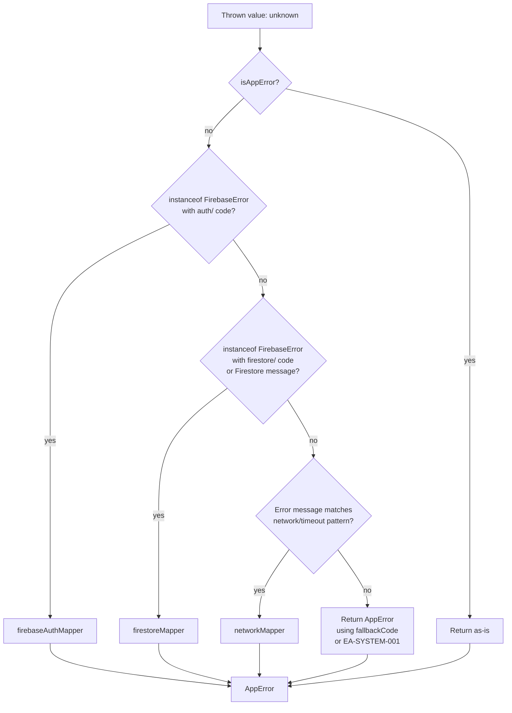

# Design Document

## Unified Error Handling — Eye Aura

## Overview

Eye Aura is a premium healthcare platform where trust and calm are non-negotiable. Today, raw Firebase error codes (`auth/invalid-credential`), Firestore messages (`Permission denied`), and HTTP status codes leak directly into the UI. This design replaces the stub `lib/errors.ts` with a production-grade `lib/errors/` module that intercepts every thrown value in the system and converts it into a structured `AppError` before it reaches any user-facing surface.

The module introduces three core concepts:

1. **Error Codes** — typed string literals in the format `EA-[CATEGORY]-[NNN]` that uniquely identify every error condition across 14 domains.
2. **AppError** — a standardized object carrying a `code`, `title`, `message`, and optional `suggestion` — the only shape that ever reaches the UI.
3. **Dispatch Chain** — a priority-ordered pipeline (`getDisplayError`) that routes any thrown value through the correct mapper and always returns an `AppError`, never throwing itself.

The design is fully backward-compatible: the existing `EA` constant is re-exported as an alias so all current import sites continue to compile without changes.

---

## Architecture

The module lives entirely inside `lib/errors/` and is consumed through a single barrel export. No component, service, or context imports from individual files — they import from `@/lib/errors`.

```
lib/errors/
├── error-codes.ts          # ERROR_CODES registry + EACode type
├── error-messages.ts       # ERROR_MESSAGES record (title, message, suggestion per code)
├── app-error.ts            # AppError interface + isAppError type guard
├── firebase-error-mapper.ts # Firebase Auth, Firestore, and Network mappers
├── api-error-handler.ts    # HTTP status code → AppError mapper
├── error-handler.ts        # getDisplayError(), formatDisplayError(), logError()
└── index.ts                # Barrel: re-exports everything + backward-compat EA alias
```

The data flow for any error is:



The `getDisplayError` function is the **only** entry point for converting errors to `AppError`. Components and services call it, then either pass the result to `formatDisplayError()` for inline display or to `errorFromAppError()` on the toast hook.

---

## Components and Interfaces

#### `app-error.ts`

```typescript
export interface AppError {
  code: EACode;
  title: string;
  message: string;
  suggestion?: string;
}

/**
 * Type guard — true when the value has all three required AppError fields
 * and code is a valid EACode. Used by getDisplayError to short-circuit.
 */
export function isAppError(value: unknown): value is AppError {
  return (
    typeof value === "object" &&
    value !== null &&
    "code" in value &&
    "title" in value &&
    "message" in value &&
    typeof (value as AppError).code === "string" &&
    typeof (value as AppError).title === "string" &&
    typeof (value as AppError).message === "string"
  );
}
```

#### `error-codes.ts`

The `ERROR_CODES` constant is a nested object organized by category. Each leaf value is a string literal. `EACode` is derived as a union of all leaf values so TypeScript enforces correctness at every call site.

```typescript
export const ERROR_CODES = {
  AUTH: {
    INVALID_CREDENTIAL:   "EA-AUTH-001",
    USER_NOT_FOUND:       "EA-AUTH-002",
    EMAIL_IN_USE:         "EA-AUTH-003",
    WEAK_PASSWORD:        "EA-AUTH-004",
    POPUP_CANCELLED:      "EA-AUTH-005",
    TOO_MANY_REQUESTS:    "EA-AUTH-006",
    GENERIC:              "EA-AUTH-007",
  },
  USER: {
    LOAD_FAILED:          "EA-USER-001",
    SAVE_FAILED:          "EA-USER-002",
  },
  BOOKING: {
    SLOT_CONFLICT:        "EA-BOOKING-001",
    ALREADY_CANCELLED:    "EA-BOOKING-002",
  },
  APPOINTMENT: {
    LOAD_FAILED:          "EA-APPOINTMENT-001",
    CANCEL_FAILED:        "EA-APPOINTMENT-002",
  },
  ASSESSMENT: {
    EXPIRED:              "EA-ASSESSMENT-001",
    NOT_ASSIGNED:         "EA-ASSESSMENT-002",
    INVALID_LINK:         "EA-ASSESSMENT-003",
  },
  PAYMENT: {
    CREATION_FAILED:      "EA-PAYMENT-001",
    VERIFICATION_FAILED:  "EA-PAYMENT-002",
  },
  PRESCRIPTION: {
    OPERATION_FAILED:     "EA-PRESCRIPTION-001",
  },
  SUPPORT: {
    OPERATION_FAILED:     "EA-SUPPORT-001",
  },
  DOCTOR: {
    OPERATION_FAILED:     "EA-DOCTOR-001",
  },
  ADMIN: {
    OPERATION_FAILED:     "EA-ADMIN-001",
  },
  FIRESTORE: {
    INDEX_REQUIRED:       "EA-FIRESTORE-001",
    PERMISSION_DENIED:    "EA-FIRESTORE-002",
    UNAVAILABLE:          "EA-FIRESTORE-003",
    NOT_FOUND:            "EA-FIRESTORE-004",
  },
  API: {
    SERVER_ERROR:         "EA-API-001",
    NOT_FOUND:            "EA-API-002",
    FORBIDDEN:            "EA-API-003",
    UNAUTHORIZED:         "EA-API-004",
    RATE_LIMITED:         "EA-API-005",
  },
  NETWORK: {
    CONNECTION_ISSUE:     "EA-NETWORK-001",
    TIMEOUT:              "EA-NETWORK-002",
  },
  SYSTEM: {
    UNEXPECTED:           "EA-SYSTEM-001",
    MAINTENANCE:          "EA-SYSTEM-002",
  },
} as const;

// Recursive value extractor — produces the union of all leaf string literals
type DeepValues<T> = T extends string
  ? T
  : T extends object
  ? DeepValues<T[keyof T]>
  : never;

export type EACode = DeepValues<typeof ERROR_CODES>;
```

#### `error-messages.ts`

`ERROR_MESSAGES` is a `Record<EACode, { title: string; message: string; suggestion?: string }>`. Every code in `ERROR_CODES` must have a corresponding entry — this bijection is enforced at compile time by typing the record key as `EACode`.

```typescript
import type { EACode } from "./error-codes";

type ErrorMessageEntry = { title: string; message: string; suggestion?: string };

export const ERROR_MESSAGES: Record<EACode, ErrorMessageEntry> = {
  "EA-AUTH-001": {
    title: "Unable to Sign In",
    message: "Please check your email address and password and try again.",
  },
  "EA-AUTH-002": {
    title: "Account Not Found",
    message: "We couldn't find an account with that email address.",
  },
  "EA-AUTH-003": {
    title: "Email Already Registered",
    message: "An account with this email already exists. Please sign in instead.",
  },
  "EA-AUTH-004": {
    title: "Password Too Weak",
    message: "Please choose a password that is at least 8 characters long.",
  },
  "EA-AUTH-005": {
    title: "Sign In Cancelled",
    message: "The sign-in window was closed. Please try again when you're ready.",
  },
  "EA-AUTH-006": {
    title: "Too Many Attempts",
    message: "Your account has been temporarily locked. Please try again in a few minutes.",
  },
  "EA-AUTH-007": {
    title: "Authentication Error",
    message: "We encountered a problem with your sign-in. Please try again.",
  },
  "EA-USER-001": {
    title: "Profile Unavailable",
    message: "We couldn't load your profile. Please refresh the page.",
  },
  "EA-USER-002": {
    title: "Profile Save Failed",
    message: "We couldn't save your profile changes. Please try again.",
  },
  "EA-BOOKING-001": {
    title: "Slot No Longer Available",
    message: "This time slot has just been taken. Please choose another.",
    suggestion: "Refresh the calendar to see current availability.",
  },
  "EA-BOOKING-002": {
    title: "Appointment Already Cancelled",
    message: "This appointment has already been cancelled.",
    suggestion: "Please book a new appointment if you still need a consultation.",
  },
  "EA-APPOINTMENT-001": {
    title: "Appointments Unavailable",
    message: "We couldn't load your appointments. Please try again.",
  },
  "EA-APPOINTMENT-002": {
    title: "Cancellation Failed",
    message: "We couldn't cancel this appointment. Please try again or contact support.",
  },
  "EA-ASSESSMENT-001": {
    title: "Assessment Expired",
    message: "This assessment has expired. Please ask your doctor to reassign it.",
    suggestion: "Contact your doctor to request a new assessment link.",
  },
  "EA-ASSESSMENT-002": {
    title: "Assessment Not Available",
    message: "No assessment has been assigned to you at this time.",
    suggestion: "Please contact your doctor if you believe this is an error.",
  },
  "EA-ASSESSMENT-003": {
    title: "Invalid Assessment Link",
    message: "This assessment link is not valid. Please use the link provided by your doctor.",
    suggestion: "Check your email for the original assessment link.",
  },
  "EA-PAYMENT-001": {
    title: "Payment Could Not Be Started",
    message: "We couldn't initiate your payment. Please try again.",
    suggestion: "If the issue persists, contact support with your booking reference.",
  },
  "EA-PAYMENT-002": {
    title: "Payment Verification Failed",
    message: "We couldn't verify your payment. Please contact support.",
    suggestion: "Do not retry — contact support with your payment reference.",
  },
  "EA-PRESCRIPTION-001": {
    title: "Prescription Error",
    message: "We couldn't complete this prescription action. Please try again.",
  },
  "EA-SUPPORT-001": {
    title: "Support Request Failed",
    message: "We couldn't process your support request. Please try again.",
  },
  "EA-DOCTOR-001": {
    title: "Doctor Action Failed",
    message: "We couldn't complete this action. Please try again.",
  },
  "EA-ADMIN-001": {
    title: "Admin Action Failed",
    message: "We couldn't complete this management action. Please try again.",
  },
  "EA-FIRESTORE-001": {
    title: "Data Temporarily Unavailable",
    message: "Some information is taking longer than expected to load. Please try again shortly.",
  },
  "EA-FIRESTORE-002": {
    title: "Access Not Available",
    message: "You don't have permission to view this information.",
  },
  "EA-FIRESTORE-003": {
    title: "Service Temporarily Unavailable",
    message: "Our database is temporarily unreachable. Please check your connection and try again.",
  },
  "EA-FIRESTORE-004": {
    title: "Information Not Found",
    message: "The requested information could not be found.",
  },
  "EA-API-001": {
    title: "Something Went Wrong",
    message: "We encountered an unexpected issue. Please try again or contact support.",
  },
  "EA-API-002": {
    title: "Information Not Found",
    message: "The information you requested could not be found.",
  },
  "EA-API-003": {
    title: "Access Restricted",
    message: "You don't have permission to perform this action.",
  },
  "EA-API-004": {
    title: "Session Expired",
    message: "Your session has expired. Please sign in again.",
  },
  "EA-API-005": {
    title: "Too Many Requests",
    message: "You've made too many requests. Please wait a moment and try again.",
  },
  "EA-NETWORK-001": {
    title: "Connection Issue",
    message: "Please check your internet connection and try again.",
  },
  "EA-NETWORK-002": {
    title: "Request Timed Out",
    message: "The request took too long to complete. Please try again.",
  },
  "EA-SYSTEM-001": {
    title: "Unexpected Issue",
    message: "Something unexpected happened. Please try again.",
    suggestion: "If this keeps happening, please contact support.",
  },
  "EA-SYSTEM-002": {
    title: "Service Unavailable",
    message: "Eye Aura is temporarily unavailable for maintenance. Please check back shortly.",
    suggestion: "Follow our status page for updates.",
  },
};
```

#### `firebase-error-mapper.ts`

This file exports three mapper functions. Each returns `AppError | null` — `null` signals "not my responsibility, try the next mapper."

**Firebase Auth Mapper**

Priority order (highest to lowest) is implemented as an explicit ordered switch/if-chain, not a lookup table, so the priority is visible and auditable:

```typescript
export function mapFirebaseAuthError(error: unknown): AppError | null {
  // Guard: must be an object with a code starting with "auth/"
  if (
    typeof error !== "object" ||
    error === null ||
    !("code" in error) ||
    typeof (error as { code: unknown }).code !== "string" ||
    !(error as { code: string }).code.startsWith("auth/")
  ) {
    return null;
  }

  const code = (error as { code: string }).code;

  // Priority 1 — highest: rate limiting
  if (code === "auth/too-many-requests") {
    return makeAppError("EA-AUTH-006");
  }
  // Priority 2: invalid credentials (two Firebase codes map to same EA code)
  if (code === "auth/invalid-credential" || code === "auth/wrong-password") {
    return makeAppError("EA-AUTH-001");
  }
  // Priority 3
  if (code === "auth/user-not-found") return makeAppError("EA-AUTH-002");
  // Priority 4
  if (code === "auth/email-already-in-use") return makeAppError("EA-AUTH-003");
  // Priority 5
  if (code === "auth/weak-password") return makeAppError("EA-AUTH-004");
  // Priority 6: popup cancelled (two codes)
  if (code === "auth/popup-closed-by-user" || code === "auth/cancelled-popup-request") {
    return makeAppError("EA-AUTH-005");
  }
  // Priority 7 — fallback for any unrecognized auth/ code
  return makeAppError("EA-AUTH-007");
}
```

**Firestore Mapper**

Code-based rules take priority over message-based rules. The implementation checks code first, then falls through to message matching:

```typescript
export function mapFirestoreError(error: unknown): AppError | null {
  if (
    typeof error !== "object" ||
    error === null ||
    !("code" in error)
  ) {
    return null;
  }

  const code = (error as { code: unknown }).code;
  const message = (error as { message?: unknown }).message;
  const msgStr = typeof message === "string" ? message.toLowerCase() : "";

  // Code-based rules take priority (checked first)
  if (code === "permission-denied") return makeAppError("EA-FIRESTORE-002");
  if (code === "unavailable" || code === "deadline-exceeded") return makeAppError("EA-FIRESTORE-003");
  if (code === "not-found") return makeAppError("EA-FIRESTORE-004");

  // Message-based rule (lower priority)
  if (msgStr.includes("requires an index")) return makeAppError("EA-FIRESTORE-001");

  // Fallback for any unrecognized Firestore error
  if (typeof code === "string" && code.length > 0) {
    return makeAppError("EA-FIRESTORE-001");
  }

  return null;
}
```

**Network Mapper**

Timeout is more specific than generic network failure, so it is checked first:

```typescript
export function mapNetworkError(error: unknown): AppError | null {
  if (typeof error !== "object" || error === null) return null;

  const message = (error as { message?: unknown }).message;
  if (typeof message !== "string" || message.trim() === "") return null;

  const msg = message.toLowerCase();

  // Timeout is more specific — checked before generic network patterns
  if (msg.includes("timeout") || msg.includes("timed out")) {
    return makeAppError("EA-NETWORK-002");
  }

  if (
    msg.includes("network") ||
    msg.includes("fetch") ||
    msg.includes("networkerror") ||
    msg.includes("failed to fetch")
  ) {
    return makeAppError("EA-NETWORK-001");
  }

  return null;
}
```

**Helper**

```typescript
function makeAppError(code: EACode): AppError {
  const entry = ERROR_MESSAGES[code];
  return { code, title: entry.title, message: entry.message, suggestion: entry.suggestion };
}
```

#### `api-error-handler.ts`

Maps HTTP status codes to `AppError`. Never includes the raw status code in any returned field.

```typescript
export function mapApiError(status: number | undefined): AppError {
  if (status === undefined || status === null) {
    // No HTTP response received — network failure before server responded
    return makeAppError("EA-NETWORK-001");
  }

  switch (status) {
    case 401: return makeAppError("EA-API-004");
    case 403: return makeAppError("EA-API-003");
    case 404: return makeAppError("EA-API-002");
    case 429: return makeAppError("EA-API-005");
    case 500: return makeAppError("EA-API-001");
    default:  return makeAppError("EA-API-001"); // All unrecognized codes → generic server error
  }
}
```

Design decision: `mapApiError` always returns an `AppError` (never `null`) because the caller already knows they have an HTTP response — there is no "not my responsibility" case.

#### `error-handler.ts`

The three public functions that all application code calls:

**`getDisplayError(error: unknown, fallbackCode?: EACode): AppError`**

```typescript
export function getDisplayError(
  error: unknown,
  fallbackCode: EACode = ERROR_CODES.SYSTEM.UNEXPECTED
): AppError {
  // 1. Already an AppError — return unchanged (idempotent)
  if (isAppError(error)) return error;

  // 2. Null / undefined / non-object primitive (not string) → system fallback
  if (
    error === null ||
    error === undefined ||
    (typeof error !== "object" && typeof error !== "string")
  ) {
    return makeAppError(fallbackCode);
  }

  // 3. Try Firebase Auth mapper
  const authResult = mapFirebaseAuthError(error);
  if (authResult) return authResult;

  // 4. Try Firestore mapper
  const firestoreResult = mapFirestoreError(error);
  if (firestoreResult) return firestoreResult;

  // 5. Try network mapper
  const networkResult = mapNetworkError(error);
  if (networkResult) return networkResult;

  // 6. Plain Error or string with unrecognized message → use fallbackCode
  return makeAppError(fallbackCode);
}
```

**`formatDisplayError(error: AppError): string`**

```typescript
export function formatDisplayError(error: AppError): string {
  const base = `[${error.code}] ${error.title} \u2014 ${error.message}`;
  return error.suggestion ? `${base} ${error.suggestion}` : base;
}
// Example output: "[EA-AUTH-001] Unable to Sign In — Please check your email address and password and try again."
```

**`logError(code: string, error: unknown, context?: string): void`**

```typescript
const IS_PRODUCTION = process.env.NODE_ENV === "production";

export function logError(code: string, error: unknown, context?: string): void {
  const entry = ERROR_MESSAGES[code as EACode];
  const title = entry?.title ?? "Unknown Error";
  const originalMessage =
    error === null || error === undefined
      ? "(no error object)"
      : error instanceof Error
      ? error.message
      : String(error);

  const contextPrefix = context ? ` [${context.slice(0, 100)}]` : "";
  const logLine = `[${code}]${contextPrefix} ${title} | Original: ${originalMessage}`;

  if (IS_PRODUCTION) {
    // In production: only console.error (captured by Sentry / error tracking)
    console.error(logLine, error instanceof Error ? error.stack : error);
  } else {
    // In development: full console.error with stack trace
    console.error(logLine);
    if (error instanceof Error && error.stack) {
      console.error(error.stack);
    }
  }
}
```

Design decision: `logError` always uses `console.error` (never `console.log` or `console.debug`) so that production error tracking services (Sentry, Datadog) capture every call. In development, the stack trace is printed separately for readability.

#### `index.ts` — Barrel and Backward-Compatible Alias

```typescript
// Public API
export type { AppError } from "./app-error";
export { isAppError } from "./app-error";
export { ERROR_CODES } from "./error-codes";
export type { EACode } from "./error-codes";
export { ERROR_MESSAGES } from "./error-messages";
export { getDisplayError, formatDisplayError, logError } from "./error-handler";
export { mapFirebaseAuthError, mapFirestoreError, mapNetworkError } from "./firebase-error-mapper";
export { mapApiError } from "./api-error-handler";

// ── Backward-compatible alias ─────────────────────────────────────────────
// The old lib/errors.ts exported a flat `EA` object with keys like AUTH_001.
// This alias maps each old key to its new ERROR_CODES value so existing
// import sites (`import { EA } from "@/lib/errors"`) continue to compile.
import { ERROR_CODES } from "./error-codes";

export const EA = {
  // Auth
  AUTH_001: ERROR_CODES.AUTH.INVALID_CREDENTIAL,
  AUTH_002: ERROR_CODES.AUTH.USER_NOT_FOUND,
  AUTH_003: ERROR_CODES.AUTH.EMAIL_IN_USE,
  AUTH_004: ERROR_CODES.AUTH.WEAK_PASSWORD,
  AUTH_005: ERROR_CODES.AUTH.POPUP_CANCELLED,
  AUTH_006: ERROR_CODES.AUTH.TOO_MANY_REQUESTS,
  AUTH_007: ERROR_CODES.AUTH.GENERIC,
  // Booking
  BKG_001: ERROR_CODES.BOOKING.SLOT_CONFLICT,
  BKG_002: ERROR_CODES.BOOKING.ALREADY_CANCELLED,
  // Payments
  PAY_001: ERROR_CODES.PAYMENT.CREATION_FAILED,
  PAY_002: ERROR_CODES.PAYMENT.VERIFICATION_FAILED,
  // Appointments
  APT_001: ERROR_CODES.APPOINTMENT.LOAD_FAILED,
  APT_002: ERROR_CODES.APPOINTMENT.CANCEL_FAILED,
  // Prescriptions
  PRE_001: ERROR_CODES.PRESCRIPTION.OPERATION_FAILED,
  // Support
  SUP_001: ERROR_CODES.SUPPORT.OPERATION_FAILED,
  // Doctor
  DOC_001: ERROR_CODES.DOCTOR.OPERATION_FAILED,
  // Admin
  ADM_001: ERROR_CODES.ADMIN.OPERATION_FAILED,
  // API
  API_001: ERROR_CODES.API.SERVER_ERROR,
  API_002: ERROR_CODES.API.NOT_FOUND,
  API_003: ERROR_CODES.API.FORBIDDEN,
  API_004: ERROR_CODES.API.UNAUTHORIZED,
  // General → System
  GEN_001: ERROR_CODES.SYSTEM.UNEXPECTED,
  GEN_002: ERROR_CODES.NETWORK.CONNECTION_ISSUE,
  GEN_003: ERROR_CODES.FIRESTORE.NOT_FOUND,
} as const;
```

The old `eaMessage()` and `eaError()` functions are **not** re-exported. All call sites must be migrated to `getDisplayError()` + `formatDisplayError()` / `errorFromAppError()` and `logError()` respectively.

#### Toast System Extension — `components/ui/toast-provider.tsx`

The `ToastContextValue` interface gains one new method. The existing `error(message: string)` method is retained for pre-sanitized strings but gains a guard against raw Firebase patterns:

```typescript
interface ToastContextValue {
  toast: (message: string, type?: ToastType) => void;
  success: (message: string) => void;
  error: (message: string) => void;       // pre-sanitized strings only
  info: (message: string) => void;
  errorFromAppError: (error: AppError) => void;  // NEW — required for AppError objects
}
```

Implementation of `errorFromAppError`:

```typescript
const errorFromAppError = useCallback((appError: AppError) => {
  toast(formatDisplayError(appError), "error");
}, [toast]);
```

Guard on `error()` against raw Firebase patterns:

```typescript
const error = useCallback((message: string) => {
  const RAW_PATTERN = /^(auth|firestore)\//i;
  const safeMessage = RAW_PATTERN.test(message)
    ? formatDisplayError(makeAppError(ERROR_CODES.SYSTEM.UNEXPECTED))
    : message;
  toast(safeMessage, "error");
}, [toast]);
```

#### React Error Boundary — `components/error-boundary.tsx`

A class component (required by React's `componentDidCatch` API):

```typescript
interface ErrorBoundaryProps {
  children: ReactNode;
  fallback?: ReactNode;  // optional custom fallback replaces entire default UI
}

interface ErrorBoundaryState {
  hasError: boolean;
}

export class ErrorBoundary extends Component<ErrorBoundaryProps, ErrorBoundaryState> {
  state = { hasError: false };

  static getDerivedStateFromError(): ErrorBoundaryState {
    return { hasError: true };
  }

  componentDidCatch(error: Error, info: ErrorInfo): void {
    // Always log — even if logError itself throws, the fallback UI still renders
    try {
      logError(ERROR_CODES.SYSTEM.UNEXPECTED, error, "ErrorBoundary");
    } catch {
      console.error("[EA-SYSTEM-001] ErrorBoundary caught an error", error);
    }
  }

  render() {
    if (!this.state.hasError) return this.props.children;
    if (this.props.fallback) return this.props.fallback;
    return <ErrorFallbackUI />;
  }
}
```

The `ErrorFallbackUI` renders: Eye Aura logo, `EA-SYSTEM-001`, title "Something Went Unexpected", message "We've encountered an unexpected issue. Our team has been notified.", and a "Reload Page" button (`window.location.reload()`). No stack trace, no component tree, no technical details.

---

## Data Models

#### `AppError`

| Field | Type | Required | Description |
|---|---|---|---|
| `code` | `EACode` | ✓ | Typed error code, e.g. `"EA-AUTH-001"` |
| `title` | `string` | ✓ | Short user-facing title, e.g. `"Unable to Sign In"` |
| `message` | `string` | ✓ | Full user-facing message |
| `suggestion` | `string` | — | Optional recovery hint appended to formatted string |

#### `EACode`

A TypeScript union type derived from all leaf values in `ERROR_CODES`. At compile time, any string not in the registry is a type error. The format is always `EA-[CATEGORY]-[NNN]` where `NNN` is a three-digit zero-padded number.

#### `ERROR_CODES` Registry — 14 Categories

| Category | Prefix | Codes |
|---|---|---|
| AUTH | `EA-AUTH-` | 001–007 |
| USER | `EA-USER-` | 001–002 |
| BOOKING | `EA-BOOKING-` | 001–002 |
| APPOINTMENT | `EA-APPOINTMENT-` | 001–002 |
| ASSESSMENT | `EA-ASSESSMENT-` | 001–003 |
| PAYMENT | `EA-PAYMENT-` | 001–002 |
| PRESCRIPTION | `EA-PRESCRIPTION-` | 001 |
| SUPPORT | `EA-SUPPORT-` | 001 |
| DOCTOR | `EA-DOCTOR-` | 001 |
| ADMIN | `EA-ADMIN-` | 001 |
| FIRESTORE | `EA-FIRESTORE-` | 001–004 |
| API | `EA-API-` | 001–005 |
| NETWORK | `EA-NETWORK-` | 001–002 |
| SYSTEM | `EA-SYSTEM-` | 001–002 |

#### Structured Log Entry Format

```
[EA-AUTH-001] [AuthService] Unable to Sign In | Original: Firebase: Error (auth/invalid-credential).
```

Fields: `[code]` `[context?]` `title` `|` `Original:` `error.message`

---

## Migration Strategy

The migration is designed to be incremental and backward-compatible. No existing import site breaks on day one.

**Phase 1 — Module creation (no breaking changes)**
1. Create `lib/errors/` with all seven files.
2. The barrel `index.ts` re-exports the `EA` alias so all existing `import { EA } from "@/lib/errors"` imports continue to resolve.
3. Delete `lib/errors.ts` only after the barrel is in place.

**Phase 2 — Service layer migration**
Replace `eaError()` calls with `logError()` in all services. Services throw errors upward — they do not call `eaMessage()` for display. This phase has no UI impact.

**Phase 3 — Component layer migration**
For each component that currently calls `error.message` or `eaMessage()` directly:
1. Wrap the catch block: `const appError = getDisplayError(error, EA.AUTH_001);`
2. Replace inline display: `formatDisplayError(appError)` for form error areas.
3. Replace toast calls: `errorFromAppError(appError)` for toast notifications.
4. Add `logError(appError.code, error, "ComponentName")` before display.

**Phase 4 — Audit and compliance**
Run the compliance grep:
```bash
grep -rn "\.message" app/ components/ services/ contexts/ lib/ \
  --include="*.tsx" --include="*.ts" | grep -v "// EA-MIGRATED"
```
Zero matches = migration complete. The `// EA-MIGRATED` comment can be added to intentional `.message` usages (e.g. internal service-to-service error propagation that never reaches the UI).

**Backward-compat guarantee**: The `EA` alias maps every old flat key to its new `ERROR_CODES` value. Old code like `EA.AUTH_001` continues to produce `"EA-AUTH-001"`. The old `eaMessage()` and `eaError()` functions are removed — their call sites must be updated as part of Phase 3/4.

---

## Correctness Properties

*A property is a characteristic or behavior that should hold true across all valid executions of a system — essentially, a formal statement about what the system should do. Properties serve as the bridge between human-readable specifications and machine-verifiable correctness guarantees.*

---

### Property 1: `getDisplayError` always returns a valid AppError

*For any* thrown value (FirebaseError, plain Error, string, number, null, undefined, plain object, or an existing AppError), `getDisplayError` SHALL return an object with a non-empty `code` matching the `EACode` format, a non-empty `title`, and a non-empty `message`. It SHALL never throw.

**Validates: Requirements 1.1, 1.6, 9.3, 9.4, 9.5, 9.6**

---

### Property 2: `getDisplayError` is idempotent on AppError inputs

*For any* valid `AppError` object (with `code`, `title`, `message`, and optional `suggestion`), passing it through `getDisplayError` SHALL return an object where all four fields are identical to the input. The function SHALL not modify, wrap, or re-map an already-structured AppError.

**Validates: Requirements 1.5**

---

### Property 3: Firebase Auth mapper returns correct EA code for every known auth/ code

*For any* Firebase Auth error code in the set `{auth/invalid-credential, auth/wrong-password, auth/user-not-found, auth/email-already-in-use, auth/weak-password, auth/popup-closed-by-user, auth/cancelled-popup-request, auth/too-many-requests}`, `mapFirebaseAuthError` SHALL return an `AppError` whose `code` matches the specified mapping. For any `auth/` prefixed code not in this set, it SHALL return an `AppError` with code `EA-AUTH-007`. For any input without an `auth/` prefixed code, it SHALL return `null`.

**Validates: Requirements 3.1, 3.2, 3.3, 3.4, 3.5, 3.6, 3.7, 3.8, 3.9**

---

### Property 4: Firestore mapper applies code-based priority over message-based priority

*For any* error object that has both a recognized Firestore code (e.g. `permission-denied`) AND a message containing `"requires an index"`, `mapFirestoreError` SHALL return the code-based `AppError` (e.g. `EA-FIRESTORE-002`), not the message-based one (`EA-FIRESTORE-001`). Code-based rules always win.

**Validates: Requirements 4.1, 4.2, 4.3, 4.4, 4.5, 4.6**

---

### Property 5: Network mapper returns timeout AppError when message matches both timeout and network patterns

*For any* error whose message contains both a network keyword (`"network"`, `"fetch"`, `"NetworkError"`, `"Failed to fetch"`) and a timeout keyword (`"timeout"`, `"timed out"`), `mapNetworkError` SHALL return an `AppError` with code `EA-NETWORK-002` (timeout), not `EA-NETWORK-001` (generic network). Timeout is always the more specific match.

**Validates: Requirements 5.1, 5.2, 5.3, 5.4**

---

### Property 6: API error handler never exposes raw HTTP status codes in AppError fields

*For any* HTTP status code passed to `mapApiError`, none of the fields (`code`, `title`, `message`, `suggestion`) of the returned `AppError` SHALL contain the numeric status code as a substring. The raw status code is always absorbed and replaced with a user-friendly message.

**Validates: Requirements 6.1, 6.2, 6.3, 6.4, 6.5, 6.6, 6.8**

---

### Property 7: `formatDisplayError` always produces the canonical `[EA-CODE] Title — Message` format

*For any* `AppError`, `formatDisplayError` SHALL return a string matching the pattern `[EA-XXX-NNN] <title> — <message>` where `—` is the Unicode em-dash (U+2014). When `suggestion` is present, it SHALL be appended after the message separated by a single space. The em-dash SHALL always be present between title and message.

**Validates: Requirements 9.1, 9.2**

---

### Property 8: `ERROR_CODES` and `ERROR_MESSAGES` are in bijection

*For every* value in `ERROR_CODES` (i.e. every `EACode` string), there SHALL be a corresponding entry in `ERROR_MESSAGES` with a non-empty `title` and non-empty `message`. Conversely, every key in `ERROR_MESSAGES` SHALL correspond to a value in `ERROR_CODES`. No orphaned codes, no missing messages.

**Validates: Requirements 2.2, 2.3, 2.5**

---

### Property 9: `logError` log format is consistent for any input

*For any* error code string and any error value (including null and undefined), `logError` SHALL write exactly one `console.error` call whose first argument matches the pattern `[<code>] <title> | Original: <message>`. When a context string is provided, it SHALL appear between the code and title as `[<code>] [<context>] <title> | Original: <message>`.

**Validates: Requirements 8.1, 8.2, 8.6, 8.7**

---

### Property 10: `errorFromAppError` toast content matches `formatDisplayError` output

*For any* `AppError`, calling `errorFromAppError(appError)` on the toast hook SHALL display a toast whose message string is exactly equal to `formatDisplayError(appError)`. The toast type SHALL always be `"error"`.

**Validates: Requirements 10.2, 10.4**

---

## Error Handling

#### `getDisplayError` never throws

The dispatch chain is wrapped in a try/catch at the top level. If any mapper throws internally (e.g. due to a malformed error object), `getDisplayError` catches it and returns `makeAppError(fallbackCode)`. This guarantees the function is safe to call from any catch block.

#### `logError` never throws

`logError` is wrapped in a try/catch. If `console.error` itself throws (e.g. in a test environment with a broken spy), the error is silently swallowed. Logging failure must never prevent the user from seeing an error message.

#### Error Boundary isolation

`componentDidCatch` wraps `logError` in its own try/catch. If logging fails, the fallback UI still renders. The `hasError` state is set by `getDerivedStateFromError` (synchronous, before render) so the fallback is guaranteed to appear even if `componentDidCatch` throws.

#### Toast guard against raw Firebase strings

The `error(message: string)` method on `useToast` tests the message against `/^(auth|firestore)\//i`. If matched, it replaces the message with the `EA-SYSTEM-001` formatted string. This is a last-resort safety net — the correct approach is always to call `getDisplayError` before the toast.

---

## Testing Strategy

The project uses **Vitest** with **fast-check** (already installed as a dev dependency) for property-based testing, and **@testing-library/react** for component tests.

#### Property-Based Tests

Each correctness property above maps to one property-based test in `__tests__/unified-error-handling/`. Tests run a minimum of 100 iterations (fast-check default). Each test is tagged with a comment referencing the design property.

```typescript
// Feature: unified-error-handling, Property 1: getDisplayError always returns a valid AppError
it.prop([fc.anything()])("getDisplayError always returns a valid AppError", (value) => {
  const result = getDisplayError(value);
  expect(result).toHaveProperty("code");
  expect(result).toHaveProperty("title");
  expect(result).toHaveProperty("message");
  expect(result.code).toMatch(/^EA-[A-Z]+-\d{3}$/);
  expect(result.title.length).toBeGreaterThan(0);
  expect(result.message.length).toBeGreaterThan(0);
});
```

Generators needed:
- `fc.record({ code: fc.constantFrom(...authCodes), message: fc.string() })` for Firebase Auth errors
- `fc.record({ code: fc.constantFrom(...firestoreCodes), message: fc.string() })` for Firestore errors
- `fc.record({ message: fc.oneof(fc.constant(""), fc.string()) })` for network errors
- `fc.integer({ min: 100, max: 599 })` for HTTP status codes
- `fc.record({ code: fc.constantFrom(...allEACodes), title: fc.string({ minLength: 1 }), message: fc.string({ minLength: 1 }), suggestion: fc.option(fc.string()) })` for AppError objects

#### Unit Tests

- `ERROR_CODES` format validation: every value matches `/^EA-[A-Z]+-\d{3}$/`
- `ERROR_MESSAGES` bijection: every code has a message entry and vice versa
- `logError` with null/undefined error: verifies `"(no error object)"` in log
- `logError` in production mode: verifies `console.log` is suppressed
- Error Boundary: renders fallback UI when child throws, calls `logError`
- Toast guard: raw `auth/` string is replaced with `EA-SYSTEM-001` message
- `mapApiError` with no status: returns `EA-NETWORK-001`

#### Integration Tests

- Auth form: sign-in error renders `[EA-AUTH-001]` in form error area, no `auth/` pattern visible
- Booking page: payment error displays via `errorFromAppError`, `logError` called with `"BookingPage"` context
- Assessment page: expired assessment displays `EA-ASSESSMENT-001` via toast

#### Test File Structure

```
__tests__/
└── unified-error-handling/
    ├── error-codes.test.ts          # Registry format + bijection
    ├── firebase-error-mapper.test.ts # PBT: Properties 3, 4, 5
    ├── api-error-handler.test.ts    # PBT: Property 6
    ├── error-handler.test.ts        # PBT: Properties 1, 2, 7, 9
    ├── error-messages.test.ts       # PBT: Property 8
    ├── toast-integration.test.ts    # PBT: Property 10 + unit tests
    └── error-boundary.test.tsx      # Component tests
```
