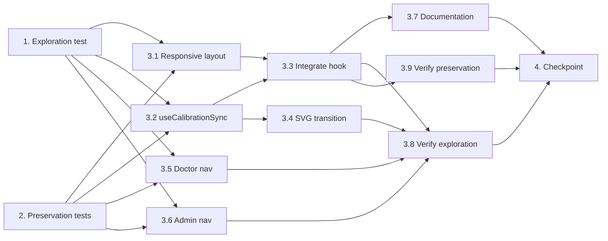

# Implementation Plan

## Overview

This task list follows the exploratory bugfix workflow to fix four interconnected bugs: (1) cramped mobile layout in TestingShell, (2) missing DPR/resize/orientation recalculation for calibration, (3) missing "Public Home" navigation in doctor/admin modules, and (4) outdated architecture documentation. The workflow writes exploration and preservation tests BEFORE implementing the fix, then validates the fix resolves all bug conditions without regressions.

## Tasks

- [x] 1. Write bug condition exploration test
  - **Property 1: Bug Condition** - Mobile Layout / Calibration Sync / Navigation Dead-End
  - **CRITICAL**: This test MUST FAIL on unfixed code - failure confirms the bugs exist
  - **DO NOT attempt to fix the test or the code when it fails**
  - **NOTE**: This test encodes the expected behavior - it will validate the fix when it passes after implementation
  - **GOAL**: Surface counterexamples that demonstrate the bugs exist
  - **Scoped PBT Approach**: Scope properties to concrete failing cases for each bug condition:
    - Layout bug: viewport < 768px (e.g., 390px) → assert TestingShell renders 2-row layout (will fail — currently renders 3-column)
    - Calibration bug: simulate DPR change from 1→2 → assert pxPerMm is recalculated (will fail — no listener exists)
    - Navigation bug: assert doctorNavItems contains entry with href "/" (will fail — entry missing)
    - Navigation bug: assert adminNavItems contains entry with href "/" (will fail — entry missing)
  - Bug Condition from design: `isBugCondition(input)` where context is "layout" AND viewport < 768, OR context is "calibration" AND (dprChanged OR resized OR orientationChanged), OR context is "navigation" AND module IN ["doctor", "admin"]
  - Expected Behavior: mobile → 2-row layout with full-width chart; DPR change → recalculated pxPerMm; doctor/admin → Public Home nav item present
  - Run test on UNFIXED code
  - **EXPECTED OUTCOME**: Test FAILS (this is correct - it proves the bugs exist)
  - Document counterexamples found (e.g., "TestingShell at 390px renders 3-column instead of 2-row", "pxPerMm remains 3.27 after DPR change to 2x", "doctorNavItems has no href '/' entry")
  - Mark task complete when test is written, run, and failure is documented
  - _Requirements: 1.1, 1.2, 1.3, 1.4, 1.5_

- [x] 2. Write preservation property tests (BEFORE implementing fix)
  - **Property 2: Preservation** - Desktop Layout / Stable Calibration / Existing Nav Items
  - **IMPORTANT**: Follow observation-first methodology
  - Observe on UNFIXED code:
    - TestingShell at viewport >= 768px renders 3-column layout (w-28 | flex-1 | w-28)
    - CalibrationData with unchanged DPR/size retains original pxPerMm value
    - doctorNavItems contains [Dashboard, Appointments, Requests, Patients, Prescriptions, Slots, Profile] in order
    - adminNavItems contains [Dashboard, Doctors, Services, Assessments, Appointments, Users, Payments, Analytics, Settings] in order
    - SnellenRenderer produces deterministic SVG dimensions for given exactHeightMm and pxPerMm
  - Write property-based tests:
    - For all viewport widths >= 768px (generate random 768–2000): TestingShell renders 3-column layout
    - For all CalibrationData where DPR has NOT changed: pxPerMm remains identical to original
    - For all existing nav item arrays: all original items remain present and in original order
    - For all exactHeightMm (0.5–90mm) and pxPerMm (1.0–10.0): SnellenRenderer SVG dimensions are deterministic
  - Verify tests PASS on UNFIXED code (confirms baseline behavior to preserve)
  - **EXPECTED OUTCOME**: Tests PASS (this confirms baseline behavior to preserve)
  - Mark task complete when tests are written, run, and passing on unfixed code
  - _Requirements: 3.1, 3.2, 3.3, 3.4, 3.5, 3.6, 3.7, 3.8_

- [x] 3. Fix for mobile layout, calibration sync, navigation dead-ends, and documentation drift

  - [x] 3.1 Implement responsive layout in TestingShell
    - Replace unconditional 3-column flex layout with responsive structure using Tailwind breakpoints
    - Below md (< 768px): Render 2-row layout — Row 1 is flex row with eye info (left) and timer/distance (right) side-by-side; Row 2 is Snellen chart at full container width
    - At md and above (>= 768px): Preserve existing 3-column layout (w-28 | flex-1 | w-28) exactly as-is
    - Use Tailwind responsive classes (md:flex-row, flex-col, etc.) — no JS-based breakpoint detection
    - On mobile, remove w-28 flex-shrink-0 from columns and use compact horizontal bar with flex items-center justify-between for top row
    - _Bug_Condition: isBugCondition(input) where input.context == "layout" AND input.viewport < 768_
    - _Expected_Behavior: 2-row layout with full-width chart area on mobile_
    - _Preservation: Desktop 3-column layout unchanged for viewport >= 768px_
    - _Requirements: 2.1, 3.1_

  - [x] 3.2 Create useCalibrationSync hook
    - Create new file: `modules/visual-acuity/engine/useCalibrationSync.ts`
    - Hook accepts current CalibrationData and callback onRecalibrate(newData: CalibrationData)
    - Listen for resize, orientationchange, and matchMedia('(resolution: Xdpi)') change events
    - On trigger, compute new pxPerMm: scale original calibration using DPR ratio change (newDpr / calibration.dpr)
    - Debounce recalculation at 300ms to avoid excessive re-renders
    - Return current effective CalibrationData (original or recalculated)
    - Clean up all event listeners on unmount
    - _Bug_Condition: isBugCondition(input) where input.context == "calibration" AND (dprChanged OR resized OR orientationChanged)_
    - _Expected_Behavior: recalculated pxPerMm = cardWidthPx / CARD_WIDTH_MM × (newDpr / originalDpr)_
    - _Preservation: When DPR/size unchanged, pxPerMm remains identical to original calibration_
    - _Requirements: 2.2, 2.3, 3.2, 3.3_

  - [x] 3.3 Integrate useCalibrationSync into TestingShell
    - Import and call useCalibrationSync in TestingShell, passing calibration prop
    - Use returned effective CalibrationData when rendering SnellenRenderer
    - Ensures optotypes stay physically accurate across DPR/resize/orientation changes
    - _Bug_Condition: isBugCondition(input) where input.context == "calibration"_
    - _Expected_Behavior: SnellenRenderer re-renders with updated pxPerMm on environment change_
    - _Preservation: No change to rendering when environment is stable_
    - _Requirements: 2.2, 2.3_

  - [x] 3.4 Add smooth CSS transition to SnellenRenderer SVG container
    - Add `transition: width 0.3s ease, height 0.3s ease` to the SVG container element in SnellenRenderer
    - Ensures size changes from recalculation animate smoothly rather than jumping
    - Only affects the container dimensions — does not alter SVG content rendering (geometricPrecision, CAP_HEIGHT_RATIO, Sloan spacing)
    - _Bug_Condition: isBugCondition(input) where input.context == "calibration"_
    - _Expected_Behavior: smooth visual transition on recalculation, no jarring jumps_
    - _Preservation: SVG rendering internals (exact dimensions, font sizing, spacing) unchanged_
    - _Requirements: 2.2, 3.3_

  - [x] 3.5 Add "Public Home" NavItem to doctor layout
    - In `app/doctor/layout.tsx`: Add `{ label: "Public Home", href: "/", icon: Home, group: "home" }` as first entry in doctorNavItems array
    - Add same entry to mobileNavItems array for mobile bottom navigation
    - Import Home icon from lucide-react
    - Ensure all existing nav items (Dashboard, Appointments, Requests, Patients, Prescriptions, Slots, Profile) remain in their current order after the new entry
    - _Bug_Condition: isBugCondition(input) where input.context == "navigation" AND input.module == "doctor"_
    - _Expected_Behavior: "Public Home" link to "/" visible in sidebar and mobile nav_
    - _Preservation: All existing doctor nav items remain unchanged in order_
    - _Requirements: 2.4, 3.4_

  - [x] 3.6 Add "Public Home" NavItem to admin layout
    - In `app/admin/layout.tsx`: Add `{ label: "Public Home", href: "/", icon: Home, group: "home" }` as first entry in adminNavItems array
    - Ensure it appears in mobile bottom nav and slide-out drawer
    - Import Home icon from lucide-react
    - Ensure all existing nav items (Dashboard, Doctors, Services, Assessments, Appointments, Users, Payments, Analytics, Settings) remain in their current order after the new entry
    - _Bug_Condition: isBugCondition(input) where input.context == "navigation" AND input.module == "admin"_
    - _Expected_Behavior: "Public Home" link to "/" visible in sidebar, drawer, and mobile nav_
    - _Preservation: All existing admin nav items remain unchanged in order_
    - _Requirements: 2.5, 3.5_

  - [x] 3.7 Full documentation audit and update
    - Update `docs/EYE_AURA_MASTER_ARCHITECTURE.md` to accurately reflect:
      - Premium design system tokens (GLASS, SHADOWS, TYPOGRAPHY, SPACING, RADIUS, DEPTH_LAYERS)
      - Doctor/admin layout revamp (FloatingSidebar, PageTransition, glass header, mobile bottom nav)
      - Visual acuity assessment architecture (calibration pipeline, SVG rendering, useCalibrationSync, session flow, timer engine)
      - Payment flows and service architecture
      - Navigation structure including Public Home links in all modules
      - Responsive behavior and breakpoint system (mobile 2-row layout)
    - Update `docs/EYE_AURA_MASTER_REFERENCE.md` to reflect current component hierarchy and module structures
    - Update `docs/VISUAL_ACUITY_ASSIGNMENT_FLOW.md` to include calibration sync and responsive layout details
    - _Bug_Condition: isBugCondition(input) where input.context == "docs"_
    - _Expected_Behavior: Documentation accurately reflects current implementation state_
    - _Preservation: No code changes — documentation only_
    - _Requirements: 2.6, 3.7_

  - [x] 3.8 Verify bug condition exploration test now passes
    - **Property 1: Expected Behavior** - Mobile Layout / Calibration Sync / Navigation
    - **IMPORTANT**: Re-run the SAME test from task 1 - do NOT write a new test
    - The test from task 1 encodes the expected behavior
    - When this test passes, it confirms the expected behavior is satisfied:
      - TestingShell at viewport < 768px renders 2-row layout with full-width chart
      - useCalibrationSync recalculates pxPerMm on DPR/resize/orientation change
      - doctorNavItems and adminNavItems contain Public Home entry with href "/"
    - Run bug condition exploration test from step 1
    - **EXPECTED OUTCOME**: Test PASSES (confirms bugs are fixed)
    - _Requirements: 2.1, 2.2, 2.3, 2.4, 2.5_

  - [x] 3.9 Verify preservation tests still pass
    - **Property 2: Preservation** - Desktop Layout / Stable Calibration / Existing Nav Items
    - **IMPORTANT**: Re-run the SAME tests from task 2 - do NOT write new tests
    - Run preservation property tests from step 2
    - **EXPECTED OUTCOME**: Tests PASS (confirms no regressions)
    - Confirm all preservation tests still pass after fix:
      - Desktop 3-column layout unchanged for viewport >= 768px
      - CalibrationData with unchanged DPR retains original pxPerMm
      - All existing doctor/admin nav items remain in original order
      - SnellenRenderer SVG dimensions remain deterministic
    - _Requirements: 3.1, 3.2, 3.3, 3.4, 3.5, 3.6, 3.7, 3.8_

- [x] 4. Checkpoint - Ensure all tests pass
  - Run full test suite to confirm all exploration and preservation tests pass
  - Verify no regressions in existing test coverage
  - Confirm documentation changes are accurate and complete
  - Ensure all tests pass, ask the user if questions arise

## Task Dependency Graph

## Notes

- Tasks 1 and 2 are standalone property-based test tasks that MUST be completed BEFORE any implementation
- Task 1 tests are expected to FAIL on unfixed code (confirms bugs exist)
- Task 2 tests are expected to PASS on unfixed code (captures baseline behavior)
- After implementation (task 3), task 1 tests should PASS and task 2 tests should still PASS
- Documentation task (3.7) should be done last to capture all implementation details accurately
- The useCalibrationSync hook uses debouncing (300ms) to prevent excessive re-renders during rapid environment changes
