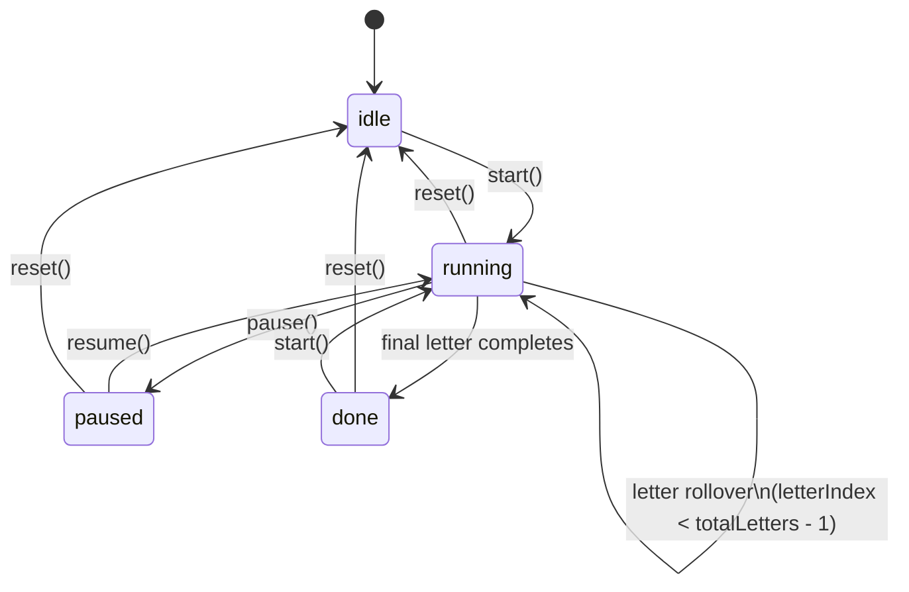

# Visual Acuity Timer & Progress Rewrite — Bugfix Design

## Overview

The visual acuity testing flow drives two independent concerns from one tangled stack: a
visual countdown ring and a line-advancement clock. They are seeded with different scopes
(per-eye total vs. per-line interval) and only one of them is paused when the user pauses,
so the displayed time and the actual progression diverge. The same code is duplicated across
the far and near testing steps.

The fix splits the responsibilities into two cleanly separated systems and consolidates the
duplicated UI:

1. **`useLetterTimer`** — single source of truth for per-letter countdown AND letter
   advancement. Uses one `requestAnimationFrame` loop driven by `performance.now()` deltas,
   reducer-style state transitions, idempotent pause/resume, Page Visibility API integration,
   and unmount cleanup.
2. **`useAssessmentProgress`** — pure derivation. Given the current eye, current line index,
   and total lines per eye, returns the global percentage, completed-letter count, and level
   labels. No timer state, read-only.
3. **`TestingShell`** — shared component that renders the testing UI for both far and near
   tests, parameterized by chart, accent colour, distance, and notation accessor. Owns the
   eye-intro / reading / self-report state machine. Promotes the global progress header above
   the white card and removes the inline `lineIndex / chart.length` mini bar.
4. **`TestingStep` and `NearTestingStep`** — become thin wrappers that pass chart data and
   accent colour to `TestingShell`.

The legacy `useAssessmentTimer` hook becomes unused after the refactor and is deleted.

## Glossary

- **Bug_Condition (C)**: The conjunction of conditions that triggers the bug — being in the
  reading phase of `TestingStep` or `NearTestingStep` AND time is advancing AND/OR pause is
  pressed.
- **Property (P)**: The desired behaviour during the reading phase — per-letter countdown
  resets at every line boundary; pause freezes both the visual ring and line advancement;
  resume continues from the exact remaining millisecond; tab-hide freezes timing; rapid
  pause/resume is idempotent; unmount cancels all timers; one global progress bar advances
  monotonically across both eyes.
- **Preservation**: Existing behaviour for everything outside the reading-phase timing —
  eye-intro screen, self-report screen, calibration, Snellen rendering, results, eye switch
  semantics, `onComplete` payload — must be byte-for-byte unchanged.
- **`useLetterTimer`**: New hook in `modules/visual-acuity/engine/useLetterTimer.ts` that
  owns the per-letter countdown and letter advancement (single source of truth).
- **`useAssessmentProgress`**: New hook in `modules/visual-acuity/engine/useAssessmentProgress.ts`
  that derives global progress (read-only, no timer state).
- **`TestingShell`**: New component in `modules/visual-acuity/steps/TestingShell.tsx` that
  renders the eye-intro / reading / self-report flow shared by far and near tests.
- **F**: Original code — `TestingStep.tsx`, `NearTestingStep.tsx`, `useAssessmentTimer.ts` as
  they exist before the fix.
- **F'**: Fixed code — `TestingStep.tsx` and `NearTestingStep.tsx` rewritten as thin wrappers
  on top of `TestingShell`, plus the two new engine hooks.
- **`durationMs`**: The per-letter duration in milliseconds, derived as `timerDuration * 1000`.
- **`remainingMs`**: Time left on the current letter, in milliseconds.
- **`letterIndex`**: Zero-based index of the letter (line) the user is currently reading
  within the current eye.
- **`completedLetters`**: Total letters completed across both eyes since assessment start.
- **`globalPercent`**: `completedLetters / (rightLines + leftLines)`, in `[0, 1]`.

## Bug Details

### Bug Condition

The bug manifests during the reading phase of either testing step. The timing layer is split
across two sources that are not synchronized:

1. The visible countdown ring is seeded with the **whole-eye** total (`D × N` seconds), so it
   never resets at letter boundaries.
2. Line advancement runs on a separate `setInterval` that is **not** paused when
   `timer.pause()` is called.

There is no global progress bar that spans both eyes; the only progress indicator is a small
inline bar showing `lineIndex / chart.length` per eye.

**Formal Specification:**

```
FUNCTION isBugCondition(input)
  INPUT: input of type {
    phase: "eye_intro" | "reading" | "self_report",
    timerDuration: 3 | 5 | 7 | 10,             // seconds
    chartLength: integer >= 1,                  // letters per eye
    elapsedMs: integer >= 0,
    paused: boolean,
    visible: boolean,                           // document.visibilityState === "visible"
    interaction: "none" | "pause_tap" | "resume_tap" | "rapid_pause_resume" | "unmount"
  }
  OUTPUT: boolean

  // The bug is potentially triggered whenever the user is in the reading phase
  // because the per-letter ring is mis-seeded and pause leaks line advancement.
  RETURN input.phase = "reading"
         AND (
           // (A) Per-letter countdown shows total-eye time
           displayedRemaining(input) > input.timerDuration
           OR
           // (B) Pause does not stop line auto-advance
           (input.paused = true AND lineIndexAdvancesDuring(input.elapsedMs))
           OR
           // (C) No global progress bar reflects both-eye completion
           globalProgressMissing()
           OR
           // (D) Tab hidden but timer still ticks via setInterval
           (input.visible = false AND timerKeepsTicking())
           OR
           // (E) Rapid pause/resume produces duplicate intervals or stale closures
           (input.interaction = "rapid_pause_resume" AND duplicateIntervalsActive())
           OR
           // (F) Unmount mid-test does not cancel pending callbacks
           (input.interaction = "unmount" AND callbacksFireAfterUnmount())
         )
END FUNCTION
```

### Examples

- `timerDuration = 5`, `chartLength = 9`, just-started reading phase: ring shows `45` instead
  of `5`. (defect 1.1)
- `timerDuration = 5`, `chartLength = 9`, user taps Pause at `t = 7s`: ring stops at `38` but
  `lineIndex` advances to `2`, then `3`, then `4` while paused. (defect 1.2)
- After resuming from pause: ring continues counting down from `38` while the chart card
  shows the wrong line because line advancement leaked. (defect 1.3)
- During an entire 9-line right-eye test: no global progress bar exists; the only progress
  hint is a per-eye `lineIndex/9` bar that resets when the eye switches. (defect 1.4)
- User backgrounds the tab for 30 seconds: on return, the ring is no longer in sync with
  real-elapsed time on the current letter. (defect 1.5)
- User rapidly taps Pause/Resume 10 times in 200 ms: the test enters a state where the ring
  visually freezes but lines keep advancing or the ring re-snaps to a stale value. (defect 1.6)

## Expected Behavior

### Preservation Requirements

**Unchanged Behaviors:**

- The eye-intro screen (`eyePhase === "eye_intro"`) renders the same intro card with eye
  icon, cover-eye copy, distance copy, and "Ready — Start Test" / "Ready — Start Near Test"
  button.
- The self-report screen (`eyePhase === "self_report"`) renders the same list of selectable
  notations and the same "Could not read any line" option.
- After right-eye self-report, the test SHALL transition to the left-eye intro with state
  reset; after left-eye self-report, `onComplete({ right, left })` SHALL be called with the
  same payload shape.
- `SnellenRenderer` SHALL be called with the same props (`letters`, `exactHeightMm`,
  `calibration`, `animate`, and the `key={`${currentEye}-${lineIndex}`}` remount semantics).
- `useVisionProgression` SHALL remain untouched and continue to be available for any
  consumer that still uses it.
- The far accent colour SHALL remain `#0f4f4b` (deep teal) and the near accent colour SHALL
  remain `#b5964d` (gold).
- The doctor-note footer SHALL keep the same copy (with distance / 35 cm / 3 m placeholders).

**Scope:**

All inputs that do NOT trigger `isBugCondition` SHALL be completely unaffected by this fix.
This includes:

- Calibration step, instructions step, type selector, duration selector, results step,
  `AcuitySession` orchestrator.
- Eye-intro and self-report phases of the testing steps.
- Snellen and Jaeger chart data (`SNELLEN_LINES`, `NEAR_VISION_LINES`) and the renderer.
- `useVisionProgression` hook.
- The `EyeAcuityResult` / `AcuityTestResult` payload shapes.

## Hypothesized Root Cause

Based on reading the existing code at `modules/visual-acuity/steps/TestingStep.tsx`,
`modules/visual-acuity/steps/NearTestingStep.tsx`, and
`modules/visual-acuity/engine/useAssessmentTimer.ts`, the most likely root causes are:

1. **Mis-scoped countdown seed.** `TestingStep.tsx` calls
   `timer.start(timerDuration * chart.length)` (line ~51) and the matching call exists
   verbatim in `NearTestingStep.tsx`. The hook is a single-shot countdown that decrements
   once per second; seeding it with the whole-eye duration produces the "22 / 45s"
   counter the user sees. The countdown is never reset at line boundaries.

2. **Independent, unpaused line-advance interval.** Each testing step starts a separate
   `setInterval(..., timerDuration * 1000)` to advance `lineIndex`. This interval has no
   reference to the `timer.isPaused` state and therefore keeps firing while the user thinks
   the test is paused. Two parallel timing systems with no coupling.

3. **Tick-based instead of delta-based timing.** `useAssessmentTimer` uses `setInterval(...,
   1000)` and decrements `remaining` by 1 per tick. This is drift-prone, susceptible to
   browser tab throttling, and lacks `performance.now()` anchoring. There is no Page
   Visibility integration.

4. **No idempotent pause/resume.** Rapid pause/resume can interleave with state updates and
   stale-closure callbacks because the line-advance `setInterval` is not gated by the
   pause state and closure captures `lineIndexRef.current`.

5. **No global progress hook.** Progress is computed inline as `lineIndex / chart.length`
   and rendered as a small bar inside the card. There is no concept of "global percent
   across both eyes" anywhere in the module.

6. **Verbatim duplication.** The same defective logic lives in two files. The duplication is
   the structural enabler — fixing one file would leave the other broken — and is itself a
   maintenance bug.

## Correctness Properties

Property 1: Bug Condition - Per-Letter Timer Resets and Pause Stops Line Advancement

_For any_ reading-phase input where `isBugCondition` returns true (per-letter ring shows
total-eye time, pause leaks line advancement, no global progress bar exists, tab-hidden
keeps ticking, rapid pause/resume duplicates loops, or unmount fires stale callbacks),
the fixed code SHALL behave such that:

- The per-letter countdown ring SHALL drain from `timerDuration` seconds to `0` and reset to
  `timerDuration` at each line boundary.
- Pause SHALL freeze both the visual ring and the line-advance clock; resume SHALL continue
  from the exact remaining millisecond.
- A single global progress bar SHALL display monotonically advancing
  `completedLetters / (rightLines + leftLines)` across both eyes.
- Page-hidden state SHALL freeze the RAF loop and resume on visibility return.
- Rapid pause/resume SHALL be idempotent (no duplicate RAF loops, no skipped letters).
- Unmount SHALL cancel the active RAF handle.
- The all-letters-complete callback SHALL fire exactly once per eye.

**Validates: Requirements 2.1, 2.2, 2.3, 2.4, 2.5, 2.6, 2.7, 2.8, 2.9**

Property 2: Preservation - Non-Reading-Phase Behaviour and Unrelated Modules

_For any_ input where `isBugCondition` returns false (eye-intro phase, self-report phase,
calibration, Snellen rendering, results, eye-switch semantics, the `onComplete` payload, the
chart data sources, or the `useVisionProgression` hook), the fixed code SHALL produce
exactly the same observable behaviour as the original code, preserving all UI copy,
component contracts, and downstream payload shapes.

**Validates: Requirements 3.1, 3.2, 3.3, 3.4, 3.5, 3.6, 3.7, 3.8, 3.9, 3.10**

Property 3: Clinical Invariance — Snellen Math, Calibration, and Progression Are Untouched

_For any_ input where the clinical pipeline is exercised (calibration, optotype rendering,
Snellen line selection, pass/fail evaluation, `bestNotation` derivation, `EyeAcuityResult`
computation, `AcuityTestResult` payload assembly), the fixed code SHALL produce
byte-for-byte identical outputs to the original code:

- `SnellenRenderer` SHALL produce SVGs with identical numeric `width`, `height`,
  `viewBox`, `<text>` `fontSize`, per-letter `x` (`slotCenterX`), `y` (`baselineY`), and
  rendered-mm dimensions for the same `(letters, exactHeightMm, calibration)`.
- `CalibrationStep` SHALL be unmodified; `pxPerMm` outputs for the same user-completed
  card sizing SHALL be identical.
- `SNELLEN_LINES` and `NEAR_VISION_LINES` SHALL be unchanged in length, order, and
  per-line attributes (`exactHeightMm`, `letters`, `notation` / `notation6m` /
  `jaeger` / `snellen` / `snellen6m`, `pointSize`, `label`).
- `useVisionProgression` SHALL be unmodified; its `advance()` outputs for any sequence
  of `(correct, retried)` calls SHALL be identical.
- `AcuitySession.handleTestComplete` SHALL produce identical `AcuityTestResult` payloads
  for identical user response sequences (ignoring volatile `sessionId`, `startedAt`,
  `completedAt`, `durationSeconds`).
- During resize / orientation / fullscreen / responsive-breakpoint transitions, timer
  state and letter state SHALL be preserved (no remount-induced reset).
- Animations of the new global progress bar and per-letter ring SHALL NOT trigger any
  layout, reflow, or font metric recomputation on `SnellenRenderer`; CLS attributable
  to the testing card SHALL remain 0.

**Validates: Requirements 3.11, 3.12, 3.13, 3.14, 3.15, 3.16, 3.17, 3.18, 3.19, 3.20**

## Fix Implementation

### Architecture Diagram

```
┌─────────────────────────────────────────────────────────┐
│ TestingStep.tsx          NearTestingStep.tsx            │
│   (thin wrapper)           (thin wrapper)               │
│        │                         │                       │
│        ▼                         ▼                       │
│   <TestingShell                                          │
│     chart={...}                                          │
│     accent="#0f4f4b" | "#b5964d"                         │
│     distanceLabel="3 metres" | "35 cm"                   │
│     notationOf={(line) => line.notation | line.snellen}  │
│     ... />                                               │
│              │                                           │
│              ▼                                           │
│   ┌──────────────────────┐  ┌─────────────────────────┐  │
│   │ useLetterTimer       │  │ useAssessmentProgress   │  │
│   │  - RAF loop          │  │  - Pure derivation      │  │
│   │  - performance.now() │  │  - { globalPercent,     │  │
│   │  - Reducer state     │  │      completedLetters,  │  │
│   │  - Visibility API    │  │      totalLetters,      │  │
│   │  - onLetterComplete  │  │      currentLevel,      │  │
│   │  - onAllComplete     │  │      totalLevels }      │  │
│   └──────────────────────┘  └─────────────────────────┘  │
└─────────────────────────────────────────────────────────┘
```

### A. `useLetterTimer` Hook

**File:** `modules/visual-acuity/engine/useLetterTimer.ts`

**TypeScript Signature:**

```ts
export type LetterTimerStatus = "idle" | "running" | "paused" | "done";

export interface UseLetterTimerOptions {
  /** Total letters to run before firing onAllComplete. */
  totalLetters: number;
  /** Per-letter duration in milliseconds. */
  durationMs: number;
  /** Fired when a single letter's timer reaches zero. Receives the letter index that just
   *  completed (0-based). The hook then auto-advances to letterIndex+1. */
  onLetterComplete?: (completedIndex: number) => void;
  /** Fired exactly once when the last letter completes. The hook then settles in `done`. */
  onAllComplete?: () => void;
}

export interface UseLetterTimerReturn {
  status: LetterTimerStatus;
  /** 0-based index of the currently-active letter. */
  letterIndex: number;
  /** Configured duration of the current letter, in ms. */
  durationMs: number;
  /** Time remaining on the current letter, in ms. Always 0 ≤ remainingMs ≤ durationMs. */
  remainingMs: number;
  /** Convenience accessors derived from remainingMs / durationMs. */
  remainingSeconds: number;        // Math.ceil(remainingMs / 1000)
  elapsedFraction: number;         // 1 - remainingMs / durationMs, clamped to [0, 1]

  /** Begin a fresh assessment for an eye. Idempotent if already running for the same args. */
  start: (durationMs?: number) => void;
  /** User-visible pause (sticky). Idempotent. */
  pause: () => void;
  /** User-visible resume. Idempotent. */
  resume: () => void;
  /** Manually force the next letter (e.g. on user action). Resets remainingMs to durationMs. */
  nextLetter: (durationMs?: number) => void;
  /** Reset to idle, letterIndex 0, remainingMs = durationMs. Cancels any pending RAF. */
  reset: () => void;
}

export function useLetterTimer(opts: UseLetterTimerOptions): UseLetterTimerReturn;
```

**State Machine:**



**Internal State (reducer-managed, single source of truth):**

```ts
type State = {
  status: LetterTimerStatus;
  letterIndex: number;
  durationMs: number;
  remainingMs: number;
  /** Sticky user pause. Distinct from visibility pause. */
  userPaused: boolean;
  /** True while document.hidden === true. */
  visibilityPaused: boolean;
  /** performance.now() of the last RAF tick. */
  lastTickAt: number | null;
};

type Action =
  | { type: "START"; durationMs: number }
  | { type: "PAUSE" }
  | { type: "RESUME" }
  | { type: "VISIBILITY_HIDE" }
  | { type: "VISIBILITY_SHOW" }
  | { type: "TICK"; deltaMs: number }
  | { type: "NEXT_LETTER"; durationMs?: number }
  | { type: "ALL_COMPLETE" }
  | { type: "RESET" };
```

**RAF Loop Pseudocode:**

```pascal
FUNCTION rafLoop(now)
  IF state.status != "running" THEN
    rafHandleRef.current := null
    RETURN
  END IF

  IF state.userPaused OR state.visibilityPaused THEN
    // Re-anchor lastTickAt so resume does not credit hidden time.
    state.lastTickAt := now
    rafHandleRef.current := requestAnimationFrame(rafLoop)
    RETURN
  END IF

  IF state.lastTickAt IS NULL THEN
    state.lastTickAt := now
  END IF

  delta := now - state.lastTickAt
  state.lastTickAt := now

  dispatch({ type: "TICK", deltaMs: delta })

  rafHandleRef.current := requestAnimationFrame(rafLoop)
END FUNCTION

FUNCTION reducer(state, action)
  CASE action.type OF
    "START":
      RETURN {
        status: "running",
        letterIndex: 0,
        durationMs: action.durationMs,
        remainingMs: action.durationMs,
        userPaused: false,
        visibilityPaused: state.visibilityPaused,
        lastTickAt: null
      }

    "PAUSE":
      // Idempotent: setting userPaused = true twice is a no-op.
      RETURN { ...state, userPaused: true }

    "RESUME":
      // Idempotent: setting userPaused = false twice is a no-op.
      // Re-anchor lastTickAt so the next tick measures only post-resume time.
      RETURN { ...state, userPaused: false, lastTickAt: null }

    "VISIBILITY_HIDE":
      RETURN { ...state, visibilityPaused: true }

    "VISIBILITY_SHOW":
      RETURN { ...state, visibilityPaused: false, lastTickAt: null }

    "TICK":
      newRemaining := MAX(0, state.remainingMs - action.deltaMs)
      IF newRemaining > 0 THEN
        RETURN { ...state, remainingMs: newRemaining }
      ELSE IF state.letterIndex < totalLetters - 1 THEN
        RETURN { ...state, letterIndex: state.letterIndex + 1, remainingMs: state.durationMs }
      ELSE
        RETURN { ...state, status: "done", remainingMs: 0 }
      END IF

    "NEXT_LETTER":
      RETURN { ...state,
               letterIndex: MIN(state.letterIndex + 1, totalLetters - 1),
               durationMs: action.durationMs ?? state.durationMs,
               remainingMs: action.durationMs ?? state.durationMs }

    "RESET":
      cancelRAF()
      RETURN { status: "idle", letterIndex: 0, durationMs: state.durationMs,
               remainingMs: state.durationMs, userPaused: false,
               visibilityPaused: state.visibilityPaused, lastTickAt: null }
  END CASE
END FUNCTION
```

**Side-effect choreography (Effects):**

- `useEffect` watches `status` and (re)starts the RAF loop only when transitioning into
  `running` AND a RAF is not already scheduled (`rafHandleRef.current === null`). This gives
  idempotent start.
- `useEffect` listens to `document.visibilitychange` and dispatches `VISIBILITY_HIDE` /
  `VISIBILITY_SHOW`. The user's sticky pause state is unaffected.
- `useEffect` cleanup cancels the RAF handle on unmount and on `status → idle | done`.
- `useEffect` watches `letterIndex` and fires `onLetterComplete(letterIndex - 1)` when the
  index increments through the running state.
- `useEffect` watches `status` and fires `onAllComplete()` exactly once when status
  transitions `running → done`. A `hasFiredRef` guards against a double call across StrictMode
  remounts and synchronous re-renders.

**Idempotency guarantees:**

- `start()` always cancels the prior RAF before scheduling a new one.
- `pause()` is a no-op if `userPaused` is already true.
- `resume()` is a no-op if `userPaused` is already false; in either case it re-anchors
  `lastTickAt` so the next tick credits only post-resume time.
- `nextLetter()` clamps `letterIndex` to `[0, totalLetters - 1]`.

**Unit invariants the hook MUST hold:**

- `0 ≤ remainingMs ≤ durationMs` at all times.
- `0 ≤ letterIndex < totalLetters` at all times in `running`/`paused`.
- `letterIndex` is monotonically non-decreasing in `running` (never goes backwards except via
  `reset()` or a fresh `start()`).
- `onAllComplete` fires at most once per `start()`.
- No RAF callback fires after `reset()` returns or after unmount.

### B. `useAssessmentProgress` Hook

**File:** `modules/visual-acuity/engine/useAssessmentProgress.ts`

**TypeScript Signature:**

```ts
export interface UseAssessmentProgressInput {
  currentEye: "right" | "left";
  /** 0-based index within the current eye. */
  letterIndex: number;
  /** Number of lines per eye for the current chart (typically the same for left and right). */
  totalLinesPerEye: number;
  /** Optional override if right and left charts diverge in length. Defaults to totalLinesPerEye. */
  rightLines?: number;
  leftLines?: number;
}

export interface AssessmentProgress {
  /** Total letters completed across both eyes since the assessment started. */
  completedLetters: number;
  /** Total letters across both eyes (rightLines + leftLines). */
  totalLetters: number;
  /** completedLetters / totalLetters, clamped to [0, 1]. NaN-safe. */
  globalPercent: number;
  /** 1-based level number for header display ("Level 6/9"). */
  currentLevel: number;
  /** Total levels for the current eye, equal to totalLinesPerEye. */
  totalLevels: number;
}

export function useAssessmentProgress(input: UseAssessmentProgressInput): AssessmentProgress;
```

**Derivation Pseudocode:**

```pascal
FUNCTION useAssessmentProgress(input)
  rightLines := input.rightLines ?? input.totalLinesPerEye
  leftLines  := input.leftLines  ?? input.totalLinesPerEye
  totalLetters := rightLines + leftLines

  IF input.currentEye = "right" THEN
    completedLetters := input.letterIndex
  ELSE
    completedLetters := rightLines + input.letterIndex
  END IF

  completedLetters := CLAMP(completedLetters, 0, totalLetters)

  IF totalLetters = 0 THEN
    globalPercent := 0
  ELSE
    globalPercent := completedLetters / totalLetters
  END IF

  RETURN {
    completedLetters,
    totalLetters,
    globalPercent,
    currentLevel: input.letterIndex + 1,
    totalLevels: input.totalLinesPerEye
  }
END FUNCTION
```

This hook is pure (no `useState`, no `useEffect`). It is implemented with `useMemo` for
referential stability.

### C. `TestingShell` Component

**File:** `modules/visual-acuity/steps/TestingShell.tsx`

**TypeScript Signature:**

```ts
import type { CalibrationData, Eye, EyeAcuityResult, TimerDuration } from "../types";

export interface TestingShellChartLine {
  /** Primary notation displayed top-right ("20/30" or near "20/30"). */
  notation: string;
  /** Secondary notation in parentheses ("6/9"). */
  notation6m: string;
  /** Letters to render on the chart. */
  letters: string[];
  /** Exact letter height in mm (used by SnellenRenderer). */
  exactHeightMm: number;
  /** Display label e.g. "Driving" / "Reading". */
  label: string;
}

export type TestingShellAccent = {
  primary: string;        // e.g. "#0f4f4b"
  primaryHover?: string;  // e.g. "#0a3a36"
  ringActive?: string;    // ring colour while running (defaults to primary)
  ringPaused?: string;    // ring colour while paused
};

export interface TestingShellProps {
  calibration: CalibrationData;
  timerDuration: TimerDuration;
  /** Lines for the eye currently being tested. Same array used for both eyes today. */
  chart: TestingShellChartLine[];
  /** Visual identity. */
  accent: TestingShellAccent;
  /** "3 metres" or "35 cm" copy in the doctor-note footer. */
  distanceLabel: string;
  /** "Far" | "Near" — used in headings and CTA copy. */
  testKind: "far" | "near";
  onComplete: (results: { right: EyeAcuityResult; left: EyeAcuityResult }) => void;
}

export function TestingShell(props: TestingShellProps): JSX.Element;
```

**Internal Composition:**

```ts
function TestingShell({ calibration, timerDuration, chart, accent, distanceLabel,
                         testKind, onComplete }: TestingShellProps) {
  const [currentEye, setCurrentEye] = useState<Eye>("right");
  const [eyePhase, setEyePhase]     = useState<EyePhase>("eye_intro");
  const [rightBest, setRightBest]   = useState<string | null>(null);

  const timer = useLetterTimer({
    totalLetters: chart.length,
    durationMs: timerDuration * 1000,
    onAllComplete: () => setEyePhase("self_report"),
  });

  const progress = useAssessmentProgress({
    currentEye,
    letterIndex: timer.letterIndex,
    totalLinesPerEye: chart.length,
  });

  // ... render eye_intro | reading | self_report screens
}
```

**Reading-phase rendering (replaces the buggy ring + inline mini-bar):**

- Top header row above the white card:
  - Left: eye icon (accent-coloured) + "{Right|Left} Eye" + "Level {progress.currentLevel}/{progress.totalLevels}"
  - Right: "Snellen {currentLine.notation} ({currentLine.notation6m})"
- Below the header: a single thin global progress bar
  `width: ${progress.globalPercent * 100}%` with accent fill.
- White card body: same `SnellenRenderer` and the per-letter circular timer ring driven by
  `timer.elapsedFraction` and `timer.remainingSeconds`.
- The previous inline `lineIndex / chart.length` mini-bar inside the card is removed.
- Pause banner copy and Pause/Resume button remain as today, but `onClick` calls
  `timer.pause()` / `timer.resume()`.

**Eye switch and completion choreography:**

- When `onAllComplete` fires for the right eye, `eyePhase → "self_report"`.
- After the user picks a notation on the right-eye self-report screen,
  `setCurrentEye("left")`, `setEyePhase("eye_intro")`, `timer.reset()`.
- When the user taps "Ready" on the left-eye intro, the shell calls `timer.start()` again.
- After the user picks a notation on the left-eye self-report screen, the shell calls
  `onComplete({ right: { eye: "right", bestNotation: rightBest, lineResults: [] },
                  left:  { eye: "left",  bestNotation: notation, lineResults: [] } })`.

This payload shape is byte-for-byte identical to the existing flow (preservation 3.4).

### D. Refactored `TestingStep` and `NearTestingStep`

**File:** `modules/visual-acuity/steps/TestingStep.tsx`

```ts
"use client";

import { useState } from "react";
import { TestingShell } from "./TestingShell";
import { SNELLEN_LINES } from "../snellen-data";
import type { CalibrationData, EyeAcuityResult, TimerDuration } from "../types";

interface TestingStepProps {
  calibration: CalibrationData;
  timerDuration: TimerDuration;
  onComplete: (results: { right: EyeAcuityResult; left: EyeAcuityResult }) => void;
}

const FAR_CHART = SNELLEN_LINES.map(line => ({
  notation: line.notation,
  notation6m: line.notation6m,
  letters: line.letters,
  exactHeightMm: line.exactHeightMm,
  label: line.label,
}));

export function TestingStep(props: TestingStepProps) {
  return (
    <TestingShell
      {...props}
      chart={FAR_CHART}
      accent={{ primary: "#0f4f4b", primaryHover: "#0a3a36", ringPaused: "#b5964d" }}
      distanceLabel="3 metres"
      testKind="far"
    />
  );
}
```

**File:** `modules/visual-acuity/steps/NearTestingStep.tsx`

```ts
"use client";

import { TestingShell } from "./TestingShell";
import { NEAR_VISION_LINES } from "../near/near-vision-data";
import type { CalibrationData, EyeAcuityResult, TimerDuration } from "../types";

interface NearTestingStepProps {
  calibration: CalibrationData;
  timerDuration: TimerDuration;
  onComplete: (results: { right: EyeAcuityResult; left: EyeAcuityResult }) => void;
}

const NEAR_CHART = NEAR_VISION_LINES.map(line => ({
  notation: line.snellen,
  notation6m: line.snellen6m,
  letters: line.letters,
  exactHeightMm: line.exactHeightMm,
  label: line.label,
}));

export function NearTestingStep(props: NearTestingStepProps) {
  return (
    <TestingShell
      {...props}
      chart={NEAR_CHART}
      accent={{ primary: "#b5964d", primaryHover: "#9f833f", ringPaused: "#b5964d" }}
      distanceLabel="35 cm"
      testKind="near"
    />
  );
}
```

Each wrapper drops to ~25 lines vs the ~250 today.

### Files Removed / Marked Deprecated

- `modules/visual-acuity/engine/useAssessmentTimer.ts` — DELETE. After the refactor it is
  unused. (Sanity-check via `grep_search` for `useAssessmentTimer` before deleting.)

### Doc Updates (Out of Code Scope, In Tasks Scope)

- `VISUAL_ACUITY_ENGINE.md` Section 5 ("Assessment Flow") and Section 8 ("File Reference")
  must be updated to describe the new `useLetterTimer` + `useAssessmentProgress` +
  `TestingShell` triad and to remove the `useAssessmentTimer.ts` row.

## Clinical Safety Envelope

This rewrite is infrastructure-only. Timing precision, layout, and rendering consistency
may be improved, but every piece of clinical math (calibration, optotype scaling, Snellen
progression, pass/fail rules, acuity result computation) MUST remain byte-for-byte
unchanged. This section names the invariants and the strategies that protect them.

### Clinical Invariants (must hold byte-for-byte)

Each clinical concern below is owned by a specific artifact. The rewrite touches none of
these artifacts; only the new `useLetterTimer`, `useAssessmentProgress`, and
`TestingShell` are introduced.

- **Optotype rendering math** → `modules/visual-acuity/SnellenRenderer.tsx` and
  `modules/visual-acuity/optotypes.ts` — UNTOUCHED. The pipeline `rawCapPx =
  exactHeightMm * pxPerMm`, `capPx = max(rawCapPx, MIN_CAP_PX)`, `fontSize = capPx /
  CAP_HEIGHT_RATIO` (with `MIN_CAP_PX = 4`, `CAP_HEIGHT_RATIO = 0.711`,
  `LETTER_GAP_RATIO = 0.5`, `PAD_H_RATIO = 0.75`, `PAD_V_RATIO = 0.4`) is preserved
  bit-for-bit.
- **Calibration math** → `modules/visual-acuity/steps/CalibrationStep.tsx` and the
  `CalibrationData` type in `modules/visual-acuity/types.ts` — UNTOUCHED. `pxPerMm =
  cardLongPx / 85.60` and the persisted `CalibrationData` shape are preserved.
- **Snellen progression data** → `modules/visual-acuity/snellen-data.ts` and
  `modules/visual-acuity/near/near-vision-data.ts` — UNTOUCHED. Both `SNELLEN_LINES` and
  `NEAR_VISION_LINES` retain identical length, order, and per-line attributes.
- **Pass/fail / progression rules** → `modules/visual-acuity/engine/useVisionProgression.ts`
  and `modules/visual-acuity/steps/ResultsStep.tsx` — UNTOUCHED. `stopAfterFails`
  defaults to 2; "could not read any line" still maps to `bestNotation = null`.
- **Acuity result computation** → `AcuitySession.handleTestComplete` in
  `modules/visual-acuity/AcuitySession.tsx` — UNTOUCHED. The `AcuityTestResult`
  assembly (testType, testingDistance, timerDuration, calibration, rightEye, leftEye,
  startedAt/completedAt, durationSeconds, sessionId) is preserved.
- **Infrastructure layer** → `useLetterTimer`, `useAssessmentProgress`, and
  `TestingShell` are pure infrastructure: they own timing and layout but never the
  clinical math. They consume `chart` data and `calibration` as opaque values and pass
  them straight through to `SnellenRenderer`.

### Resize/Reflow Safety Strategy

`TestingShell` is designed so that no layout event can perturb timer or letter state.

- `TestingShell` MUST NOT use a `key` prop that depends on viewport dimensions. React
  reconciliation never remounts `SnellenRenderer` because of resize.
- The `SnellenRenderer` mount is keyed only by the existing semantic
  `key={`${currentEye}-${letterIndex}`}`. Resize does not change this key, so resize
  never re-runs the renderer's mount-time calculations.
- `TestingShell` and `useLetterTimer` MUST NOT subscribe to `window.resize` or
  `orientationchange` to mutate timer state. The only `visibilitychange` subscription
  in `useLetterTimer` toggles `visibilityPaused`, never `userPaused` or `letterIndex`.
- Timer state is owned by the `useLetterTimer` reducer (independent of any layout
  state), so any layout-induced React re-render leaves `remainingMs`, `letterIndex`,
  and `status` intact.
- Fullscreen toggling and CSS responsive breakpoints likewise do not touch reducer
  state.

### Animation Isolation

All new animation surfaces use compositor-friendly properties so they cannot induce
layout, reflow, or font metric recomputation on `SnellenRenderer`.

- The new global progress bar animates with `transform: scaleX(progress.globalPercent)`
  on a fixed-width parent — never `width: ${...}%`. A `will-change: transform` hint is
  applied to keep it on its own compositor layer.
- The per-letter circular ring uses `stroke-dashoffset` transitions (already used today)
  — no DOM relayout.
- The `SnellenRenderer` SVG MUST NOT be wrapped in any element with a CSS `transform`,
  `scale`, or `width: 100%` that would rescale it. This rule is reaffirmed from the
  existing engine doc; the SVG keeps numeric `width` and `height` attributes and
  remains its own ICB.
- The pause banner uses `color` and `background-color` transitions only — never
  `display`, `width`, `height`, `font-size`, or `padding`.

### Cross-Viewport / DPI Strategy

The existing engine doc's cross-viewport contract is reaffirmed:

- `SnellenRenderer` SVG uses numeric `width`/`height` (CSS pixels). Browser cannot
  scale the element.
- The single sizing source is `pxPerMm` from card calibration; `MIN_CAP_PX = 4` clamps
  sub-pixel illegibility without rescaling other lines.
- The rewrite SHALL NOT introduce any viewport-relative unit (`vw`, `vh`, `%`) into the
  optotype rendering path or any wrapper that could rescale the SVG.
- Percent-based widths remain acceptable only on the global progress bar's *parent
  container* (which is layout chrome, not optotype content) and on the
  scroll-wrapper inside `SnellenRenderer` that already exists today.
- DPR and browser zoom are absorbed by `pxPerMm` per the engine doc; no new code path
  reads `devicePixelRatio` for rendering decisions.

### `performance.now()` + RAF Justification (clinical wording)

Exposure-duration accuracy directly affects Snellen result reliability. `setInterval`
drifts under CPU load and is throttled by the browser when the tab is hidden, producing
exposure variance of up to several hundred milliseconds across a 5–10 second letter.
Driving the loop with `requestAnimationFrame` and `performance.now()` deltas keeps
exposure variance to a single frame (≈16 ms) under steady load, and the visibility
re-anchoring in the reducer keeps the *patient-visible* exposure exactly at the
configured value across visibility transitions. The clinical effect: the patient never
sees a letter for shorter or longer than the configured `timerDuration`, regardless of
device load.

## Testing Strategy

### Test Framework Decision

The repository has no existing test runner (`package.json` has `lint`, `typecheck`, no `test`
script). The fix introduces:

- **Vitest** as the test runner (works with Next.js 14, TypeScript strict, supports React
  Testing Library and `@testing-library/react-hooks`-style `renderHook`).
- **fast-check** for property-based testing.
- **@testing-library/react** + **happy-dom** (or **jsdom**) for hook + component tests with a
  DOM that supports the Page Visibility API.

These additions are devDependencies only and do not affect the build.

Test files live under `modules/visual-acuity/__tests__/` so the module remains
self-contained:

```
modules/visual-acuity/__tests__/
  bug-condition.exploration.test.ts          (Property 1 — exploration)
  preservation.test.ts                       (Property 2 — preservation)
  useLetterTimer.test.ts                     (unit)
  useAssessmentProgress.test.ts              (unit)
  TestingShell.test.tsx                      (integration)
```

### Validation Approach

The strategy follows two phases. Phase one writes property-based tests that surface the bug
on the UNFIXED code (exploration) and tests that capture preservation behaviour on the
UNFIXED code. Phase two implements the fix and verifies both test sets pass.

### Exploratory Bug Condition Checking

**Goal:** Surface counterexamples that demonstrate the bug BEFORE the fix. Confirm or refute
the root-cause hypothesis. If refuted, re-hypothesize.

**Test Plan:** Use `fast-check` to randomly generate `(timerDuration, chartLength,
elapsedMs, paused, visible, interactionSequence)` tuples and run a `renderHook(() => …)`
harness over a thin shim that mounts the existing reading-phase logic. Assert the per-letter
ring shows ≤ `timerDuration` seconds and that pause stops line advancement. Run on the
UNFIXED code — these property-based assertions WILL fail and the failing examples document
the bug.

For deterministic confirmation, also include a small set of **scoped** test cases that hit
specific failing inputs (e.g. `timerDuration = 5`, `chartLength = 9`, `pauseAtMs = 7000`) so
the bug reproduction is immediate and stable.

**Test Cases:**

1. **Per-letter ring scope (will fail on unfixed code).** For all `timerDuration ∈ {3, 5, 7,
   10}` and any chart length ≥ 1, just after start, displayed remaining seconds equals
   `timerDuration`, not `timerDuration * chartLength`.
2. **Pause stops advancement (will fail on unfixed code).** For all `pauseAtMs ∈ [0,
   timerDuration * 1000)`, after pausing and waiting `2 * timerDuration * 1000` ms,
   `lineIndex` is unchanged.
3. **Resume continuity (will fail on unfixed code).** Pause at `t = pauseAtMs`, wait
   `waitMs`, resume; remaining time on the current letter equals
   `timerDuration * 1000 - pauseAtMs ± toleranceMs`.
4. **Global progress missing (will fail on unfixed code).** No DOM element matches the
   global progress selector (`[data-testid="va-global-progress"]`) or any element rendering
   `completedLetters / (rightLines + leftLines)`.
5. **Visibility freeze (will fail on unfixed code).** Dispatch a `visibilitychange` event
   with `document.hidden = true`, wait 5 seconds of fake timer time, return to visible —
   on the unfixed code the displayed remaining drifts by ≥ 1 second from expected.
6. **Rapid pause/resume idempotency (will fail on unfixed code).** Spam pause/resume 50
   times in 50 ms; assert `lineIndex` is unchanged and exactly one logical timer is active.

**Expected Counterexamples:**

- `(timerDuration=5, chartLength=9, displayedRemaining=45)` — proves defect 1.1.
- `(timerDuration=5, pauseAtMs=2000, waitMs=10000, lineIndexAfter=2)` — proves defect 1.2.
- `globalProgressBarPresent = false` for any reading-phase render — proves defect 1.4.

### Fix Checking

**Goal:** Verify that for all inputs satisfying `isBugCondition`, the fixed code produces
the expected behaviour.

**Pseudocode:**

```pascal
FOR ALL input WHERE isBugCondition(input) DO
  // Mount TestingShell or its hooks.
  result := simulateReadingPhase_F'(input)

  // (A) Per-letter ring scope
  ASSERT result.displayedRemainingSec ≤ input.timerDuration

  // (B) Pause freezes advancement
  IF input.paused THEN
    ASSERT result.lineIndexDeltaWhilePaused = 0
  END IF

  // (C) Global progress bar exists and is monotonic
  ASSERT result.hasGlobalProgressBar = true
  ASSERT result.globalPercentSequence is non-decreasing

  // (D) Visibility freeze
  IF NOT input.visible THEN
    ASSERT result.remainingMsDeltaWhileHidden = 0
  END IF

  // (E) Rapid pause/resume idempotency
  IF input.interaction = "rapid_pause_resume" THEN
    ASSERT result.activeRafCount ≤ 1
    ASSERT result.lineIndexDelta = 0  // during the spam window
  END IF

  // (F) Unmount cleanup
  IF input.interaction = "unmount" THEN
    ASSERT result.callbacksFiredAfterUnmount = 0
  END IF
END FOR
```

### Preservation Checking

**Goal:** Verify that for all inputs where `isBugCondition` is false (eye-intro, self-report,
calibration, results, etc.), the fixed code produces exactly the same observable behaviour
as the original.

**Pseudocode:**

```pascal
FOR ALL input WHERE NOT isBugCondition(input) DO
  ASSERT render_F(input)  ≈ render_F'(input)
  ASSERT onComplete_F(input) = onComplete_F'(input)  // same payload shape
END FOR
```

**Testing Approach:** Property-based testing is recommended for preservation because the
preservation surface is broad (eye-intro, self-report, eye switch, payload shape) and a
fast-check generator can sweep the input domain (eye in {right, left}, eyePhase in
{eye_intro, self_report}, timerDuration in {3,5,7,10}, chartLength in {1..15}, selected
notation in {valid notations, null}). For preservation invariants that are about the DOM /
copy, snapshot tests work well; for the `onComplete` payload, equivalence assertions across
F and F' for the same input are decisive.

**Test Plan:** First, render the UNFIXED `TestingStep` / `NearTestingStep` for the
non-buggy phases and record the resulting snapshots and `onComplete` payloads. Then write
preservation tests asserting the same outputs on the fixed code. Run on the UNFIXED code
first to capture the baseline; tests must PASS there.

**Test Cases:**

1. **Eye-intro snapshot.** Render `eye_intro` for both eyes, both tests; assert the same DOM
   structure on F and F'.
2. **Self-report snapshot.** Render `self_report` for both eyes; assert the same list of
   selectable buttons and the same "Could not read any line" button.
3. **Eye switch behaviour.** Pick a notation on right-eye self-report; assert `currentEye`
   becomes `"left"`, `eyePhase` becomes `"eye_intro"`, and `letterIndex` resets to 0.
4. **`onComplete` payload equivalence.** For all (rightSelection, leftSelection) tuples
   drawn from `notations ∪ {null}`, assert F and F' invoke `onComplete` with the same
   payload.
5. **`useVisionProgression` untouched.** Direct hook tests on `useVisionProgression`
   continue to pass with no source changes.
6. **Snellen renderer call.** Property-based: for any (currentEye, letterIndex), assert
   `SnellenRenderer` is called with the exact same `letters`, `exactHeightMm`,
   `calibration`, `animate` props.

### Unit Tests

- `useLetterTimer`:
  - Initial state is `idle`, `remainingMs = durationMs`, `letterIndex = 0`.
  - `start()` transitions to `running`.
  - With fake `requestAnimationFrame` and `performance.now`, advancing time by `durationMs`
    increments `letterIndex` by 1 and resets `remainingMs` to `durationMs`.
  - At the final letter, `onAllComplete` fires exactly once and status becomes `done`.
  - `pause()` / `resume()` are idempotent (50× spam ⇒ same final state as 1×).
  - `visibilitychange` to hidden freezes ticks; back to visible resumes without changing
    `userPaused`.
  - `reset()` cancels pending RAF; no callback fires after `reset()` returns.
  - Unmount cancels RAF; no callback fires after unmount.
- `useAssessmentProgress`:
  - For `(eye=right, letterIndex=k)` ⇒ `completedLetters = k`.
  - For `(eye=left,  letterIndex=k)` ⇒ `completedLetters = rightLines + k`.
  - `globalPercent` ∈ `[0, 1]` for all valid inputs.
  - `globalPercent` monotonically non-decreasing as `(eye, letterIndex)` advances.
  - `currentLevel = letterIndex + 1`, `totalLevels = totalLinesPerEye`.

### Property-Based Tests

Using `fast-check`:

- **Invariant: `0 ≤ remainingMs ≤ durationMs`** under any sequence of
  `(start, pause, resume, tick, visibilityHide, visibilityShow)` actions.
- **Invariant: `letterIndex` is monotonically non-decreasing** in `running` between
  `start()` calls.
- **Invariant: `globalPercent` is monotonically non-decreasing** as the simulation runs.
- **Invariant: `onAllComplete` fires exactly once per `start()`** across any random action
  sequence including rapid pause/resume.
- **Invariant: For non-buggy inputs, F and F' produce equivalent snapshots and the same
  `onComplete` payload.**
- **Invariant: Pause-then-resume preserves remaining time** within a small tolerance:
  `|remainingMs_after_resume - remainingMs_at_pause| < 16 ms` (one RAF frame).
- **Invariant: Tab hide/show preserves remaining time** within tolerance.

### Integration Tests

- Full `TestingShell` flow: render with a sample chart of 3 letters, advance the timer
  through all 3 letters, assert transition to `self_report`, pick a notation, assert
  transition to left-eye `eye_intro`, advance through all 3 letters again, pick a
  notation, assert `onComplete` is called with the correct payload.
- Eye switch mid-test: while in right-eye reading at letter 2, simulate the user picking a
  notation (in the alternative flow); assert `useLetterTimer.reset()` is called and the
  left-eye reading begins fresh.
- Tab background mid-test: dispatch `visibilitychange` to hidden during letter 2, wait the
  full duration in fake time, return to visible; assert `letterIndex` is still 2 with
  `remainingMs` close to its pre-hidden value.
- Component unmount mid-test: render and unmount during letter 2; assert no console errors
  and no callbacks fire after unmount (use `vi.spyOn(window, "requestAnimationFrame")`).
- Interval duration change mid-test: rare path — calling `nextLetter(newDurationMs)` clamps
  state correctly and does not crash.
